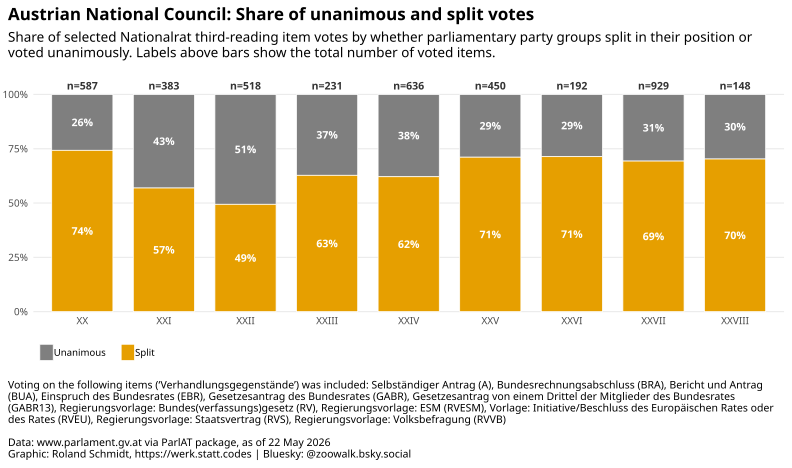
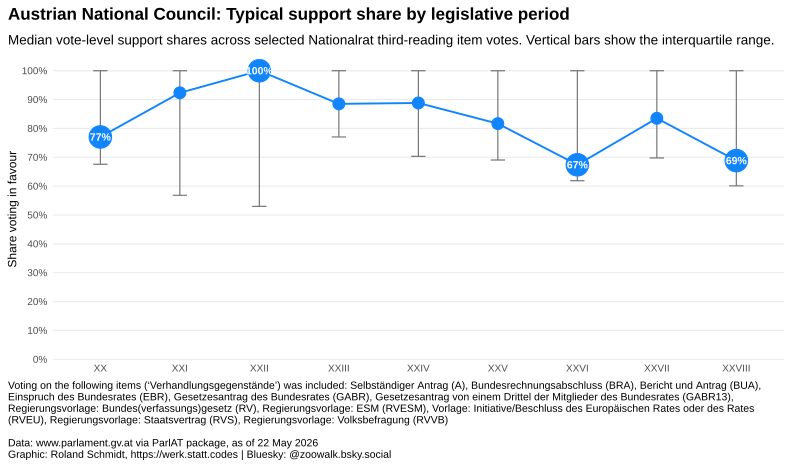
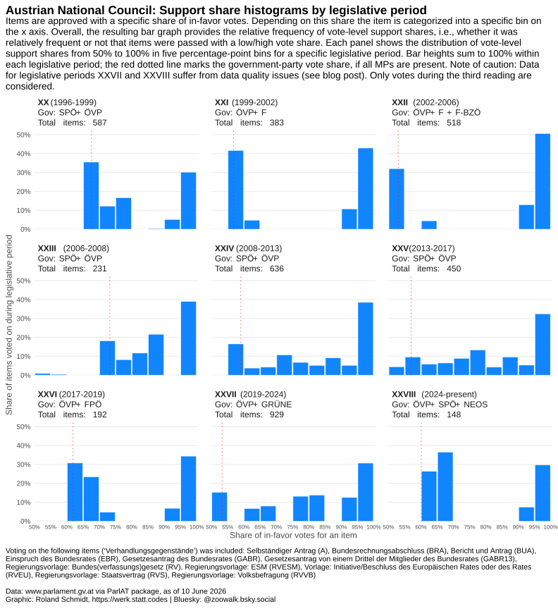
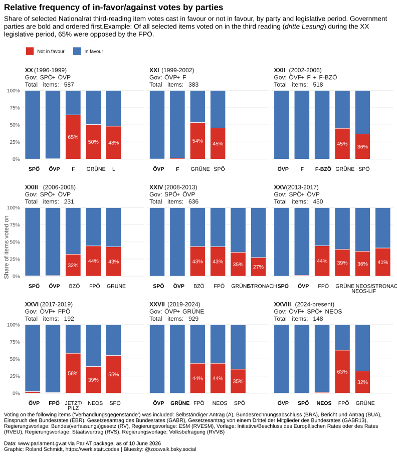
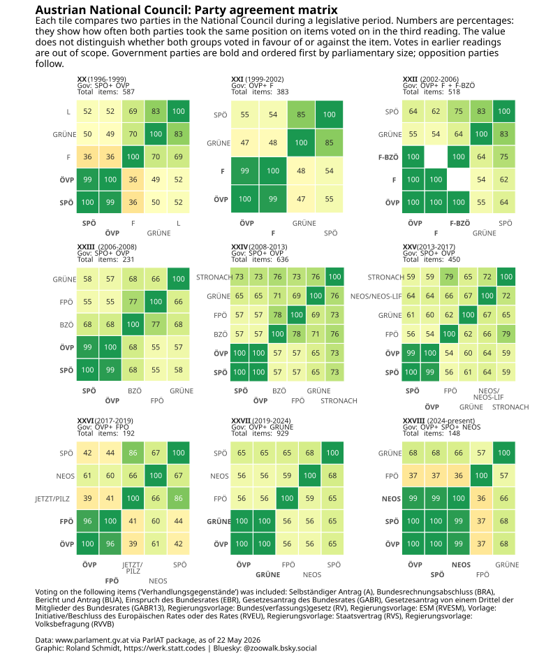
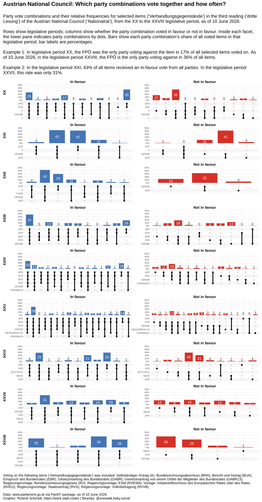
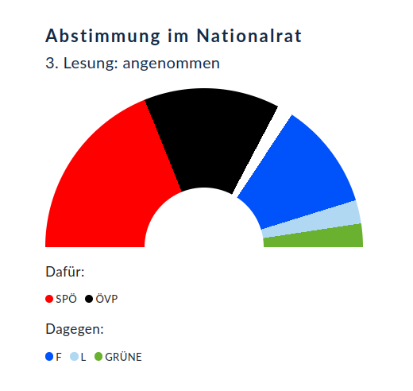

# Just the results, please {.unnumbered}

::: {layout-ncol="2"}
{group="voting_patterns_gallery"}

{group="voting_patterns_gallery"}

{group="voting_patterns_gallery"}

{group="voting_patterns_gallery"}

{group="voting_patterns_gallery"}

{group="voting_patterns_gallery"}
:::

# Context

I have recently been tinkering with the `get_item_details()` function of the [ParlAT package](https://werkstattcodes.github.io/ParlAT/index.html "Open ParlAT page"){target="_blank"}. While a few things are still in flux (it’s version 0.0.5 after all), the main development is the inclusion of the `votes` parameter into the function arguments. When set to `TRUE`, the function now returns the voting result of the provided item ('Verhandlungsgegenstand') in its third reading in the National Council ('dritte Lesung im Nationalrat').

To get a clear picture of what I mean, look at this [example](https://www.parlament.gv.at/gegenstand/XX/I/1833){target="_blank"} from the website of the Austrian Parliament.

{width="50%"}

The `get_item_details()` parses the data that lie behind the graph on the voting results, i.e. it returns the number of MPs per party who vote in favor or against the specific item.

Note that not every item type is actually subject to votes; not every item that can be voted on in fact reaches the third reading; and votes prior to the third reading are (at least for now) not returned. If the item does not feature a vote or a third reading, the returned vote column returns NULL. I emphasize this so that the scope of what the function can and cannot deliver is clear.

To demonstrate the parameter’s utility, I will query in this blog post the parties’ votes since the 20th legislative period (1996) until now, and will check:

1.  How often do parties vote in favor or against an item in the third reading (relative frequency per legislative period)?
2.  With which other party does a party vote (either in favor or against)? This should return an agreement matrix for every party pair.
3.  What is the relative frequency of party combinations for in-favor and not-in-favor votes for the different legislative periods? In other words, what are the sets of parties voting together in which frequency and how (in-favor/against).

Additionally, there are some 'low-hanging fruits' along the way, which I will also take up.

As you will see, the querying of the relevant data is rather straightforward. Most of the code presented was needed to create the graphs, so don’t get distracted by some lengthy code chunks.

And before I finally dive into the actual code, the usual caveats apply a) this is work in progress, if you see any errors or have suggestions etc. do not hesitate to contact me with feedback ([bluesky direct msg](https://bsky.app/profile/zoowalk.bsky.social){target="_blank"} or the [repo forum](https://github.com/werkstattcodes/ParlAT/discussions){target="_blank"} if directly related to ParlAT); b) although I am developing the ParlAT package, I don’t consider myself as an expert on all the ins-and-outs of the Austrian Parliament. The main motivation is to provide a tool which makes researching the Austrian Parliament a bit easier, and c) this is a blog post and does not pretend to be an academic output etc, and d) full disclosure, I used LLM assistance to iron-out some details of the graphs and review the writing of the blog post.

To give you an overview of the code below, essentially, there are three steps (more details below):

1.  use `get_items()` to get a data frame of the items for the legislative periods in question
2.  feed the URLs of the obtained items as input to the `get_item_details(vote = TRUE)` query
3.  wrangle and filter the data and produce the graphs.

Enough rambling. Let's dive in...

# Packages

Get the necessary packages.

```{r}
#| label: setup
#| code-summary: "Load packages and configure parallel plan"
# Load packages required for data retrieval, wrangling, tables, and plots.
library(ParlAT)
library(tidyverse)
library(reactablefmtr) #table formatter
library(reactable) #creation of reactables
library(ggupset) #upsetter plots
library(ggtext) #text formatting in ggplots
library(tidytext)
library(furrr) #apply functions in parallel
library(patchwork) #combine multiple plots into one
```

# Get items

## Query data

To start with, let's get all items for the legislative periods 20 to 28. No big deal.

```{r}
#| label: fetch-items
#| code-summary: "Fetch National Council items and cache them"
#| cache: true
#| eval: true
# Fetch National Council items for legislative periods 20 to 28.
items_20_28 <- seq(20, 28) %>%
  map(., \(x) get_items(legis_period = x, institution = "NR")) %>%
  list_rbind()
nrow(items_20_28)
```

```{r}
#| label: load-items-cache
#| include: false
# Load cached item metadata used by the post.
readr::write_rds(
  items_20_28,
  here::here(
    "posts",
    "2026-05-21-ParlAT-votingPatterns",
    "_data",
    "items_20_28.rds"
  )
)
items_20_28 <- readr::read_rds(here::here(
  "posts",
  "2026-05-21-ParlAT-votingPatterns",
  "_data",
  "items_20_28.rds"
))

# Record the latest item date represented in the source data. Will be used later in the graph's text.
data_cutoff <- {
  d <- max(items_20_28$date, na.rm = TRUE)
  sub("^0", "", format(d, "%d %B %Y"))
}
```

To get an overview of the (relative) frequency of the different item types, let's transform this data into two tables. Maybe that's of interest to some.

## Frequency Tables

```{r}
#| label: summarise-items
#| include: true
#| code-fold: true
#| code-summary: "Read cached item data and inspect item types"
# Prepare item-type count and share tables for the full item set.
period_cols <- sort(unique(items_20_28$legis_period))
compact_table_theme <- reactablefmtr::fivethirtyeight(font_size = 12)
table_source <- reactablefmtr::html(
  "<span style=\x27font-size:8pt;color:grey30;font-family:Segoe UI !important;line-height:0.5\x27>Source: www.parlament.gv.at. Analysis: Roland Schmidt - @zoowalk.bsky.social - https://werk.statt.codes</span>"
)

style_reactable_table <- function(table, title, subtitle = NULL) {
  styled_table <- table %>%
    reactablefmtr::add_title(
      title = reactablefmtr::html(paste0(
        "<span style=\x27font-size:12pt;\x27>",
        title,
        "</span>"
      ))
    )

  if (!is.null(subtitle)) {
    styled_table <- styled_table %>%
      reactablefmtr::add_subtitle(
        subtitle = reactablefmtr::html(paste0(
          "<span style=\x27font-size:10pt;line-height:0.5;\x27>",
          subtitle,
          "</span>"
        )),
        font_color = "grey30",
        font_weight = "normal",
        font_style = "italic"
      )
  }

  styled_table %>%
    reactablefmtr::add_source(source = table_source)
}

# Format legislative-period columns as right-aligned integer counts for the first table.
period_count_cols <- setNames(
  map(
    period_cols,
    \(period) {
      colDef(
        align = "right",
        format = colFormat(separators = TRUE, digits = 0),
        na = ""
      )
    }
  ),
  period_cols
)

# Format legislative-period columns as right-aligned percentage shares for the second table.
period_share_cols <- setNames(
  map(
    period_cols,
    \(period) {
      colDef(
        align = "right",
        format = colFormat(digits = 1, suffix = "%"),
        na = ""
      )
    }
  ),
  period_cols
)

# Count document types per legislative period and reshape to one row per document type.
type_abs_counts <- items_20_28 %>%
  count(legis_period, type_doc_long, type_doc) %>%
  pivot_wider(
    id_cols = c(type_doc_long, type_doc),
    names_from = legis_period,
    values_from = n
  )

# Calculate each document type as a percentage of all items within its legislative period.
type_rel_counts <- items_20_28 %>%
  count(legis_period, type_doc_long, type_doc) %>%
  mutate(rel = n / sum(n), .by = legis_period) %>%
  pivot_wider(
    id_cols = c(type_doc_long, type_doc),
    names_from = legis_period,
    values_from = rel
  ) %>%
  mutate(across(where(is.numeric), \(x) x * 100))

# Render the document-type counts as a compact interactive table.
type_abs_counts_table <- reactable(
  type_abs_counts,
  columns = c(
    list(
      type_doc_long = colDef(
        name = "Document type",
        align = "left",
        minWidth = 320,
        filterable = TRUE,
        sticky = "left"
      ),
      type_doc = colDef(
        name = "Code",
        align = "left",
        minWidth = 80,
        filterable = TRUE,
        sticky = "left"
      )
    ),
    period_count_cols
  ),
  fullWidth = TRUE,
  compact = TRUE,
  highlight = FALSE,
  outlined = TRUE,
  defaultPageSize = 23,
  defaultSorted = "XXVIII",
  defaultSortOrder = "desc",
  theme = compact_table_theme
) %>%
  style_reactable_table(
    "ITEM TYPES BY LEGISLATIVE PERIOD",
    paste0(
      "Absolute number of each item type per legislative period. Data as of ",
      data_cutoff,
      "."
    )
  )

# Render the document-type percentage shares as a compact interactive table.
type_rel_counts_table <- reactable(
  type_rel_counts,
  columns = c(
    list(
      type_doc_long = colDef(
        name = "Document type",
        align = "left",
        minWidth = 320,
        filterable = TRUE,
        sticky = "left"
      ),
      type_doc = colDef(
        name = "Code",
        align = "left",
        minWidth = 80,
        filterable = TRUE,
        sticky = "left"
      )
    ),
    period_share_cols
  ),
  fullWidth = TRUE,
  compact = TRUE,
  highlight = FALSE,
  outlined = TRUE,
  defaultPageSize = 23,
  defaultSorted = "XXVIII",
  defaultSortOrder = "desc",
  theme = compact_table_theme
) %>%
  style_reactable_table(
    "ITEM TYPES BY LEGISLATIVE PERIOD",
    paste0(
      "Share of each type within all items in the legislative period. Data as of ",
      data_cutoff,
      "."
    )
  )
```

:::: column-page-right
::: panel-tabset
### Items by absolute frequency per legis period

```{r}
#| label: item-type-counts-table
#| echo: false
# Render the absolute item-type counts table.
type_abs_counts_table
```

### Items by relative frequency per legis period

```{r}
#| label: type-doc-shares-table
#| echo: false
# Render the relative item-type shares table.
type_rel_counts_table
```
:::
::::

## Keep items of interest

The `get_items()` call from above returned all (!) items. When interested in votes in the third reading, only a subset of items is relevant. Below we filter for them. In case I missed any category here, please let me know.

```{r}
#| label: define-item-scope
#| code-summary: "Select legislative item types for voting analysis"
# Select vote-relevant item types for the voting analysis.
items_select <- c("^A$", "RV", "BUA", "GABR", "GABR13", "BRA", "^EBR$") %>%
  paste0(., collapse = "|")

items_scope <- items_20_28 %>%
  filter(str_detect(type_doc, regex(items_select)))

items_scope %>%
  distinct(type_doc_long, type_doc)
```

```{r}
#| label: item-scope-freq-table
#| code-summary: "Frequency table on item types for voting analysis"
#| column: page-right
#| eval: true
#| include: false
# Prepare and render item-scope frequency and share tables.
items_scope_doc_shares <- items_scope %>%
  count(legis_period, type_doc_long, type_doc) %>%
  mutate(rel = n / sum(n), .by = legis_period) %>%
  pivot_wider(
    id_cols = c(type_doc, type_doc_long),
    names_from = legis_period,
    values_from = rel
  ) %>%
  mutate(across(where(is.numeric), \(x) x * 100))

# Render the scoped document-type shares with the same compact table style as above.
items_scope_doc_shares_table <- reactable(
  items_scope_doc_shares,
  columns = c(
    list(
      type_doc = colDef(
        name = "Code",
        align = "left",
        minWidth = 80,
        filterable = TRUE,
        sticky = "left"
      ),
      type_doc_long = colDef(
        name = "Document type",
        align = "left",
        minWidth = 320,
        filterable = TRUE,
        sticky = "left"
      )
    ),
    period_share_cols
  ),
  fullWidth = TRUE,
  compact = TRUE,
  highlight = FALSE,
  outlined = TRUE,
  defaultPageSize = 23,
  defaultSorted = "XXVIII",
  defaultSortOrder = "desc",
  theme = compact_table_theme
) %>%
  style_reactable_table(
    "SELECTED DOCUMENT TYPES FOR VOTING ANALYSIS",
    paste0(
      "Share of the selected vote-relevant document types within each legislative period. Data as of ",
      data_cutoff,
      "."
    )
  )

items_scope_doc_shares_table
```

# Get item details

## Single case example

Before using the results obtained above to query the voting results, it might be instructive to demonstrate the return value of the new `votes` parameter with a single item. The item is the one for which we saw above the results. Note that the return value for `votes` is a list column, it contains a data frame with nested data.

```{r}
#| label: single-case-vote-result
#| code-summary: "Single case vote results"
#| code-fold: false
# Fetch and inspect one item with voting result details.
example <- get_item_details(
  item_url = "https://www.parlament.gv.at/gegenstand/XX/I/1833?selectedStage=105",
  votes = TRUE
)

#content of votes list column
example$votes

#content of interest
example$votes[[1]]$result %>% select(text, infavor)
```

So as you can see from the above chunk, the returned votes column is a list column which contains another list column `result`. From here, we can extract the party name (`text`) and the vote result (`infavor`). (Note, in a later version the function might get further streamlined so that the return value is already the nested result).

## Query data

To apply this approach to our data frame comprising data from the 20th legislative period onwards, let's extract the urls of the items and feed them to `get_item_details()` with votes set to TRUE. I wrap the function call in purrr's `safely` to collect any potential errors; and use `future_map()` to query the API with multiple workers simultaneously, i.e. to speed up the process.

```{r}
#| label: fetch-item-details
#| code-summary: "Fetch item details with voting results and cache them"
#| cache: true
#| eval: true
# Fetch voting details for all selected item URLs.
plan(multisession, workers = 4)

item_urls <- items_scope %>%
  pull(item_url)

safe_get_item_details <- safely(get_item_details)

item_details_raw <- item_urls %>%
  future_map(
    \(x) {
      safe_result <- safe_get_item_details(item_url = x, votes = TRUE)
      safe_result$item_url <- x
      safe_result
    },
    .progress = TRUE,
    .options = furrr_options(packages = c("ParlAT", "purrr", "tibble"))
  )
```

```{r}
#| label: load-item-details-cache
#| eval: true
#| include: false
# Load cached item-detail API results.
readr::write_rds(
  item_details_raw,
  here::here(
    "posts",
    "2026-05-21-ParlAT-votingPatterns",
    "_data",
    "item_details_raw.rds"
  )
)

# plan(sequential)

item_details_raw <- readr::read_rds(here::here(
  "posts",
  "2026-05-21-ParlAT-votingPatterns",
  "_data",
  "item_details_raw.rds"
))
```

Below, I a) check for any failed calls, and b) combine the successful calls into a single data frame.

```{r}
#| label: prepare-vote-agreement-data
#| code-summary: "Build party agreement matrix from cached vote details"
# Separate failed item-detail calls and bind successful results.
failed_items <- item_details_raw %>%
  keep(\(x) !is.null(x$error)) %>%
  map(\(x) {
    tibble(
      item_url = x$item_url,
      error = conditionMessage(x$error)
    )
  }) %>%
  list_rbind()
nrow(failed_items)

#combine successful calls into one single data frame
items_details <- item_details_raw %>%
  keep(\(x) is.null(x$error)) %>%
  map("result") %>%
  list_rbind()
nrow(items_details)
```

As we can see, there were `r nrow(failed_items)` failed item calls. And the successful calls returned `r nrow(items_details)` item details.

## Check votes & reading stage

Before unpacking the nested `votes` column, a quick detour. As an intermediate step, let me cross-tabulate the presence of item votes and the procedural stage of the item. Remember that not every item necessarily (yet) features a vote during the third reading.

```{r}
#| label: summarise-vote-presence
#| code-summary: "How many items have a vote"
# Add indicator of item has vote data yes/no.
items_details <- items_details %>%
  mutate(votes_present = map_lgl(votes, \(x) !is.null(x)))

# Count vote indicator
vote_yn <- items_details %>%
  count(votes_present) %>%
  mutate(rel = n / sum(n))
vote_yn

# Vote presence and item's status number
items_details %>%
  select(status_number, status_description, votes_present, item_url) %>%
  count(status_number, votes_present)

table(items_details$status_number, items_details$votes_present)
```

As it turns out, `r scales::percent(vote_yn %>% filter(votes_present) %>% pull(rel), accuracy = 1)` of all retrieved items feature a vote. If we cross-tabulate this with the status number (which is part of the API response), we see that almost all items with a vote are of category 5 (out of 5), i.e., are concluded.

So what about the other items which are also of status 5, but do not feature a vote. Unfortunately, at least that's my current understanding, there is no explicit return value indicating whether an item has reached the third reading. However, I also incorporated the `stages` parameter into `get_item_details()` which returns one row for each stage (and merits its own blog post). The column `stage_name` has a description of the stage, and this string can be searched for the presence of 'dritte Lesung'/third reading. To demonstrate this, here the stages for our single case example:

```{r}
#| label: example-third-reading-stage
#|code-summary: "Example: check for third reading"
# Inspect the example item stages for a third-reading marker.
example$stages[[1]]

#filter stage_name for 3rd reading
example$stages[[1]] %>%
  filter(str_detect(stage_name, regex("dritter? Lesung", ignore_case = T))) %>%
  pull(stage_name)
```

As we can see above, the filter result reveals that the example item has reached the third reading. Let's use this approach to check for our full dataset.

```{r}
#| label: detect-third-reading
#| code-summary: "Check for third reading"
# Flag items whose stage data indicates a third reading.
items_details <- items_details %>%
  mutate(
    third_reading = map_lgl(stages, \(x) {
      if (is.null(x) || !"stage_name" %in% names(x)) {
        return(FALSE)
      }
      any(
        str_detect(x$stage_name, regex("dritter? Lesung", ignore_case = TRUE)),
        na.rm = TRUE
      )
    })
  )

#cross-tab third reading and vote presence
items_details %>%
  count(votes_present, third_reading)
```

The last table in the chunk above is important. Almost all items are either a (third reading AND have votes) OR (are NOT third readings AND do not have votes). There are two items which don't fit the pattern. I checked them manually and these are items where the second and the third reading were in the *same* session (hence our search for 'dritter? Lesung' had a match), but the item failed to cross the second reading (hence no vote.) Based on this result, we can confidently conclude that all our extracted votes pertain to a third reading. Let's unnest the data now to get the actual results.

```{r}
#| label: unnest-vote-results
#| code-summary: "Unnest vote results"
# Unnest voting result details into one row per party vote.
items_votes <- items_details %>%
  unnest_wider(votes, names_sep = "_")
class(items_votes$votes_result)

#keep only those items where a vote took actually place
items_votes <- items_votes %>%
  filter(map_lgl(votes_result, \(x) !is.null(x))) %>%
  unnest(votes_result)

#keep only columns of interest
items_votes <- items_votes %>%
  select(
    item_url,
    type = type_doc,
    title,
    item_number,
    item_url,
    legis_period,
    text,
    code,
    fraction,
    party_infavor = infavor
  )
```

```{r}
#| label: load-item-votes-cache
#| include: false
# Load cached item details with third-reading flags.
readr::write_rds(items_details, here::here("posts","2026-05-21-ParlAT-votingPatterns","_data","item_votes.rds"))
items_details <- readr::read_rds(here::here(
  "posts",
  "2026-05-21-ParlAT-votingPatterns",
  "_data",
  "item_votes.rds"
))
```

# Results

## Graphic 1: Split and unanimous votes

With the data now available, let's see whether we can find anything meaningful. As a first step, I want to know how many items were passed on a unanimous vote vs split vote.

```{r}
#| label: prepare-contested-vote-data
#| code-fold: true
#| code-summary: "Prepare graph data, general annotations etc."
# Prepare contested-vote classifications and shared plot metadata.
votes_contested <- items_votes %>%
  mutate(vote_id = paste(legis_period, item_url, sep = "|")) %>%
  group_by(vote_id, legis_period, item_url) %>%
  summarise(
    vote_types_n = n_distinct(party_infavor),
    vote_record = paste(paste(text, party_infavor, sep = ":"), collapse = "; "),
    # vote_favor_share = sum(fraction[party_infavor], na.rm = TRUE) /
    #   sum(fraction, na.rm = TRUE),
    .groups = "drop"
  ) %>%
  mutate(contested = if_else(vote_types_n > 1, "split", "unanimous"))


# Count voted items per legislative period for plot annotations and facet labels.
items_voted_n <- items_votes %>%
  mutate(vote_id = paste(legis_period, item_url, sep = "|")) %>%
  distinct(legis_period, vote_id) %>%
  count(legis_period, name = "items_voted_n") %>%
  mutate(items_voted_label = glue::glue("n={items_voted_n}"))

# Define governing parties by legislative period for facet labels and party ordering. This could be also done programmatically with ParlAT's get_mps, but I wanted to keep as direct as possible here.
gov_parties <- tribble(
  ~legis_period , ~text   , ~gov_rank ,
  "XX"          , "SPÖ"   ,         1 ,
  "XX"          , "ÖVP"   ,         2 ,
  "XXI"         , "ÖVP"   ,         1 ,
  "XXI"         , "F"     ,         2 ,
  "XXII"        , "ÖVP"   ,         1 ,
  "XXII"        , "F"     ,         2 ,
  "XXII"        , "F-BZÖ" ,         3 ,
  "XXIII"       , "SPÖ"   ,         1 ,
  "XXIII"       , "ÖVP"   ,         2 ,
  "XXIV"        , "SPÖ"   ,         1 ,
  "XXIV"        , "ÖVP"   ,         2 ,
  "XXV"         , "SPÖ"   ,         1 ,
  "XXV"         , "ÖVP"   ,         2 ,
  "XXVI"        , "ÖVP"   ,         1 ,
  "XXVI"        , "FPÖ"   ,         2 ,
  "XXVII"       , "ÖVP"   ,         1 ,
  "XXVII"       , "GRÜNE" ,         2 ,
  "XXVIII"      , "ÖVP"   ,         1 ,
  "XXVIII"      , "SPÖ"   ,         2 ,
  "XXVIII"      , "NEOS"  ,         3
)

# Collapse governing parties into one display label per legislative period. Will be used for annotations later.
gov_party_labels <- gov_parties %>%
  arrange(legis_period, gov_rank) %>%
  summarise(
    gov_parties = paste(text, collapse = " + "),
    .by = legis_period
  )

# Build reusable facet labels with period years, government parties, and total items.
legis_period_labels <- ParlAT::get_legis_periods() %>%
  filter(legis_period_abbrev %in% unique(items_votes$legis_period)) %>%
  left_join(items_voted_n, by = c("legis_period_abbrev" = "legis_period")) %>%
  left_join(
    gov_party_labels,
    by = c("legis_period_abbrev" = "legis_period")
  ) %>%
  mutate(
    years = if_else(
      is.na(date_end),
      paste0(format(date_start, "%Y"), "-present"),
      paste0(format(date_start, "%Y"), "-", format(date_end, "%Y"))
    ),
    label = paste0(
      "<b>",
      legis_period_abbrev,
      "</b>",
      " (",
      years,
      ")",
      "<br>",
      "Gov: ",
      gov_parties,
      "<br>",
      "Total items: ",
      scales::number(items_voted_n, accuracy = 1)
    )
  ) %>%
  select(name = legis_period_abbrev, value = label) %>%
  tibble::deframe()

# Create a compact description of included item types for graph captions.
items_label_str <- items_scope %>%
  distinct(type_doc, type_doc_long) %>%
  arrange(type_doc) %>%
  mutate(label = paste0(type_doc_long, " (", type_doc, ")")) %>%
  pull(label) %>%
  paste(collapse = ", ")

# Define one shared caption used by all vote visualisations.
vote_graph_caption <- paste0(
  "Voting on the following items ('Verhandlungsgegenstände') was included: ",
  items_label_str,
  "<br><br>Data: www&#46;parlament.gv.at via ParlAT package, as of ",
  data_cutoff,
  "<br>Graphic: Roland Schmidt, https&#58;//werk.statt.codes | Bluesky: @zoowalk.bsky.social"
)

# Shared sizes for a consistent look across all graphs. Every plot renders at
# out-width 100% in the same body-outset-right column, so on-screen text size depends
# only on point-size / fig-width. Keeping fig-width identical in every chunk
# header (gg_fig_width) plus these point sizes guarantees equal visible text.
gg_fig_width <- 11 # set as fig-width in every plot chunk header
gg_base_size <- 12
gg_title_size <- 17
gg_subtitle_size <- 13.5
gg_caption_size <- 10.5
gg_strip_size <- 12
gg_axis_size <- 10
gg_axis_colour <- "#4D4D4D"
gg_annot_size <- 3.7 # geom_text data-label size (mm)
gg_plot_family <- "Noto Sans"

noto_sans_svg_fonts <- list(
  systemfonts::fonts_as_import(
    gg_plot_family,
    weight = c("normal", "bold"),
    type = "import",
    repositories = NULL,
    may_embed = TRUE
  )
)

svg_noto <- function(filename, width, height, ...) {
  svglite::svglite(
    filename = filename,
    width = width,
    height = height,
    web_fonts = noto_sans_svg_fonts,
    ...
  )
}

vote_stance_colors <- c(
  "In favour" = "#4575b4",
  "Not in favour" = "#d73027"
)

vote_split_colors <- c(
  "unanimous" = "#7f7f7f",
  "split" = "#e69f00"
)

# Shared theme applied to every plot; per-plot specifics are layered on top.
theme_vote_plot <- function(base_size = gg_base_size) {
  theme_minimal(base_size = base_size, base_family = gg_plot_family) +
    theme(
      panel.grid.minor = element_blank(),
      plot.title.position = "plot",
      plot.caption.position = "plot",
      plot.title = element_text(
        hjust = 0,
        size = gg_title_size,
        family = gg_plot_family,
        face = "bold",
        margin = ggplot2::margin(b = 8)
      ),
      plot.subtitle = ggtext::element_textbox_simple(
        size = gg_subtitle_size,
        family = gg_plot_family,
        lineheight = 1.15,
        margin = ggplot2::margin(t = 4, b = 12)
      ),
      plot.caption = ggtext::element_textbox_simple(
        hjust = 0,
        halign = 0,
        size = gg_caption_size,
        family = gg_plot_family,
        lineheight = 1.1,
        margin = ggplot2::margin(t = 14)
      ),
      strip.text = ggtext::element_markdown(
        size = gg_strip_size,
        family = gg_plot_family,
        lineheight = 1.2,
        hjust = 0
      ),
      axis.text = element_text(
        size = gg_axis_size,
        family = gg_plot_family,
        colour = gg_axis_colour
      ),
      axis.title = element_text(
        family = gg_plot_family,
        colour = gg_axis_colour
      ),
      legend.position = "bottom",
      legend.justification = "left",
      plot.margin = ggplot2::margin(t = 8, r = 8, b = 8, l = 8)
    )
}


# Calculate relative shares of unanimous and split votes per legislative period.
votes_contested_shares <- votes_contested %>%
  mutate(
    contested = factor(contested, levels = c("unanimous", "split"))
  ) %>%
  count(legis_period, contested, name = "votes_n") %>%
  mutate(
    vote_share = votes_n / sum(votes_n),
    vote_share_label = scales::percent(vote_share, accuracy = 1),
    .by = legis_period
  ) %>%
  left_join(items_voted_n, by = "legis_period")
```

```{r}
#| label: plot-contested-vote-shares
#| code-fold: true
#| code-summary: "Stacked split vote shares"
#| column: body-outset-right
#| fig-width: 11
#| fig-height: 6.5
#| out-width: "100%"
#| fig-align: "center"
#| dev: svg_noto
#| fig-ext: svg
# Plot the share of unanimous and split votes by legislative period.
p_votes_contested <- votes_contested_shares %>%
  ggplot(aes(x = legis_period, y = vote_share, fill = contested)) +
  geom_col(width = 0.75, colour = "white", linewidth = 0.35) +
  geom_text(
    aes(label = vote_share_label),
    position = position_stack(vjust = 0.5),
    colour = "white",
    size = gg_annot_size,
    family = gg_plot_family,
    fontface = "bold"
  ) +
  geom_text(
    data = items_voted_n,
    aes(x = legis_period, y = 1.04, label = items_voted_label),
    inherit.aes = FALSE,
    size = gg_annot_size,
    family = gg_plot_family,
    fontface = "bold",
    colour = "grey20"
  ) +
  scale_y_continuous(
    labels = scales::percent_format(accuracy = 1),
    breaks = seq(0, 1, by = 0.25),
    expand = expansion(mult = c(0, 0.02))
  ) +
  scale_fill_manual(
    values = vote_split_colors,
    breaks = c("unanimous", "split"),
    labels = c("Unanimous", "Split"),
    name = NULL
  ) +
  coord_cartesian(ylim = c(0, 1.08), clip = "off") +
  labs(
    x = NULL,
    y = NULL,
    title = "Austrian National Council: Share of unanimous and split votes",
    subtitle = paste0(
      "Share of selected Nationalrat third-reading item votes by whether parliamentary party groups ",
      "split in their position or voted unanimously. Labels above bars show the total number of voted items."
    ),
    caption = vote_graph_caption
  ) +
  theme_vote_plot() +
  theme(
    panel.grid.major.x = element_blank(),
    legend.spacing.x = grid::unit(2.0, "lines"),
    legend.key.width = grid::unit(1, "lines"),
    legend.text = element_text(
      family = gg_plot_family,
      margin = ggplot2::margin(r = 16)
    )
  )

p_votes_contested
```

I guess it's not a huge surprise that the vast majority of votes were not unanimous. Split votes dominate in almost every legislative period, usually making up roughly 60 to 70 percent of all votes.

The exception is the XXII legislative period, where unanimous votes slightly outnumber split votes. That is maybe the most noteworthy result in this first graph. After all, this was the rather tumultuous ÖVP-FPÖ government period in which the FPÖ split and the BZÖ emerged. I have to admit this is a result contrary to what I expected.

## Graphic 2: Median support share

The above graph was relatively crude in the sense, that it only differentiated between unanimous and split votes. In the following step, I calculate the in-favor vote share for every item, i.e. the share of MPs who voted in favor for the item in question. The vote numbers are also available from the data returned by `get_item_details()`. Taken together for each legislative period, we can calculate the median and IQR of these vote shares. This should allow us to compare the support for an average item voted on during the third reading.

```{r}
#| label: calculate-support-share
#| code-summary: "Calculate in-favor vote share"
# Calculate vote-level support shares by legislative period.
support_share <- items_votes %>%
  mutate(vote_id = paste(legis_period, item_url, sep = "|")) %>%
  group_by(vote_id, legis_period, item_url) %>%
  summarise(
    mp_count = sum(fraction),
    vote_favor_share = sum(fraction[party_infavor], na.rm = TRUE) /
      sum(fraction, na.rm = TRUE),
    .groups = "drop"
  )

support_share_avg <- support_share %>%
  group_by(legis_period) %>%
  summarise(
    median_support = median(vote_favor_share, na.rm = T),
    q25_support = as.numeric(quantile(vote_favor_share, 0.25, na.rm = T)),
    q75_support = as.numeric(quantile(vote_favor_share, 0.75, na.rm = T))
  )
```

```{r}
#| label: plot-support-share-summary
#| code-fold: true
#| code-summary: "Median support share by legislative period"
#| column: body-outset-right
#| fig-width: 11
#| fig-height: 6.5
#| out-width: "100%"
#| fig-align: "center"
#| dev: svg_noto
#| fig-ext: svg
# Plot median support shares and interquartile ranges by legislative period.
support_share_avg_plot <- support_share_avg %>%
  mutate(
    legis_period = factor(legis_period, levels = sort(unique(legis_period)))
  )

support_share_labels <- bind_rows(
  support_share_avg_plot %>% slice_min(legis_period, n = 1, with_ties = FALSE),
  support_share_avg_plot %>% slice_max(legis_period, n = 1, with_ties = FALSE),
  support_share_avg_plot %>%
    slice_min(median_support, n = 1, with_ties = FALSE),
  support_share_avg_plot %>% slice_max(median_support, n = 1, with_ties = FALSE)
) %>%
  distinct(legis_period, .keep_all = TRUE) %>%
  mutate(median_support_label = scales::percent(median_support, accuracy = 1))

p_support_share_summary <- support_share_avg_plot %>%
  ggplot(aes(x = legis_period, y = median_support)) +
  geom_errorbar(
    aes(ymin = q25_support, ymax = q75_support),
    width = 0.18,
    colour = "grey45",
    linewidth = 0.55
  ) +
  geom_line(aes(group = 1), colour = "#1185FE", linewidth = 0.9) +
  geom_point(
    colour = "#1185FE",
    size = 5,
    stroke = 0.8
  ) +
  geom_point(
    data = support_share_labels,
    colour = "#1185FE",
    fill = "#1185FE",
    shape = 21,
    size = 10,
    stroke = 0.8
  ) +
  geom_text(
    data = support_share_labels,
    aes(label = median_support_label),
    colour = "white",
    size = gg_annot_size,
    family = gg_plot_family,
    fontface = "bold"
  ) +
  scale_y_continuous(
    labels = scales::percent_format(accuracy = 1),
    limits = c(0, 1),
    breaks = seq(0, 1, by = 0.1),
    expand = expansion(mult = c(0, 0.04))
  ) +
  labs(
    x = NULL,
    y = "Share voting in favour",
    title = "Austrian National Council: Typical support share by legislative period",
    subtitle = paste0(
      "Median vote-level support shares across selected Nationalrat third-reading item votes. ",
      "Vertical bars show the interquartile range."
    ),
    caption = vote_graph_caption
  ) +
  theme_vote_plot() +
  theme(
    panel.grid.major.x = element_blank()
  )

p_support_share_summary
```

The median support share gives a slightly different perspective than the split/unanimous distinction above. XXI and the grand-coalition periods XXIII and XXIV also show high typical support, with median values well above 85 percent. By contrast, XXVI and XXVIII stand out for their lower median support shares. In both periods, a typical item was passed with something much closer to a governing majority.

At this point, it might be good to do a *data sanity check* again. Let's aggregate all votes per item. We would expect that the number is never higher than 183, i.e., the total number of MPs in the National Council.

```{r}
#| label: check-item-total-votes
#| code-summary: "Check item total votes"
# Calculate total recorded MP votes per item for turnout checks.
item_votes_totals <- items_votes %>%
  group_by(legis_period, item_url) %>%
  summarise(
    mp_count = sum(fraction)
  ) %>%
  ungroup() %>%
  mutate(
    turnout = mp_count / 183
  )

item_votes_totals %>% count(mp_count, sort = T)
```

Surprisingly, there are `r item_votes_totals %>% filter(mp_count > 183) %>% nrow()` items where we have more than 183 MPs. I strongly assume that this is simply a data quality issue. To facilitate a follow-up, here are the urls of the items in question:

```{r}
#| label: list-high-turnout-items
#| code-summary: "Items with more than 183 votes"
# List items whose recorded vote totals exceed 183 MPs.
item_votes_totals %>% filter(mp_count > 183) %>% select(item_url)
```

What this check also demonstrated is that `get_item_details(votes=TRUE)` implicitly returns participation data, i.e., how many MPs were actually present during the vote. I could imagine that it might be interesting to check, e.g., when participation was particularly low etc.

::: callout-important
HOWEVER, the table below also reveals that the data for the XXVII and XXVIII legislative period feature suspiciously stable data/most likely wrong data. It seems as if the mode of reporting has changed. This is a significant limitation when dealing with questions which need the exact count for every party. I wonder what the reason is.
:::

```{r}
#| label: summarise-turnout
#| code-summary: "Overview participation data"
# Summarise turnout statistics by legislative period.
item_votes_totals %>%
  group_by(legis_period) %>%
  summarise(
    items_n = n(),
    turnout_mean = mean(turnout),
    turnout_sd = sd(turnout),
    turnout_max = max(turnout),
    turnout_min = min(turnout)
  )
```

## Graphic 3: Support share histogram

Bearing in mind the above caveat for the last two legislative periods, let's continue with the analysis of the in-favor votes. Above I showed the median, but the median is also only a summary statistic and conceals the shape of the underlying distribution. To remedy this, the histogram below puts each vote into a bin corresponding to its vote-in-favor share. The x-axis shows five percentage-point bins of the item's in-favor vote share (e.g. 60-65 %). The y-axis is the relative frequency of the items in the relevant bin within a legislative period. Within a facet, all bars sum to 100%. The red dotted line marks parliamentary vote share of the governing parties in that legislative period (it's not perfectly aligned, but you get the idea).

```{r}
#| label: plot-support-share-histogram
#| code-fold: true
#| code-summary: "Precomputed support share histogram by legislative period"
#| column: body-outset-right
#| fig-width: 11
#| fig-height: 12
#| out-width: "100%"
#| fig-align: "center"
#| dev: svg_noto
#| fig-ext: svg
# Plot support-share histograms with government vote-share reference lines.
histogram_support_breaks <- seq(0.5, 1, by = 0.05)
histogram_bin_width <- diff(histogram_support_breaks)[1]

support_share_histogram <- support_share %>%
  filter(vote_favor_share >= 0.5) %>%
  mutate(
    legis_period = factor(legis_period, levels = sort(unique(legis_period))),
    support_bin = cut(
      vote_favor_share,
      breaks = histogram_support_breaks,
      include.lowest = TRUE,
      right = TRUE
    ),
    support_bin_midpoint = histogram_support_breaks[as.integer(support_bin)] +
      histogram_bin_width / 2
  ) %>%
  count(legis_period, support_bin_midpoint, name = "votes_n") %>%
  mutate(vote_share = votes_n / sum(votes_n), .by = legis_period)

government_share_lines <- items_votes %>%
  mutate(vote_id = paste(legis_period, item_url, sep = "|")) %>%
  left_join(gov_parties, by = c("legis_period", "text")) %>%
  summarise(
    gov_share = sum(fraction[!is.na(gov_rank)], na.rm = TRUE) /
      sum(fraction, na.rm = TRUE),
    .by = c(vote_id, legis_period)
  ) %>%
  count(legis_period, gov_share, name = "share_votes_n") %>%
  arrange(legis_period, desc(share_votes_n), gov_share) %>%
  slice_head(n = 1, by = legis_period) %>%
  select(legis_period, gov_share) %>%
  mutate(
    legis_period = factor(
      legis_period,
      levels = sort(unique(support_share$legis_period))
    )
  )

p_support_share_histogram <- support_share_histogram %>%
  ggplot(aes(x = support_bin_midpoint, y = vote_share)) +
  geom_col(
    colour = "white",
    fill = "#1185FE",
    linewidth = 0.25,
    width = histogram_bin_width * 0.95
  ) +
  geom_vline(
    data = government_share_lines,
    aes(xintercept = gov_share),
    colour = "red",
    linetype = "dotted",
    linewidth = 0.45,
    alpha = 0.75
  ) +
  facet_wrap(
    ~legis_period,
    ncol = 3,
    labeller = labeller(legis_period = as_labeller(legis_period_labels))
  ) +
  scale_x_continuous(
    labels = scales::percent_format(accuracy = 1),
    breaks = histogram_support_breaks,
    limits = range(histogram_support_breaks),
    expand = expansion(mult = c(0, 0.01))
  ) +
  scale_y_continuous(
    labels = scales::percent_format(accuracy = 1),
    expand = expansion(mult = c(0, 0.05))
  ) +
  labs(
    x = "Share of in-favor votes for an item",
    y = "Share of items voted on during legislative period",
    title = "Austrian National Council: Support share histograms by legislative period",
    subtitle = paste0(
      "Items are approved with a specific share of in-favor votes. Depending on this share the item is categorized into a specific bin on the x axis. Overall, the resulting bar graph provides the relative frequency of vote-level support shares, i.e., whether it was relatively frequent or not that items were passed with a low/high vote share.
      Each panel shows the distribution of vote-level support shares from 50% to 100% in five percentage-point bins for a specific legislative period. ",
      "Bar heights sum to 100% within each legislative period; the red dotted line marks the  government-party vote share, if all MPs are present. Note of caution: Data for legislative periods XXVII and XXVIII suffer from data quality issues (see blog post). Only
      votes during the third reading are considered."
    ),
    caption = vote_graph_caption
  ) +
  theme_vote_plot() +
  theme(
    panel.grid.major.x = element_blank(),
    panel.spacing.x = grid::unit(1.3, "lines"),
    panel.spacing.y = grid::unit(1.1, "lines"),
    axis.text.x = element_text(
      size = gg_axis_size - 2,
      family = gg_plot_family,
      colour = gg_axis_colour
    ),
    axis.title.y = element_text(
      family = gg_plot_family,
      colour = gg_axis_colour,
      margin = ggplot2::margin(r = 12)
    )
  )

p_support_share_histogram
```

If pressed, I would identify two rough patterns: a *bimodal/U-shaped* one and a *unimodal/left-skewed* one. The U-shaped pattern is clearest in XXI, XXII, XXVI, and XXVIII: there are relatively many unanimous or near-unanimous votes, but also relatively many votes close to the governing majority threshold. In substantive terms, this suggests a mix of uncontroversial items and items carried mainly by the government majority.

The left-skewed pattern is more visible in legislative period XXIII, XXIV, XXV, and XXVII. Here, the distribution leans more strongly toward high support shares, meaning that a larger share of items attracted votes from across the aisle.

Two further points: 1) note that there is an oddity in the graph on the XXIII and XXV legislative periods. Some items passed with a lower vote share than the share of government parties. The explanation is that the red line reflects the share of government-party MPs if all 183 MPs are present. With reduced turnout, a bill can be passed by the MPs of the government parties also below that ratio, i.e. not all MPs of the government parties were present, but still enough to pass the bill. 2) the shape of these distributions also depends on the number and relative size of parties in the National Council. Imagine a chamber with three parties, two governing parties and one opposition party, a U-shaped distribution would be almost unavoidable: items would pass either with the governing majority alone or with unanimous support. As the number of parties increases, especially when parties are of similar size, the range between a bare government majority and unanimity is more likely to be filled. But this is just a general qualification, I am sure others have more thoroughly thought about this.

## Graphic 4: Relative frequency of vote type

In the next graph, I want to depict the relative frequency of in-favor and against votes by party and legislative period. For this some party name standardization is needed.

```{r}
#| label: standardise-party-names
#| code-summary: "Party/parl-group name standardization"
#| code-fold: true
# Harmonise party labels and define shared party ordering.
items_votes <- items_votes %>%
  mutate(
    text = case_when(
      legis_period == "XXV" & text %in% c("NEOS", "NEOS-LIF") ~ "NEOS/NEOS-LIF",
      legis_period == "XXVI" & text %in% c("JETZT", "PILZ") ~ "JETZT/PILZ",
      TRUE ~ text
    ),
    code = case_when(
      legis_period == "XXV" & text == "NEOS/NEOS-LIF" ~ "NEOS/NEOS-LIF",
      legis_period == "XXVI" & text == "JETZT/PILZ" ~ "JETZT/PILZ",
      TRUE ~ code
    ),
    vote_id = paste(legis_period, item_url, sep = "|")
  )

#sort by party size per legislative period
party_order <- items_votes %>%
  distinct(legis_period, text) %>%
  left_join(gov_parties, by = c("legis_period", "text")) %>%
  mutate(is_gov = !is.na(gov_rank)) %>%
  group_by(legis_period) %>%
  arrange(!is_gov, gov_rank, text, .by_group = TRUE) %>%
  mutate(party_order = row_number()) %>%
  ungroup()
```

```{r}
#| label: plot-party-vote-shares
#| code-fold: true
#| code-summary: "Graph: Stacked party vote-position shares"
#| column: body-outset-right
#| fig-width: 11
#| fig-height: 13
#| out-width: "100%"
#| fig-align: "center"
#| dev: svg_noto
#| fig-ext: svg
# Plot party-level in-favour and not-in-favour vote shares.
max_party_slots <- max(party_order$party_order, na.rm = TRUE)
legis_period_levels <- sort(unique(party_order$legis_period))

party_vote_shares <- items_votes %>%
  distinct(vote_id, legis_period, text, party_infavor) %>%
  count(legis_period, text, party_infavor, name = "votes_n") %>%
  mutate(vote_share = votes_n / sum(votes_n), .by = c(legis_period, text)) %>%
  left_join(party_order, by = c("legis_period", "text")) %>%
  mutate(
    party_slot = party_order,
    vote_stance = if_else(party_infavor, "In favour", "Not in favour"),
    vote_stance = factor(vote_stance, levels = c("In favour", "Not in favour")),
    vote_share_label = if_else(
      vote_stance == "Not in favour" & vote_share >= 0.04,
      scales::percent(vote_share, accuracy = 1),
      NA_character_
    ),
    legis_period = factor(legis_period, levels = sort(unique(legis_period)))
  )

party_vote_axis_labels <- party_order %>%
  mutate(
    party = str_remove(text, "___.*$"),
    party = str_replace_all(party, "/", "/<br>"),
    label = if_else(is_gov, paste0("<b>", party, "</b>"), party),
    legis_period = factor(legis_period, levels = legis_period_levels)
  )

p_party_vote_shares <- party_vote_shares %>%
  ggplot(aes(x = party_slot, y = vote_share, fill = vote_stance)) +
  geom_col(width = 0.75, colour = "white", linewidth = 0.35) +
  geom_text(
    data = party_vote_shares %>% filter(vote_stance == "Not in favour"),
    aes(y = vote_share / 2, label = vote_share_label),
    colour = "white",
    size = gg_annot_size,
    family = gg_plot_family,
    na.rm = TRUE
  ) +
  ggtext::geom_richtext(
    data = party_vote_axis_labels,
    aes(x = party_order, y = -0.10, label = label),
    inherit.aes = FALSE,
    size = gg_annot_size,
    family = gg_plot_family,
    label.colour = NA,
    fill = NA,
    label.padding = grid::unit(rep(0, 4), "pt"),
    lineheight = 0.95,
    vjust = 1
  ) +
  facet_wrap(
    ~legis_period,
    ncol = 3,
    labeller = labeller(legis_period = as_labeller(legis_period_labels))
  ) +
  scale_x_continuous(
    breaks = seq_len(max_party_slots),
    limits = c(0.5, max_party_slots + 0.5),
    labels = NULL,
    expand = expansion(mult = 0)
  ) +
  scale_y_continuous(
    labels = scales::percent_format(accuracy = 1),
    breaks = seq(0, 1, by = 0.25),
    expand = expansion(mult = c(0, 0.02))
  ) +
  scale_fill_manual(
    values = vote_stance_colors,
    breaks = c("Not in favour", "In favour"),
    name = NULL
  ) +
  coord_cartesian(ylim = c(-0.18, 1), clip = "off") +
  labs(
    x = NULL,
    y = "Share of items voted on",
    title = "Relative frequency of in-favor/against votes by parties",
    subtitle = paste0(
      "Share of selected Nationalrat third-reading item votes cast in favour or not in favour, ",
      "by party and legislative period. Government parties are bold and ordered first.",
      "Example: Of all selected items voted on in the third reading (*dritte Lesung*) during the XX legislative period, 65% were opposed by the FPÖ."
    ),
    caption = vote_graph_caption
  ) +
  theme_vote_plot() +
  theme(
    legend.position = "top",
    panel.grid.major.x = element_blank(),
    panel.spacing.y = grid::unit(1.4, "lines"),
    axis.text.x = element_blank(),
    axis.ticks.x = element_blank(),
    plot.margin = ggplot2::margin(t = 8, r = 8, b = 34, l = 8)
  )

p_party_vote_shares
```

Unsurprisingly, the graph demonstrates that coalition parties almost always vote in favor of items. This is visible across very different government constellations: grand coalitions, ÖVP-FPÖ, ÖVP-Greens, and the current three-party coalition all show very low no-vote shares among governing parties.

What's noteworthy, at least to me, is the high no-ratio of the current FPÖ parliamentary group. It is only exceeded by the FPÖ in the XX legislative period, i.e., during the Haider years, where the party voted against almost two thirds of the items covered here.

## Graphic 5: Party-pairs

If you are still reading, congrats! I hope the remaining graphs will be enough of a reward.

Next, I wanted to take the vote results and see how often one party voted together with another party, and this regardless of whether the vote would be in favor or against a particular item. The result is the party pair matrix below.

```{r}
#| label: prepare-agreement-matrix
#| code-summary: "Prepare data for visualisations"
#| code-fold: true
# Prepare party pair agreement shares and display labels.
items_votes_combi <- items_votes %>%
  left_join(., items_votes, by = "vote_id", suffix = c("_x", "_y")) %>%
  mutate(
    agreement = if_else(
      party_infavor_x == party_infavor_y,
      "agreement",
      "disagreement"
    )
  )

agreement_matrix <- items_votes_combi %>%
  #  filter(text_x != text_y) %>%
  group_by(legis_period_x, text_x, text_y, agreement, .drop = TRUE) %>%
  summarise(
    agreement_n = n(),
  ) %>%
  ungroup() %>%
  mutate(
    agreement_share = agreement_n / sum(agreement_n),
    .by = c(legis_period_x, text_x, text_y)
  ) %>%
  filter(agreement == "agreement")

agreement_matrix_wide <- agreement_matrix %>%
  select(legis_period_x, text_x, text_y, agreement_share) %>%
  pivot_wider(names_from = text_y, values_from = agreement_share)

agreement_matrix_ordered <- agreement_matrix %>%
  left_join(
    party_order %>%
      transmute(
        legis_period_x = legis_period,
        text_x = text,
        is_gov_x = is_gov,
        party_order_x = party_order
      ),
    by = c("legis_period_x", "text_x")
  ) %>%
  left_join(
    party_order %>%
      transmute(
        legis_period_x = legis_period,
        text_y = text,
        is_gov_y = is_gov,
        party_order_y = party_order
      ),
    by = c("legis_period_x", "text_y")
  ) %>%
  mutate(
    text_x = reorder_within(text_x, party_order_x, legis_period_x),
    text_y = reorder_within(text_y, party_order_y, legis_period_x)
  )

label_vec_x <- agreement_matrix_ordered %>%
  distinct(text_x, is_gov_x) %>%
  mutate(
    party = str_remove(as.character(text_x), "___.*$"),
    # break long collapsed names so they wrap instead of overlapping on the x-axis
    party = str_replace_all(party, "/", "/<br>"),
    label = if_else(is_gov_x, paste0("<b>", party, "</b>"), party)
  ) %>%
  select(name = text_x, value = label) %>%
  mutate(name = as.character(name)) %>%
  tibble::deframe()

label_vec_y <- agreement_matrix_ordered %>%
  distinct(text_y, is_gov_y) %>%
  mutate(
    party = str_remove(as.character(text_y), "___.*$"),
    label = if_else(is_gov_y, paste0("<b>", party, "</b>"), party)
  ) %>%
  select(name = text_y, value = label) %>%
  mutate(name = as.character(name)) %>%
  tibble::deframe()
```

```{r}
#| label: plot-agreement-matrix
#| code-fold: true
#| code-summary: "Plot party agreement matrix"
#| column: body-outset-right
#| fig-width: 11
#| fig-height: 13
#| out-width: "100%"
#| fig-align: "center"
#| dev: svg_noto
#| fig-ext: svg
# Plot party pair agreement matrices by legislative period.
p_agreement_matrix <- agreement_matrix_ordered %>%
  mutate(
    legis_period_x = factor(
      legis_period_x,
      levels = sort(unique(legis_period_x))
    ),
    label_colour = if_else(
      agreement_share <= 0.20 | agreement_share >= 0.85,
      "white",
      "grey15"
    )
  ) %>%
  ggplot(aes(x = text_x, y = text_y, fill = agreement_share)) +
  geom_tile(colour = "white", linewidth = 0.5) +
  geom_text(
    aes(
      label = scales::number(agreement_share * 100, accuracy = 1),
      colour = label_colour
    ),
    fontface = "plain",
    size = gg_annot_size,
    family = gg_plot_family
  ) +
  scale_colour_identity() +
  scale_fill_distiller(
    palette = "RdYlGn",
    direction = 1,
    limits = c(0, 1),
    labels = scales::percent_format(accuracy = 1),
    name = "Agreement"
  ) +
  guides(fill = "none") +
  facet_wrap(
    ~legis_period_x,
    ncol = 3,
    scales = "free",
    axes = "all",
    axis.labels = "all",
    labeller = labeller(legis_period_x = as_labeller(legis_period_labels))
  ) +
  scale_x_discrete(labels = label_vec_x, guide = guide_axis(n.dodge = 2)) +
  scale_y_discrete(labels = label_vec_y) +
  labs(
    x = NULL,
    y = NULL,
    title = "Austrian National Council: Party agreement matrix",
    subtitle = paste0(
      "Each tile compares two parties in the National Council during a legislative period. ",
      "Numbers are percentages: they show how often both parties took the same position on items voted on ",
      " in the third reading. The value does not distinguish whether both groups ",
      "voted in favour of or against the item. Votes in earlier readings are out of scope. ",
      "Government parties are bold and ordered first by parliamentary size; opposition parties follow."
    ),
    caption = vote_graph_caption
  ) +
  theme_vote_plot() +
  theme(
    panel.grid = element_blank(),
    # element_markdown needed so bold government party labels render
    axis.text.x = ggtext::element_markdown(
      size = gg_axis_size,
      family = gg_plot_family
    ),
    axis.text.y = ggtext::element_markdown(
      size = gg_axis_size,
      family = gg_plot_family
    ),
    axis.text.x.bottom = ggtext::element_markdown(
      size = gg_axis_size,
      family = gg_plot_family
    ),
    axis.text.x.top = ggtext::element_markdown(
      size = gg_axis_size,
      family = gg_plot_family
    ),
    axis.text.y.left = ggtext::element_markdown(
      size = gg_axis_size,
      family = gg_plot_family
    ),
    axis.text.y.right = ggtext::element_markdown(
      size = gg_axis_size,
      family = gg_plot_family
    ),
    strip.text = ggtext::element_markdown(
      size = gg_strip_size - 2,
      family = gg_plot_family,
      lineheight = 0.9,
      hjust = 0
    ),
    aspect.ratio = 1
  )

p_agreement_matrix
```

I believe there is quite a bit in this graph to unpack, and others who work on this professionally may want to take this further, but what stands out to me is again the FPÖ of the current XXVIII and the XX legislative period. Compared with both other parties and its own behavior in other legislative periods, the FPÖ relatively rarely votes together with other parties during these two periods.

The other clear pattern is the near-perfect agreement among governing parties. This holds for SPÖ-ÖVP grand coalitions, ÖVP-FPÖ governments, the ÖVP-Greens coalition, and the current ÖVP-SPÖ-NEOS coalition.

## Graphic 6: UpSet plot

In the graph above we looked at the relative frequency of how often pairs of parties voted together, regardless of whether the vote would be in-favor or against the item at stake. In the next step, I 1) move beyond pairs and look at party combinations and 2) distinguish between in-favor and against votes.

To do so, I use the `ggupset` package, which creates this IMHO quite powerful UpSet plots. How to read them? The lower pane shows the combination of parties who voted together. Each party is identified by a dot. The upper pane presents the percentage of all voted items in the respective legislative period which was voted for/against by that party combination.

To make this more concrete, here is an example. In the current 28th legislative period, 26 % of all items voted on in the third reading got in-favor votes by (and only by) the three government parties ÖVP, SPÖ, and NEOS. In 30 % of all items subject to a vote, all parties voted in favor (what also corresponds to our first plot in this post). What stands out for me are the 36 % of against-votes by the FPÖ alone. This is the highest rate across all the legislative periods covered in this post (even if I add up FPÖ-BZÖ joint and single against-votes in the 23rd legislative period). To put it in other words, in 36 % of all items voted on during the current legislative period, the FPÖ was the only party saying no. The Greens did so in only 6 % of all votes.

Note that the percentages within a legislative period do *not* add up to 100%. This is by definition. E.g. the 30 % in which the FPÖ was the sole party to vote no, we have another 30 % where all other parties voted yes. Hence, the same items appear twice in the graph.

```{r}
#| label: plot-upset-period-percent
#| code-fold: true
#| code-summary: "Percentage UpSet plots by legislative period and vote type"
#| column: body-outset-right
#| fig-width: 11
#| fig-height: 21
#| out-width: "100%"
#| fig-align: "center"
#| dev: svg_noto
#| fig-ext: svg
# Plot UpSet charts of party combinations by vote stance.
vote_sets_percent <- items_votes %>%
  distinct(vote_id, legis_period, text, party_infavor) %>%
  summarise(
    parties = list(sort(unique(text))),
    .by = c(vote_id, legis_period, party_infavor)
  ) %>%
  mutate(
    vote_stance = if_else(party_infavor, "In favour", "Not in favour"),
    vote_stance = factor(vote_stance, levels = c("In favour", "Not in favour"))
  ) %>%
  count(legis_period, vote_stance, parties, name = "votes_n") %>%
  left_join(
    items_voted_n %>% select(legis_period, items_voted_n),
    by = "legis_period"
  ) %>%
  mutate(
    vote_share = votes_n / items_voted_n
  )

# get max height of y bar to standardize across plots
upset_y_max <- max(vote_sets_percent$vote_share, na.rm = TRUE)
upset_label_offset <- 0.05

vote_stance_levels <- levels(vote_sets_percent$vote_stance)

#define function to create plot per legislative period
make_period_upset_plot <- function(period, vote_type, show_period_label) {
  period_parties <- party_order %>%
    filter(legis_period == period) %>%
    arrange(party_order) %>%
    pull(text)

  label_data <- vote_sets_percent %>%
    filter(legis_period == period, vote_stance == vote_type) %>%
    mutate(
      vote_share_label = scales::number(vote_share * 100, accuracy = 1),
      vote_share_label_inside = if_else(
        vote_share >= 0.05,
        vote_share_label,
        NA_character_
      ),
      vote_share_label_above = if_else(
        vote_share < 0.05,
        vote_share_label,
        NA_character_
      )
    )

  period_intersections <- label_data %>%
    mutate(parties_key = map_chr(parties, paste, collapse = "|")) %>%
    arrange(desc(votes_n), parties_key) %>%
    pull(parties)

  label_data %>%
    ggplot(aes(x = parties, y = vote_share, fill = vote_stance)) +
    geom_col(width = 0.75) +
    geom_text(
      data = label_data,
      aes(y = vote_share / 2, label = vote_share_label_inside),
      colour = "white",
      size = gg_annot_size,
      family = gg_plot_family,
      fontface = "plain",
      na.rm = TRUE
    ) +
    geom_text(
      data = label_data,
      aes(y = vote_share + upset_label_offset, label = vote_share_label_above),
      colour = "grey20",
      size = gg_annot_size,
      family = gg_plot_family,
      fontface = "plain",
      na.rm = TRUE
    ) +
    scale_x_upset(
      sets = period_parties,
      intersections = period_intersections,
      n_intersections = Inf
    ) +
    scale_fill_manual(
      values = vote_stance_colors,
      guide = "none"
    ) +
    scale_y_continuous(
      labels = scales::percent_format(accuracy = 1),
      limits = c(0, upset_y_max + upset_label_offset),
      expand = expansion(mult = c(0, 0.05))
    ) +
    labs(
      title = vote_type,
      x = NULL,
      y = if (show_period_label) period else NULL
    ) +
    theme_minimal(base_size = 9, base_family = gg_plot_family) +
    theme_combmatrix(
      combmatrix.label.text = element_text(size = 7, family = gg_plot_family),
      combmatrix.panel.point.size = 1.8
    ) +
    theme(
      plot.title = element_text(
        size = 11,
        hjust = 0.5,
        family = gg_plot_family,
        face = "bold",
        margin = ggplot2::margin(b = 4)
      ),
      axis.text.x = element_text(
        size = 7,
        angle = 45,
        hjust = 1,
        family = gg_plot_family
      ),
      axis.text.y = element_text(size = 7, family = gg_plot_family),
      panel.grid.minor = element_blank(),
      axis.title.y = if (show_period_label) {
        element_text(
          size = 11,
          family = gg_plot_family,
          face = "bold",
          angle = 90,
          margin = ggplot2::margin(r = 5)
        )
      } else {
        element_blank()
      },
      plot.margin = ggplot2::margin(t = 4, r = 4, b = 4, l = 4)
    )
}

period_vote_type_grid <- tidyr::expand_grid(
  legis_period = legis_period_levels,
  vote_stance = vote_stance_levels
) %>%
  mutate(show_period_label = vote_stance == first(vote_stance_levels))

#produce plot for each legislative period
period_upset_plots <- pmap(
  list(
    period_vote_type_grid$legis_period,
    period_vote_type_grid$vote_stance,
    period_vote_type_grid$show_period_label
  ),
  make_period_upset_plot
)

#combine plots and add title etc
p_upset_period_percent <- wrap_plots(
  period_upset_plots,
  ncol = length(vote_stance_levels)
) +
  plot_annotation(
    title = "Austrian National Council: Which party combinations vote together and how often?",
    subtitle = paste0(
      "Party vote combinations and their relative frequencies for selected items ",
      "('Verhandlungsgegenstände') in the third reading ('dritte Lesung') of the Austrian ",
      "National Council ('Nationalrat'), from the XX to the XXVIII legislative period, ",
      "as of ",
      data_cutoff,
      ".",
      "<br><br>",
      "Rows show legislative periods; columns show whether the party combination voted ",
      "in favour or not in favour. Inside each facet, the lower pane indicates party ",
      "combinations by dots. Bars show each party combination's share of all voted items ",
      "in that legislative period; bar labels are percentages.",
      "<br><br>",
      "Example 1: In legislative period XX, the FPÖ was the only party voting against ",
      "the item in 17% of all selected items voted on. As of ",
      data_cutoff,
      ", in the ",
      "legislative period XXVIII, the FPÖ is the only party voting against in 36% of all items.",
      "<br><br>",
      "Example 2: In the legislative period XXI, 43% of all items received an in-favour ",
      "vote from all parties. In the legislative period XXVII, this rate was only 31%."
    ),
    caption = vote_graph_caption,
    theme = theme(
      plot.title = element_text(
        hjust = 0,
        size = gg_title_size,
        family = gg_plot_family,
        face = "bold",
        margin = ggplot2::margin(b = 18)
      ),
      plot.subtitle = ggtext::element_textbox_simple(
        hjust = 0,
        size = gg_subtitle_size,
        family = gg_plot_family,
        lineheight = 1.15,
        margin = ggplot2::margin(t = 8, b = 12)
      ),
      plot.caption = ggtext::element_textbox_simple(
        hjust = 0,
        halign = 0,
        size = gg_caption_size,
        family = gg_plot_family,
        lineheight = 1.1,
        margin = ggplot2::margin(t = 14)
      )
    )
  )

p_upset_period_percent
```

The up-set plot makes the same basic story more concrete because it shows the actual party combinations behind the aggregate shares. In XXVIII, the two largest patterns are especially telling: FPÖ-alone no votes and government-plus-Greens yes votes. This indicates that the current opposition is not symmetrical; the FPÖ is much more often isolated in the no camp than the Greens.

# Wrap up

The intent of this post was to demonstrate the utility of ParlAT's `get_item_details()` function and the newly added `votes` parameter. I hope the above use cases lived up to this intention. The function already opens up a number of descriptive routes into parliamentary voting behaviour, and there is clearly more to explore once additional vote stages and item types are brought into view. As so often, this post got much longer than initially planned - thanks for reading.