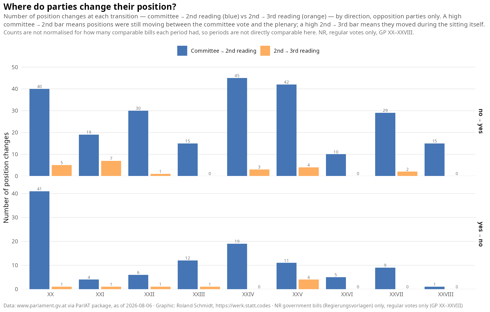
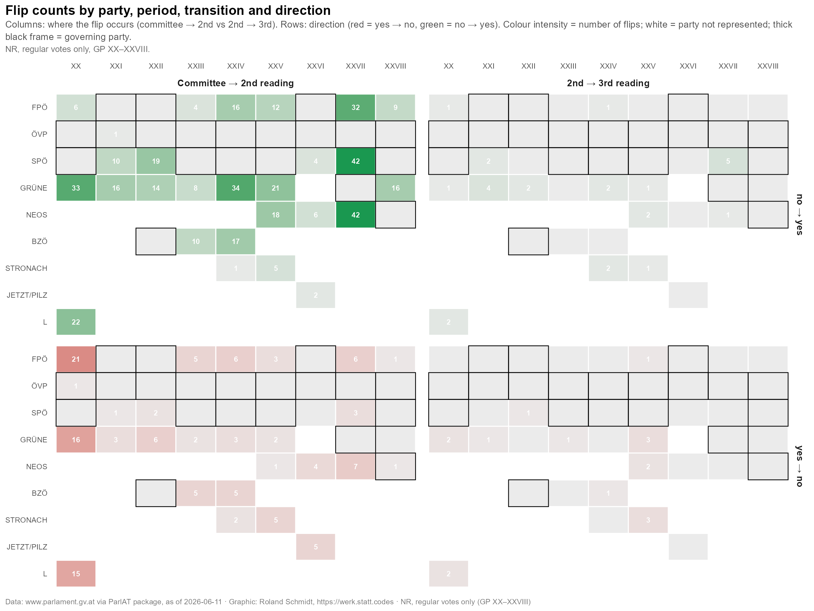
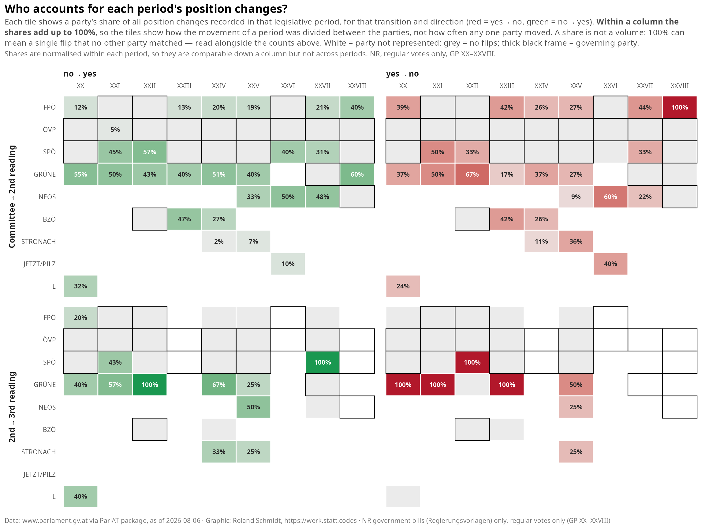
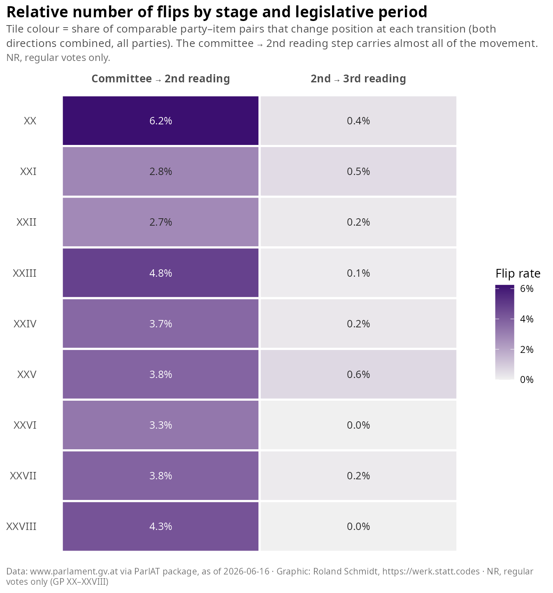
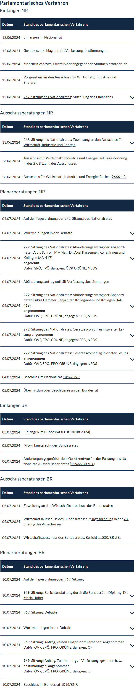
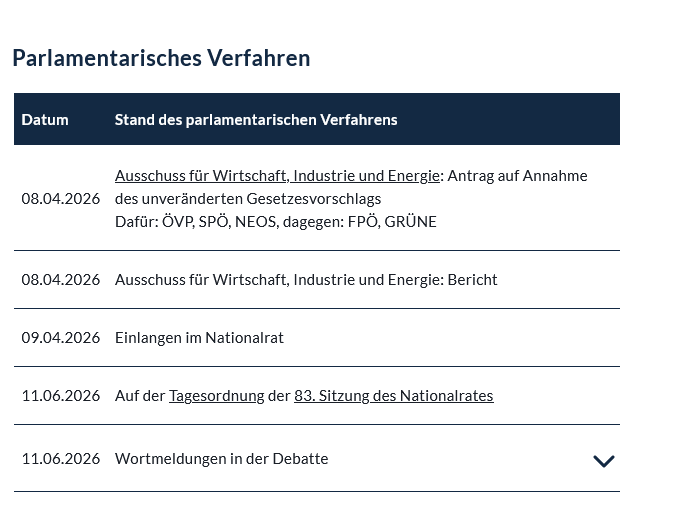

# Just the results, please {.unnumbered}

::: {layout-ncol="2"}
{group="voting_patterns_2_gallery"}

{group="voting_patterns_2_gallery"}

{group="voting_patterns_2_gallery"}

{group="voting_patterns_2_gallery"}
:::

# Context

In one of my last posts, I showcased how the {ParlAT} package offers some simple, yet powerful means to analyze voting behavior of parties in the Austrian National Council. The analysis detailed how parties voted (for or against) and on the frequency of party-combinations, i.e. how often e.g. party A voted with party B. All of the presented analysis dealt with the votes in the third reading, that's at the last stage of the legislative procedure in the National Council.

In this post I want to expand the analysis beyond the third reading and include the earlier stages of the legislative process in the National Council as well: the committee (Ausschuss), the second reading and the third reading. While doing this my interest is not so much how a party voted at a specific stage, but more on whether and *how often party positions on a legislative item actually changed over the course of the different stages within the National Council*. With this general interest a number of other questions lend themselves for answering:

- how do parties differ when it comes to their frequency on changing their voting position over the course of different stages?
- between which stages (committee → second reading, second → third reading) do the most changes happen?
- during which government can we observe most vote changes?

On a conceptual level, I believe that answering these questions can contribute to a better understanding of how government parties respond to opposition demands. Strictly speaking, a change of vote could also simply mean that an opposition party changed its mind after further consideration. While that is possible, it is unlikely; in most cases a change of an opposition party's vote means that the party got something in return. Whether this was indeed a change in the content of the bill at stake, or on another, unrelated issue, can't be answered without looking into the details of the specific item. But retrieving these numbers is a first step.

Two conceptual notes of caution:

- **Absolute numbers can mislead.** For a flip from no to yes to materialize we need to have a 'no' in the first place. If there never was a 'no', i.e. if a bill enjoyed unanimous support from the start, there cannot be any flip either. But in that case, the absence of a flip obviously does not indicate a lack of government responsiveness.
- **Legislative periods aren't directly comparable.** Different legislative periods have different legislative items at play, and these may vary in their level of contestation, i.e. how difficult it is for government and opposition parties to find common ground. Not every legislative period brings up items of similar levels of contestation.

# Set-up

Get the necessary packages. In addition, I define here a small helper function which gives all reactable tables in this post a consistent look (title, optional subtitle, and a source note at the bottom), so I don't have to repeat the same styling code over and over again.

```{r}
#| label: setup
#| code-summary: "Load packages"
library(ParlAT)
library(tidyverse)
library(furrr)
library(reactable)
library(reactablefmtr)
library(naniar)
library(ggtext)
library(patchwork)
library(ggalluvial)

# shared table theme and attribution footer for all reactable tables
compact_table_theme <- reactablefmtr::fivethirtyeight(font_size = 12)
table_source <- reactablefmtr::html(
  "<span style='font-size:8pt;color:grey30;font-family:Segoe UI !important;line-height:0.5'>Source: www.parlament.gv.at. Analysis: Roland Schmidt - @zoowalk.bsky.social - https://werk.statt.codes</span>"
)

# helper that wraps any reactable with a consistent title, optional subtitle, and source footer
style_reactable_table <- function(table, title, subtitle = NULL) {
  styled_table <- table %>%
    reactablefmtr::add_title(
      title = reactablefmtr::html(paste0(
        "<span style='font-size:12pt;'>",
        title,
        "</span>"
      ))
    )

  if (!is.null(subtitle)) {
    styled_table <- styled_table %>%
      reactablefmtr::add_subtitle(
        subtitle = reactablefmtr::html(paste0(
          "<span style='font-size:10pt;line-height:0.5;'>",
          subtitle,
          "</span>"
        )),
        font_color = "grey30",
        font_weight = "normal",
        font_style = "italic"
      )
  }

  styled_table %>%
    reactablefmtr::add_source(source = table_source)
}
```

# Get Data

## Data on the readings

This section assembles the first half of the dataset: the bills themselves and the stage data recorded on their own pages, which is where the second- and third-reading votes live. The other half — the committee vote, which as we'll see is *not* recorded there — follows in the next section, and the two are brought together after that.

### Query the items

As in the previous post, let's start by getting all items ('Verhandlungsgegenstände') of the National Council for the legislative periods 20 to 28. With {ParlAT}.

```{r}
#| label: fetch-items
#| code-summary: "Fetch National Council items and cache them"
#| cache: true
#| eval: false
# fetch all NR items for legislative periods 20–28 (GP XX through XXVIII)
items_20_28 <- seq(20, 28) %>%
  map(., \(x) get_items(legis_period = x, institution = "NR")) %>%
  list_rbind() # stack per-period tibbles into one dataframe
nrow(items_20_28)
```

```{r}
#| label: load-items-cache
#| include: false
# readr::write_rds(
#   items_20_28,
#   here::here(
#     "posts",
#     "2026-06-08-ParlAT-votingPatterns-2",
#     "_data",
#     "items_20_28.rds"
#   )
# )
items_20_28 <- readr::read_rds(here::here(
  "posts",
  "2026-06-08-ParlAT-votingPatterns-2",
  "_data",
  "items_20_28.rds"
))
```

### Keep items of interest

The `get_items()` call returned all (!) items, but not every item type is actually subject to a vote in a reading. Below I filter for those types which are: motions ('Anträge'), government bills ('Regierungsvorlagen'), budget-related items, and a few others. In case I missed any relevant category here, please let me know.

```{r}
#| label: define-item-scope
#| code-summary: "Select legislative item types"
# A=Anträge, RV=Regierungsvorlagen, BUA/GABR/BRA=budget-related, EBR=EU items
# anchored patterns (^A$, ^EBR$) prevent partial matches against longer codes
items_select <- c("^A$", "RV", "BUA", "GABR", "GABR13", "BRA", "^EBR$") %>%
  paste0(., collapse = "|")

items_scope <- items_20_28 %>%
  filter(str_detect(type_doc, regex(items_select)))

# verify which long-form type labels the regex actually matched. Note that the
# unanchored RV/GABR patterns also match variants (RVEU, RVS, GABR13, …); these
# pass the type filter but rarely carry a standard reading vote, so they drop out
# downstream. The graph caption is therefore built later, from the item types that
# actually survive into the analysis (see the votes-wide section).
items_scope %>%
  count(type_doc_long, type_doc, sort=T) %>%
  mutate(rel=n/sum(n))
```

### Query the stages

Now let's feed the URLs of the obtained items to `get_item_details()`, this time with the `stages` parameter set to `TRUE`. The stages data contains one row per procedural step of an item, and — crucially for this post — the description of each voting step. As in the previous post, I wrap the function call in purrr's `safely()` to collect any potential errors without breaking the loop, and use `future_map()` to query the API with multiple workers simultaneously, i.e. to speed up the process.

```{r}
#| label: fetch-item-details
#| code-summary: "Fetch item details with stages and cache them"
#| cache: true
#| eval: false
plan(multisession, workers = 4) # parallelise across 4 cores to speed up API fetching

item_urls <- items_scope %>%
  pull(item_url)

# wrap in safely() so a single failed request returns an error slot instead of halting the loop
safe_get_item_details <- safely(get_item_details)

item_details_raw <- item_urls %>%
  future_map(
    \(x) {
      safe_result <- safe_get_item_details(item_url = x, stages = TRUE)
      safe_result$item_url <- x # attach URL so failed results can be identified later
      safe_result
    },
    .progress = TRUE,
    .options = furrr_options(packages = c("ParlAT", "purrr", "tibble"))
  )
```

```{r}
#| label: load-item-details-cache
#| eval: true
#| include: false
# persist the raw fetch results so re-renders don't need to re-hit the API
# readr::write_rds(
#   item_details_raw,
#   here::here(
#     "posts",
#     "2026-06-08-ParlAT-votingPatterns-2",
#     "_data",
#     "item_details_raw.rds"
#   )
# )

plan(sequential) # reset to single-threaded after parallel fetch

# reload from disk so the object is available in non-eval (cached) renders
item_details_raw <- readr::read_rds(here::here(
  "posts",
  "2026-06-08-ParlAT-votingPatterns-2",
  "_data",
  "item_details_raw.rds"
))
```

### Prepare stages data

Below, I a) check for any failed calls, and b) combine the successful calls into a single data frame. Subsequently, I unnest the stages column so that we get one row per procedural step per item. Note that at this point the data frame still contains *all* stage rows for each item — also those without any vote. Filtering for the actual votes comes next.

```{r}
#| label: prepare-stages-data
#| code-summary: "Combine successful fetches and unnest stages into one row per step"
# collect items where the API call failed; conditionMessage() extracts the error string
failed_items <- item_details_raw |>
  keep(\(x) !is.null(x$error)) |>
  map(\(x) tibble(item_url = x$item_url, error = conditionMessage(x$error))) |>
  list_rbind()
failed_items

# keep only successful results and extract the nested $result element
item_details <- item_details_raw |>
  keep(\(x) is.null(x$error)) |>
  map("result") |>
  list_rbind()

# unnest stages into one row per stage per item
item_stages <- item_details |>
  select(
    item_url,
    legis_period,
    type_doc,
    title,
    item_number,
    status_number,
    status_description,
    stages,
    votes
  ) |>
  filter(map_lgl(stages, \(x) !is.null(x))) |> # drop items with no stage data at all
  unnest(stages) %>%
  mutate(stage_date = lubridate::dmy(stage_date))

# used in inline text and table subtitles throughout the document
data_cutoff <- max(item_stages$stage_date)
```

The image below is from the website of the Parliament and shows the details on the different stages of one specific bill — the same kind of information we just retrieved with the code chunk above. Two things are worth flagging up front. First, at this point we have data on **all** stages, not only voting results; rows we're not interested in still need to be dropped. Second, the stage data does not contain any info on the committee's own vote — that lives in a different entry, the one belonging to the committee's report on the bill.

To make this concrete, the worked example below follows one specific bill end to end, through every transformation step in this post: an earlier amendment to the Erneuerbaren-Ausbau-Gesetz (the renewable-energy-expansion act), decided in 2024. It's a good running example precisely because it isn't a straightforward case — the FPÖ moves from opposing it in committee to supporting it by the second reading, and the SPÖ opposes it through the second reading before coming around at the third — so we'll be able to watch both kinds of position change appear in the data as the pipeline builds up. Querying the bill's own page with `get_item_details(stages = TRUE)` returns the stages shown in the screenshot and table below — but, as just noted, nothing about the committee's vote. That vote lives on the separate committee-report page shown in the second screenshot, which the next section turns to.

::: {.column-margin}

:::

::: {.column-margin}

:::

```{r}
#| label: example-item-stages-table
#| code-summary: "Show every recorded stage for the example item as a reactable table"
# the one bill this post follows end to end through every transformation step below
example_item_url <- "https://www.parlament.gv.at/gegenstand/XXVII/I/2608"

# list columns (speeches, votes) are all NA for this item at the stage level;
# collapse them to character so reactable can render every column
item_stages_example <- get_item_details(item_url = example_item_url, stages = T) %>%
  select(
    item_url,
    legis_period,
    type_doc,
    title,
    item_number,
    status_number,
    status_description,
    stages,
    votes
  ) |>
  filter(map_lgl(stages, \(x) !is.null(x))) |> # drop items with no stage data at all
  unnest(stages) %>%
  mutate(stage_date = lubridate::dmy(stage_date)) %>%
  mutate(across(where(is.list), \(x) map_chr(x, toString)))

item_stages_example_table <- reactable(
  item_stages_example,
  columns = list(
    title = colDef(minWidth = 200, style = list(whiteSpace = "normal", lineHeight = "1.35")),
    stage_name = colDef(minWidth = 320, style = list(whiteSpace = "normal", lineHeight = "1.35"))
  ),
  fullWidth = TRUE,
  compact = TRUE,
  highlight = TRUE,
  outlined = TRUE,
  wrap = FALSE,
  pagination = FALSE,
  theme = compact_table_theme
) %>%
  style_reactable_table(
    "ALL RECORDED STAGES FOR THE EXAMPLE ITEM",
    paste0(
      "Every stage row and column for XXVII/I/2608 (Erneuerbaren-Ausbau-Gesetz, Änderung), no filtering. Data as of ",
      data_cutoff,
      "."
    )
  )

item_stages_example_table
```

```{r}
item_stages %>%
  filter(str_detect(title, regex("Erneuerbar"))) %>%
  distinct(item_url, title)
```

## Committee reports

### How much committee activity is actually a vote?

It is worth pausing on what the **bill's own page** records about its committee phase — because, as it turns out, surprisingly little of it is the actual vote. A committee does far more than decide on a bill: it requests written opinions (Stellungnahmen), sets deadlines (Fristsetzungen), refers items back, and so on. The table below breaks all of a bill's National Council committee stages down by type. The punchline: the formal **adoption vote** — the committee's decision on the bill, the part we actually want — appears on the bill's own page only rarely. That is exactly why the rest of this section goes after the committee reports and takes the committee vote from *there* instead.

```{r}
#| label: committee-context-summary
#| code-summary: "Categorise National Council committee stages and show the vote share"
# same vote-keyword set the scope filter below relies on
committee_vote_keywords <- "dafür|wechselnde Mehrheit|getrennte Abstimmung|namentliche Abstimmung|abgelehnt|mehrstimmig"

# classify every National Council committee stage by what it records
committee_stages <- item_stages %>%
  filter(phase == "Ausschussberatungen NR") %>%
  mutate(
    is_vote = str_detect(
      stage_name,
      regex(committee_vote_keywords, ignore_case = TRUE)
    ),
    category = case_when(
      str_detect(
        stage_name,
        regex("Antrag auf Annahme des", ignore_case = TRUE)
      ) ~ "Adoption vote on the bill",
      str_detect(
        stage_name,
        regex("Einholung einer Stellungnahme", ignore_case = TRUE)
      ) ~ "Opinion request (Stellungnahme)",
      str_detect(stage_name, regex("Fristsetzung", ignore_case = TRUE)) ~
        "Deadline motion (Fristsetzung)",
      is_vote ~ "Other vote",
      .default = "Non-vote / procedural"
    ),
    # only the adoption vote is carried into the analysis by the scope filter
    in_scope = category == "Adoption vote on the bill"
  )

# aggregate to one row per category with its share of all committee stages
committee_category_summary <- committee_stages %>%
  summarise(rows = n(), .by = c(category, in_scope)) %>%
  mutate(
    share = rows / sum(rows),
    in_analysis_scope = if_else(in_scope, "Yes", "No")
  ) %>%
  arrange(desc(rows)) %>%
  select(category, rows, share, in_analysis_scope)

committee_category_table <- reactable(
  committee_category_summary,
  columns = list(
    category = colDef(name = "Committee stage type", minWidth = 230),
    rows = colDef(
      name = "Stages",
      align = "right",
      minWidth = 90,
      format = colFormat(separators = TRUE)
    ),
    share = colDef(
      name = "Share of committee stages",
      minWidth = 230,
      align = "left",
      # data bars make the tiny vote share read at a glance against the procedural bulk
      cell = reactablefmtr::data_bars(
        committee_category_summary,
        max_value = 1,
        number_fmt = scales::label_percent(accuracy = 0.1),
        fill_color = "#1a9641",
        background = "#f0f0f0",
        text_position = "outside-end"
      )
    ),
    in_analysis_scope = colDef(
      name = "Adoption vote?",
      align = "center",
      minWidth = 130
    )
  ),
  fullWidth = TRUE,
  compact = TRUE,
  highlight = TRUE,
  outlined = TRUE,
  theme = compact_table_theme
) %>%
  style_reactable_table(
    "WHAT THE BILL'S OWN PAGE RECORDS ABOUT ITS COMMITTEE PHASE",
    paste0(
      "All committee stages recorded on the bills' own pages, by type — the adoption vote is the rarest of them. Data as of ",
      data_cutoff,
      "."
    )
  )

committee_category_table
```

Across all `r scales::comma(nrow(committee_stages))` committee stages recorded on the bills' own pages, only `r scales::percent(mean(committee_stages$is_vote), accuracy = 0.1)` record a vote at all, and just `r scales::percent(mean(committee_stages$in_scope), accuracy = 0.1)` are the bill-adoption vote — which is why the committee position has to come from the report instead. For reference, the table below lists the vote-bearing committee stages that *do* appear on the bills' own pages, each linked to its source.

```{r}
#| label: committee-vote-rows-table
#| code-summary: "List committee stages that record a vote, with links to the source"
committee_vote_rows <- committee_stages %>%
  filter(is_vote) %>%
  mutate(
    # strip the base URL and query string to a compact "XXVIII/I/403" style reference
    item_ref = item_url %>%
      str_remove("^https://www\\.parlament\\.gv\\.at/gegenstand/") %>%
      str_remove("\\?.*$"),
    in_analysis_scope = if_else(in_scope, "Yes", "No")
  ) %>%
  select(
    legis_period,
    item_ref,
    stage_date,
    stage_name,
    category,
    in_analysis_scope,
    item_url
  ) %>%
  arrange(desc(stage_date))

committee_vote_rows_table <- reactable(
  committee_vote_rows,
  columns = list(
    legis_period = colDef(
      name = "Legis. period",
      align = "right",
      minWidth = 90,
      filterable = TRUE
    ),
    item_ref = colDef(
      name = "Item",
      minWidth = 120,
      filterable = TRUE,
      # custom cell renderer turns the short reference into a clickable link
      cell = function(value, index) {
        htmltools::tags$a(
          href = committee_vote_rows$item_url[index],
          target = "_blank",
          value
        )
      }
    ),
    stage_date = colDef(
      name = "Stage date",
      align = "left",
      minWidth = 110,
      filterable = TRUE
    ),
    stage_name = colDef(
      name = "Stage",
      minWidth = 460,
      filterable = TRUE,
      style = list(whiteSpace = "normal", lineHeight = "1.35")
    ),
    category = colDef(name = "Type", minWidth = 180, filterable = TRUE),
    in_analysis_scope = colDef(
      name = "Adoption vote?",
      align = "center",
      minWidth = 100,
      filterable = TRUE
    ),
    item_url = colDef(show = FALSE) # kept for the cell renderer, hidden from display
  ),
  fullWidth = TRUE,
  compact = TRUE,
  highlight = FALSE,
  outlined = TRUE,
  searchable = TRUE,
  defaultPageSize = 10,
  theme = compact_table_theme
) %>%
  style_reactable_table(
    "COMMITTEE STAGES THAT RECORD A VOTE",
    paste0(
      "All 'Ausschussberatungen NR' stages containing a vote keyword. 'In scope?' marks the bill-adoption votes used in the analysis. Data as of ",
      data_cutoff,
      "."
    )
  )

committee_vote_rows_table
```

### Linking a report to its bill

Now let's fetch the example bill's companion report page the same way, with `get_item_details()`, and look at what it carries. Besides `stages`, every item — bill or report alike — also carries a `references` column: a list of typed cross-references to other legislative objects. That column is the entire mechanism this post relies on to link a committee vote back to its bill.

```{r}
#| label: example-item-references-table
#| code-summary: "Fetch the committee report's own page and show its references, incl. the Hauptgegenstand (HG) link back to the bill"
example_report_url <- "https://www.parlament.gv.at/gegenstand/XXVII/I/2666"

item_report_example <- get_item_details(
  item_url = example_report_url,
  stages = TRUE
)

item_references_example <- item_report_example %>%
  select(references) %>%
  unnest(references) %>%
  select(text, subject, zitation, url, art)

item_references_example_table <- reactable(
  item_references_example,
  columns = list(
    text = colDef(
      name = "Reference text",
      minWidth = 220,
      style = list(whiteSpace = "normal", lineHeight = "1.35")
    ),
    subject = colDef(
      name = "Subject",
      minWidth = 260,
      style = list(whiteSpace = "normal", lineHeight = "1.35")
    ),
    zitation = colDef(name = "Citation", minWidth = 100),
    url = colDef(name = "URL (relative)", minWidth = 220),
    art = colDef(name = "Type", minWidth = 70)
  ),
  fullWidth = TRUE,
  compact = TRUE,
  highlight = TRUE,
  outlined = TRUE,
  pagination = FALSE,
  theme = compact_table_theme
) %>%
  style_reactable_table(
    "REFERENCES CARRIED BY THE COMMITTEE REPORT (XXVII/I/2666)",
    "Every reference row on the report's own page. The row typed 'HG' (Hauptgegenstand, i.e. 'main subject') is the one this analysis keys on to link the report back to its bill."
  )

item_references_example_table

# resolve the HG row's relative url into the same absolute form item_url uses elsewhere
hg_parent_url <- item_references_example %>%
  filter(art == "HG") %>%
  mutate(parent_url = paste0("https://www.parlament.gv.at", url)) %>%
  pull(parent_url)

hg_parent_url
```

The report carries a single reference row here, typed `HG`. Its `url` resolves to `r hg_parent_url` — exactly the `item_url` of the bill's own stages table shown further above. That one row is the entire link between the two datasets: a committee report holds no bill-specific vote information anywhere else, and a bill's own page holds no back-reference to its report at all. `art` is how the Parliament's data model types these cross-references; besides `HG`, a report can also carry `MG` ('Mitgegenstand', a co-subject bundled into the same report) and, more rarely, `HGS`, `ZU` or `B` for other bundling or referral cases — but only `HG` is used as the match key below.

### Fetch the committee reports

With the link understood, we can go and get the reports themselves. The object holding the committee's adoption vote is the committee report (`Ausschussbericht`, type `AUB`): it carries the formal `Antrag auf Annahme des Gesetzesvorschlags` section (roughly 'Application for the acceptance of a bill'), which includes each party's vote, plus the `HG` reference back to the parent bill we just followed. So to capture committee votes properly, I fetch every committee report for periods 20–28, again with `stages = TRUE`.

```{r}
#| label: fetch-aub-details
#| code-summary: "Fetch all committee reports (Ausschussbericht) with stages and cache them"
#| cache: true
#| eval: false
aub_urls <- items_20_28 %>%
  filter(type_doc == "AUB") %>% # AUB = Ausschussbericht (committee report)
  pull(item_url) %>%
  unique()

plan(multisession, workers = 4)
safe_get_item_details <- safely(get_item_details)

aub_details_raw <- aub_urls %>%
  future_map(
    \(x) {
      safe_result <- safe_get_item_details(item_url = x, stages = TRUE)
      safe_result$item_url <- x
      safe_result
    },
    .progress = TRUE,
    .options = furrr_options(packages = c("ParlAT", "purrr", "tibble"))
  )

plan(sequential)

aub_success_n <- sum(map_lgl(aub_details_raw, \(x) is.null(x$error)))
if (aub_success_n == 0) {
  stop(paste0(
    "All ", length(aub_details_raw),
    " committee-report requests failed; the existing AUB cache was not overwritten. ",
    "First error: ", conditionMessage(aub_details_raw[[1]]$error)
  ))
}

readr::write_rds(
  aub_details_raw,
  here::here("posts", "2026-06-08-ParlAT-votingPatterns-2", "_data", "aub_details_raw.rds")
)
```

```{r}
#| label: load-aub-cache
#| eval: true
#| include: false

aub_details_raw <- readr::read_rds(here::here(
  "posts",
  "2026-06-08-ParlAT-votingPatterns-2",
  "_data",
  "aub_details_raw.rds"
))

aub_success_n <- sum(map_lgl(aub_details_raw, \(x) is.null(x$error)))
if (aub_success_n == 0) {
  stop(paste0(
    "The AUB cache contains ", length(aub_details_raw),
    " failed requests and no usable committee-report data. ",
    "Re-run the 'fetch-aub-details' cell to rebuild it before rendering. ",
    "First cached error: ", conditionMessage(aub_details_raw[[1]]$error)
  ))
}
```

### Build committee votes from the reports

Now I turn the committee reports into usable committee votes. For each report I do two things: a) read its `stages` and keep the row whose `stage_name` matches `Antrag auf Annahme des Gesetzesvorschlags` (which holds the `Dafür`/`Dagegen` party split — the actual vote), and b) resolve its `references` to find the row typed `HG` and follow that row's `url` back to the parent bill, exactly as demonstrated above for XXVII/I/2666. That `HG` reference is the *only* link between a report and its bill anywhere in the data: there's no shared numeric ID between the two pages, and titles aren't guaranteed to match character-for-character either (reports sometimes shorten or reformat a bill's title), so `references$url` is the one connection actually worth trusting. The result is one committee-vote row per bill, carrying the parent bill's identifiers so it slots in alongside the second- and third-reading rows further down.

Two places let rows silently drop out of this link — `filter()` and `inner_join()` don't warn when they discard rows, so it's worth being explicit about both:

- **No resolvable `HG` reference.** A handful of reports have no references at all, or none typed `HG` — `aub_parent`'s `map_chr()` returns `NA` for these, and `aub_committee_stages` drops them via `filter(!is.na(parent_url))`.
- **The resolved parent isn't one of our own bills.** Even once a report resolves an `HG` url, that url has to match an `item_url` already present in `parent_meta` — i.e. a bill we actually fetched and kept in scope earlier in this post. `committee_rows`'s `inner_join(parent_meta, ...)` drops any report whose parent isn't found there — for instance a bill whose item type fell outside the "Keep items of interest" filter at the very start.

```{r}
#| label: prepare-committee-votes
#| code-summary: "Extract committee votes from reports and link them to the parent bill"
# successful report fetches; retain the requested URL if an older cached result
# does not yet include the normalised item_url column
aub_details <- aub_details_raw |>
  keep(\(x) is.null(x$error)) |>
  map(\(x) {
    result <- x$result
    if (!"item_url" %in% names(result)) {
      result$item_url <- x$item_url
    }
    result
  }) |>
  list_rbind()

# link each report to its parent bill via the reference flagged "HG" (Hauptgegenstand)
aub_parent <- aub_details |>
  transmute(
    aub_url = item_url,
    parent_url = map_chr(references, \(r) {
      if (is.null(r) || !is.data.frame(r) || nrow(r) == 0) {
        return(NA_character_)
      }
      hg <- r[!is.na(r$art) & r$art == "HG", , drop = FALSE]
      if (nrow(hg) == 0) {
        return(NA_character_)
      }
      paste0("https://www.parlament.gv.at", hg$url[1])
    })
  )

# the committee's adoption-vote stage(s) from each report, linked to the parent bill
aub_committee_stages <- aub_details |>
  select(aub_url = item_url, stages) |>
  filter(map_lgl(stages, \(x) !is.null(x))) |>
  unnest(stages) |>
  filter(str_detect(
    stage_name,
    regex("Antrag auf Annahme des", ignore_case = TRUE)
  )) |>
  mutate(stage_date = lubridate::dmy(stage_date)) |>
  left_join(aub_parent, by = "aub_url") |>
  filter(!is.na(parent_url))

# parent bill's item-level fields, so committee rows line up with the reading rows
parent_meta <- item_stages |>
  distinct(
    item_url,
    legis_period,
    type_doc,
    title,
    item_number,
    status_number,
    status_description
  )

# one committee row per bill (keep the latest adoption vote if a report has several)
committee_rows <- aub_committee_stages |>
  inner_join(parent_meta, by = c("parent_url" = "item_url")) |>
  transmute(
    item_url = parent_url,
    legis_period,
    type_doc,
    title,
    item_number,
    status_number,
    status_description,
    stage_date,
    stage_name,
    phase = "Ausschussbericht",
    reading = "committee"
  ) |>
  slice_max(stage_date, n = 1, by = item_url, with_ties = FALSE)

nrow(committee_rows) # committee votes available to merge with the readings
```

Here's what that produces for our running example: a single committee-vote row for XXVII/I/2608, carrying the adoption-vote text straight from its report — the `Dagegen` list on this row is exactly where the FPÖ's committee-stage opposition (before it flips at the second reading) comes from.

```{r}
#| label: example-committee-vote
#| code-summary: "Show the committee vote row retrieved for the example item"
example_committee_row <- committee_rows %>%
  filter(item_url == example_item_url) %>%
  select(title, stage_date, stage_name, reading)

example_committee_row_table <- reactable(
  example_committee_row,
  columns = list(
    title = colDef(name = "Title", minWidth = 200, style = list(whiteSpace = "normal", lineHeight = "1.35")),
    stage_date = colDef(name = "Stage date", minWidth = 110),
    stage_name = colDef(
      name = "Stage text (raw)",
      minWidth = 420,
      style = list(whiteSpace = "normal", lineHeight = "1.35")
    ),
    reading = colDef(name = "Reading", minWidth = 100)
  ),
  fullWidth = TRUE,
  compact = TRUE,
  highlight = TRUE,
  outlined = TRUE,
  pagination = FALSE,
  theme = compact_table_theme
) %>%
  style_reactable_table(
    "COMMITTEE VOTE RETRIEVED FOR THE EXAMPLE ITEM",
    "The single row committee_rows carries for XXVII/I/2608 — built from the report XXVII/I/2666 via the HG link shown above."
  )

example_committee_row_table
```

The counts below quantify how many reports survive each step of that `HG` link, computed live from the objects built above.

```{r}
#| label: committee-match-funnel
#| code-summary: "Quantify how many committee reports survive each step of the HG match"
funnel_reports_total <- nrow(aub_details)

funnel_reports_with_adoption_stage <- aub_details |>
  select(aub_url = item_url, stages) |>
  filter(map_lgl(stages, \(x) !is.null(x))) |>
  unnest(stages) |>
  filter(str_detect(
    stage_name,
    regex("Antrag auf Annahme des", ignore_case = TRUE)
  )) |>
  pull(aub_url) |>
  n_distinct()

funnel_reports_with_hg <- aub_committee_stages |>
  pull(aub_url) |>
  n_distinct()

funnel_reports_matched_bill <- aub_committee_stages |>
  inner_join(parent_meta, by = c("parent_url" = "item_url")) |>
  pull(aub_url) |>
  n_distinct()

match_funnel <- tribble(
  ~step, ~n_reports,
  "Committee reports fetched", funnel_reports_total,
  "...with a recorded adoption-vote stage", funnel_reports_with_adoption_stage,
  "...with a resolvable HG reference to a parent bill", funnel_reports_with_hg,
  "...whose parent bill is in our own scope (inner_join)", funnel_reports_matched_bill,
  "Final committee_rows (after keeping the latest vote per bill)", nrow(committee_rows)
)

match_funnel_table <- reactable(
  match_funnel,
  columns = list(
    step = colDef(name = "Step", minWidth = 340),
    n_reports = colDef(
      name = "Reports",
      align = "right",
      format = colFormat(separators = TRUE)
    )
  ),
  fullWidth = TRUE,
  compact = TRUE,
  highlight = TRUE,
  outlined = TRUE,
  pagination = FALSE,
  theme = compact_table_theme
) %>%
  style_reactable_table(
    "HOW MANY COMMITTEE REPORTS SURVIVE THE MATCH TO A BILL",
    paste0(
      "Each row narrows the previous one; the gap between rows is exactly where reports get dropped. Data as of ",
      data_cutoff,
      "."
    )
  )

match_funnel_table
```

## Combine committee votes with the readings

The committee votes are ready, one clean row per bill. The reading votes are not: the stage data fetched back in *Data on the readings* still holds **every** procedural step, votes and non-votes alike. So this section does two things — narrow that stage data down to the actual reading votes, and then **bind the two sides together** into the finalized dataset the rest of this post analyzes.

### Scope the ordinary readings

First the narrowing. I reduce the bills' own second- and third-reading stages down to just the rows where a vote was actually cast — a finished, vote-rows-only dataset for the "ordinary" readings. Along the way, two new columns are added: `reading` records the stage — committee, second, or third reading (or, in some cases, second and third at once) — and `vote_report_type` captures *how* the vote result is reported in the stage description. The latter matters more than one might think: only stages with an explicit 'Dafür:.../Dagegen:...' pattern (which I label 'regular') state each party's position; other formats such as 'wechselnde Mehrheit' or 'namentliche Abstimmung' don't allow extracting party positions from the stage text alone.

```{r}
#| label: scope-items-ordinary
#| code-summary: "Filter to NR readings and vote-outcome text — the ordinary, committee-free dataset"
items_scope_ordinary <- item_stages |>
  filter(str_detect(phase, regex("NR"))) %>% # keep only National Council (NR) phases
  # plenary 2nd/3rd readings from the bill's own stages
  # r? makes the pattern match both "zweite"/"zweiter" and "dritte"/"dritter"
  filter(str_detect(stage_name, "(dritter?|zweiter?) Lesung")) %>%
  mutate(
    reading = case_when(
      # some items combine both readings into a single stage entry
      str_detect(stage_name, regex("zweite")) &
        str_detect(stage_name, regex("dritte")) ~ "second & third",
      str_detect(stage_name, regex("zweite")) ~ "second",
      str_detect(stage_name, regex("dritte")) ~ "third",
      .default = NA_character_
    )
  ) %>%
  # keep only stages that contain actual vote-outcome text — this is now a finished,
  # vote-rows-only dataset for the ordinary (non-committee) readings
  filter(str_detect(
    stage_name,
    regex(
      "dafür|wechselnde Mehrheit|getrennte Abstimmung|namentliche Abstimmung|abgelehnt|mehrstimmig",
      ignore_case = T
    )
  ))

nrow(items_scope_ordinary) # finished, committee-free vote dataset
```

For our running example, `items_scope_ordinary` now holds exactly the second- and third-reading rows — nothing else, and no committee row yet.

```{r}
#| label: example-vote-rows-ordinary
#| code-summary: "Show the example item's rows in the finished, committee-free vote dataset"
example_vote_rows_ordinary <- items_scope_ordinary %>%
  filter(item_url == example_item_url) %>%
  select(title, stage_date, reading, stage_name)

example_vote_rows_ordinary_table <- reactable(
  example_vote_rows_ordinary,
  columns = list(
    title = colDef(name = "Title", minWidth = 180, style = list(whiteSpace = "normal", lineHeight = "1.35")),
    stage_date = colDef(name = "Stage date", minWidth = 110),
    reading = colDef(name = "Reading", minWidth = 90),
    stage_name = colDef(
      name = "Stage text (raw)",
      minWidth = 420,
      style = list(whiteSpace = "normal", lineHeight = "1.35")
    )
  ),
  fullWidth = TRUE,
  compact = TRUE,
  highlight = TRUE,
  outlined = TRUE,
  pagination = FALSE,
  theme = compact_table_theme
) %>%
  style_reactable_table(
    "EXAMPLE ITEM: VOTE ROWS BEFORE COMMITTEE IS BROUGHT IN",
    "XXVII/I/2608's rows in items_scope_ordinary \u2014 second and third reading only, committee not yet merged."
  )

example_vote_rows_ordinary_table
```

### Bind on the committee votes

Now the merge. `committee_rows` is already vote-rows-only by construction (see *Build committee votes from the reports* above — only the adoption-vote stage was ever kept), and `items_scope_ordinary` has just been reduced to vote rows too. Since both sides are independently down to actual votes, binding them together needs no further filtering afterward. The committee step is the bill's first formal vote, taken before it reaches the plenary floor; including it lets us follow an item across three stages instead of two. `vote_report_type` is classified on the combined table, and the result is the finalized dataset the rest of this post analyzes.

```{r}
#| label: scope-items
#| code-summary: "Bind on committee votes and classify vote report type"
items_scope <- items_scope_ordinary %>%
  bind_rows(committee_rows) %>%
  mutate(
    # classify how the vote result is reported; order matters — "regular" must come first
    # because some stage names contain both "dafür" and other keywords
    vote_report_type = case_when(
      # "regular" requires the explicit Dafür:/Dagegen: party-list separator the parser
      # keys on; parenthetical forms like "mehrstimmig (dafür S,V dagegen F)" fall through
      str_detect(stage_name, regex("dafür", ignore_case = T)) &
        str_detect(stage_name, regex("dagegen", ignore_case = T)) &
        str_detect(
          stage_name,
          regex(",\\s*dagegen:|\\.\\s*Dagegen:", ignore_case = T)
        ) ~ "regular",
      str_detect(
        stage_name,
        regex("wechselnde Mehrheit", ignore_case = T)
      ) ~ "wechselnde Mehrheit",
      str_detect(
        stage_name,
        regex("namentliche Abstimmung", ignore_case = T)
      ) ~ "namentliche Abstimmung",
      str_detect(
        stage_name,
        regex("getrennte Abstimmung", ignore_case = T)
      ) ~ "getrennte Abstimmung",
      str_detect(stage_name, regex("abgelehnt", ignore_case = T)) ~ "abgelehnt",
      str_detect(
        stage_name,
        regex("mehrstimmig", ignore_case = T)
      ) ~ "mehrstimmig",
      .default = NA
    )
  )

nrow(items_scope)
nrow(item_stages)
```

And here's the payoff for our running example: the finalized, merged view — committee, second and third reading side by side for the same bill.

```{r}
#| label: example-vote-rows-combined
#| code-summary: "Show the example item's rows in the finalized, merged dataset"
example_vote_rows_combined <- items_scope %>%
  filter(item_url == example_item_url) %>%
  select(reading, stage_date, vote_report_type, stage_name) %>%
  arrange(factor(reading, levels = c("committee", "second", "third")))

example_vote_rows_combined_table <- reactable(
  example_vote_rows_combined,
  columns = list(
    reading = colDef(name = "Reading", minWidth = 90),
    stage_date = colDef(name = "Stage date", minWidth = 110),
    vote_report_type = colDef(name = "Vote report type", minWidth = 130),
    stage_name = colDef(
      name = "Stage text (raw)",
      minWidth = 420,
      style = list(whiteSpace = "normal", lineHeight = "1.35")
    )
  ),
  fullWidth = TRUE,
  compact = TRUE,
  highlight = TRUE,
  outlined = TRUE,
  pagination = FALSE,
  theme = compact_table_theme
) %>%
  style_reactable_table(
    "EXAMPLE ITEM: FINALIZED, MERGED VOTE DATASET",
    "XXVII/I/2608's rows in the final items_scope \u2014 committee, second and third reading together. This is the dataset the rest of this post analyzes."
  )

example_vote_rows_combined_table
```

```{r}
#| label: vote-report-type-distribution
#| code-summary: "Inspect the distribution of vote reporting types"
items_scope %>%
  count(vote_report_type, sort = T) %>%
  mutate(rel = n / sum(n) * 100)
```

### Check for duplicate stage rows

Time for a *data sanity check*. Now that the analysis spans up to three stages — committee, second reading and third reading — an item no longer needs to have a fixed number of rows. What it *should* have, however, is at most one row per stage: a single committee vote, a single second-reading vote, a single third-reading vote. Any item with more than one row for the same stage points to a data inconsistency (duplicates in the source, or an item that was approved/rejected twice within one stage). Let's see how many such cases there are.

```{r}
#| label: check-pairs
#| code-summary: "Identify items with duplicate vote rows within a stage"
# each item should have at most one row per stage (committee / second / third)
dup_rows <- items_scope %>%
  count(legis_period, item_url, reading, name = "n_rows") %>%
  filter(n_rows > 1) # flag any item+stage combination that occurs more than once
n_distinct(dup_rows$item_url)
```

There are `r n_distinct(dup_rows$item_url)` items out of `r n_distinct(items_scope$item_url)` which feature more than one row for the same stage.

To facilitate a closer look at these cases, the table below lists the deviating items with their individual vote-stage rows. Each item is linked to its page on the parliament's website, so you can check the underlying records yourself.

```{r}
#| label: non-pairs-table
#| code-summary: "Build reactable table of items with duplicate vote rows in a stage"
# limit to only the offending items so the table stays focused
non_pairs_details <- items_scope %>%
  semi_join(dup_rows, by = c("legis_period", "item_url")) %>%
  distinct() %>%
  select(
    legis_period,
    item_url,
    stage_date,
    stage_name,
    vote_report_type
  ) %>%
  mutate(n_obs = n(), .by = c("legis_period", "item_url"))

non_pairs_details_display <- non_pairs_details %>%
  arrange(desc(n_obs), legis_period, item_url, stage_date) %>%
  mutate(
    # strip the base URL and query string to get a compact "XXVIII/I/403" style reference
    item_ref = item_url %>%
      str_remove("^https://www\\.parlament\\.gv\\.at/gegenstand/") %>%
      str_remove("\\?.*$")
  ) %>%
  select(
    legis_period,
    item_ref,
    stage_date,
    stage_name,
    vote_report_type,
    n_obs,
    item_url
  )

non_pairs_details_table <- reactable(
  non_pairs_details_display,
  columns = list(
    legis_period = colDef(
      name = "Legis. period",
      align = "right",
      minWidth = 90,
      filterable = TRUE
    ),
    item_ref = colDef(
      name = "Item",
      minWidth = 125,
      filterable = TRUE,
      # custom cell renderer turns the short reference into a clickable link
      cell = function(value, index) {
        htmltools::tags$a(
          href = non_pairs_details_display$item_url[index],
          target = "_blank",
          value
        )
      }
    ),
    stage_date = colDef(
      name = "Stage date",
      align = "left",
      minWidth = 110,
      filterable = TRUE
    ),
    stage_name = colDef(
      name = "Stage",
      minWidth = 540,
      filterable = TRUE,
      style = list(whiteSpace = "normal", lineHeight = "1.35")
    ),
    vote_report_type = colDef(
      name = "Vote report type",
      minWidth = 155,
      filterable = TRUE
    ),
    n_obs = colDef(
      name = "Rows per item",
      align = "right",
      minWidth = 130,
      format = colFormat(digits = 0)
    ),
    item_url = colDef(show = FALSE) # kept in data for the cell renderer above, hidden from display
  ),
  fullWidth = TRUE,
  compact = TRUE,
  highlight = FALSE,
  outlined = TRUE,
  searchable = TRUE,
  defaultPageSize = 10,
  defaultSorted = "n_obs",
  defaultSortOrder = "desc",
  theme = compact_table_theme
) %>%
  style_reactable_table(
    "ITEMS WITH DUPLICATE VOTE ROWS IN A STAGE",
    paste0(
      "Items with more than one vote row for the same stage (committee, second or third reading). Data as of ",
      data_cutoff,
      "."
    )
  )

non_pairs_details_table
```

As it turns out, some are duplicates in the data source — see for instance [XX/I/1530](https://www.parlament.gv.at/gegenstand/XX/I/1530?selectedStage=105), where the votes in the second and third reading are simply reported twice. Others appear multiple times because an item was partly approved and partly rejected within one single reading, and hence got two rows in the data source, as in [XXVIII/I/403](https://www.parlament.gv.at/gegenstand/XXVIII/I/403).

Rather than trying to repair these inconsistencies one by one, I simply remove the affected items from the analysis. Subsequently, I narrow the data down to items with a 'regular' vote report — and since this filter can itself re-introduce a duplicate-free-but-now-inconsistent state, I check for and remove duplicate stage rows once more. The last line below shows which share of the original vote stages survives all these filters.

```{r}
#| label: filter-pairs
#| code-summary: "Remove items with duplicate stage rows, keep regular vote type only"
# drop items that had duplicate rows within a stage; only clean items remain
items_scope_pairs <- items_scope %>%
  anti_join(., dup_rows, by = c("legis_period", "item_url"))
nrow(items_scope_pairs)

# sanity check: no item should now have more than one row per stage
items_scope_pairs %>%
  count(legis_period, item_url, reading, name = "n_rows") %>%
  filter(n_rows > 1) %>%
  nrow()

table(items_scope_pairs$reading)

# this analysis focuses only on "regular" votes (explicit Dafür/Dagegen party lists)
items_scope_pairs_regular <- items_scope_pairs %>%
  filter(vote_report_type == "regular")

# re-check after the regular filter: filtering by type can leave residual duplicates
dup_rows2 <- items_scope_pairs_regular %>%
  count(legis_period, item_url, reading, name = "n_rows") %>%
  filter(n_rows > 1)

items_scope_pairs_regular <- items_scope_pairs_regular %>%
  anti_join(., dup_rows2, by = c("legis_period", "item_url"))

nrow(items_scope_pairs)
nrow(items_scope_pairs_regular)
nrow(items_scope_pairs_regular) / nrow(items_scope) # share of all vote stages covered
```

## Extract votes

Now to the heart of the matter: getting each party's position out of the stage description. The text follows (mostly) the pattern 'Dafür: party A, party B, dagegen: party C', so the function below splits the string at the 'dagegen' boundary and cleans up both sides. Two details are worth mentioning: first, I keep only tokens which appear in a predefined list of valid party labels — this guards against vote counts, footnotes and other non-party fragments sneaking into the results. Second, since party labels changed over the legislative periods (e.g. the FPÖ appearing as 'F' in earlier periods), a small helper maps the historical variants onto one canonical name per party.

```{r}
#| label: define-vote-extractor
#| code-summary: "Define party normalisation and Dafür/Dagegen vote text parser"
# includes historical aliases (F, NEOS-LIF, F-BZÖ, S/V/N/G single-letter forms)
# alongside canonical modern names; used as an allowlist to filter out non-party tokens
valid_parties <- c(
  "SPÖ",
  "ÖVP",
  "F",
  "FPÖ",
  "GRÜNE",
  "L",
  "BZÖ",
  "STRONACH",
  "NEOS",
  "NEOS-LIF",
  "F-BZÖ",
  "JETZT",
  "PILZ",
  "NEOS/NEOS-LIF",
  "JETZT/PILZ",
  "S",
  "V",
  "N",
  "G"
)

# maps historical/transitional party labels to a single canonical name per party
normalise_party <- function(party) {
  case_when(
    party %in% c("NEOS-LIF", "NEOS/NEOS-LIF") ~ "NEOS",
    party %in% c("JETZT", "PILZ", "JETZT/PILZ") ~ "JETZT/PILZ",
    party == "F" ~ "FPÖ",
    party == "F-BZÖ" ~ "BZÖ",
    party == "S" ~ "SPÖ",
    party == "V" ~ "ÖVP",
    party == "N" ~ "NEOS",
    party == "G" ~ "GRÜNE",
    TRUE ~ party
  )
}

fn_get_votes <- function(vt) {
  # inner helper: splits a raw comma-separated party string into a clean character vector
  clean_parties <- function(x) {
    if (is.na(x) || str_trim(x) == "-") {
      return(character(0))
    }

    x |>
      str_split(",\\s*") |>
      unlist() |>
      str_trim() |>
      str_remove("\\)+$") |> # strip trailing parentheses e.g. "SPÖ (Mehrheit)" -> "SPÖ"
      str_trim() |>
      # keep only all-caps tokens (party abbreviations); drops vote counts, notes, etc.
      keep(\(p) {
        str_detect(
          p,
          regex("^[[:upper:]ÄÖÜ]+(?:[-/][[:upper:]ÄÖÜ]+)*$")
        )
      }) |>
      keep(\(p) p %in% valid_parties) # final guard against unknown tokens
  }

  # some stage texts use ". Dagegen:" (period separator) instead of ", dagegen:"
  # normalise to a consistent comma form so the split below works in both cases
  vt_norm <- str_replace(
    vt,
    regex("\\.\\s*Dagegen:", ignore_case = TRUE),
    ", dagegen:"
  )

  # split at the dagegen boundary; n=2 prevents splitting inside party lists
  parts <- str_split(
    vt_norm,
    regex(",\\s*dagegen:", ignore_case = TRUE),
    n = 2
  )[[1]]

  if (length(parts) != 2) {
    stop("Regular vote text does not contain both Dafür and Dagegen parts.")
  }

  if (!str_detect(parts[1], regex("Dafür:", ignore_case = TRUE))) {
    stop("Regular vote text does not contain a Dafür part.")
  }

  # strip the "Dafür:" label and everything before it (dotall handles multi-line stage names)
  yes_raw <- parts[1] |>
    str_remove(regex("^.*Dafür:\\s*", dotall = TRUE, ignore_case = TRUE))

  no_raw <- parts[2]

  list(
    vote_yes = clean_parties(yes_raw),
    vote_no = clean_parties(no_raw)
  )
}
```

With the function defined, applying it to the data is a one-liner. The result is a list column containing, for every vote stage, the vector of parties in favor and the vector of parties against.

```{r}
#| label: extract-votes
#| code-summary: "Apply vote parser to extract yes/no party lists per stage"
# parse each stage_name string into a list(vote_yes, vote_no) of party vectors
items_scope_pairs_regular <- items_scope_pairs_regular %>%
  mutate(votes_li = map(stage_name, fn_get_votes))
```

The list column is handy, but for the actual analysis a 'long' data frame is more convenient: one row per item, reading, and party, with two indicator columns recording whether the party voted in favor and/or against. The `summarise()` at the end collapses any remaining duplicate rows.

```{r}
#| label: votes-long
#| code-summary: "Expand to one row per party per stage (long format)"
items_scope_pairs_regular_long <- items_scope_pairs_regular %>%
  mutate(
    votes_party = map(votes_li, \(v) {
      yes_parties <- normalise_party(v$vote_yes)
      no_parties <- normalise_party(v$vote_no)

      # union ensures each party appears once per stage even if somehow listed in both sides
      tibble(
        party = union(yes_parties, no_parties),
        yes = as.integer(party %in% yes_parties),
        no = as.integer(party %in% no_parties)
      )
    })
  ) %>%
  unnest(votes_party) %>%
  select(
    item_url,
    legis_period,
    type_doc,
    title,
    item_number,
    status_number,
    status_description,
    stage_date,
    stage_name,
    reading,
    vote_report_type,
    party,
    yes,
    no
  ) %>%
  group_by(across(-c(yes, no))) %>%
  # collapse duplicate rows (e.g. from deduplication edge cases) by taking the maximum vote value
  summarise(
    yes = max(yes, na.rm = TRUE),
    no = max(no, na.rm = TRUE),
    .groups = "drop"
  )
```

To detect flips between stages, we need each stage side by side. Hence, let's pivot the long data frame into a wide format where each row is one item-party combination, with separate columns for the committee, second-reading and third-reading vote (`yes_committee`, `no_committee`, `yes_second`, `no_second`, `yes_third`, `no_third`). An `NA` in these columns means that the party has no recorded vote at that particular stage.

```{r}
#| label: votes-wide
#| code-summary: "Pivot to wide format with separate committee/second/third columns"
items_scope_pairs_regular_wide <- items_scope_pairs_regular_long %>%
  # drop "second & third" combined rows; keep committee + clean individual readings
  filter(reading %in% c("committee", "second", "third")) %>%
  filter(vote_report_type == "regular") %>%
  select(
    item_url,
    legis_period,
    type_doc,
    title,
    item_number,
    status_number,
    status_description,
    party,
    reading,
    vote_report_type,
    yes,
    no
  ) %>%
  # pivot so each row is one item × party with one yes_/no_ column per stage
  pivot_wider(
    id_cols = c(
      item_url,
      legis_period,
      type_doc,
      title,
      item_number,
      status_number,
      status_description,
      party
    ),
    names_from = reading,
    values_from = c(vote_report_type, yes, no),
    names_glue = "{.value}_{reading}",
    # NA fills indicate the party has no recorded vote for that particular reading
    values_fill = list(
      vote_report_type = NA_character_,
      yes = NA_integer_,
      no = NA_integer_
    )
  )

# graph caption: list only the item types that actually survive into the analysis
# (the type filter is broader, but several variants never carry a reading vote)
analysed_type_labels <- items_scope_pairs_regular_wide %>%
  distinct(type_doc) %>%
  left_join(distinct(items_20_28, type_doc, type_doc_long), by = "type_doc") %>%
  arrange(type_doc) %>%
  mutate(label = paste0(type_doc_long, " (", type_doc, ")")) %>%
  pull(label) %>%
  paste(collapse = ", ")

vote_graph_caption <- paste0(
  "Item types included ('Verhandlungsgegenstände'): ",
  analysed_type_labels,
  "<br>Data: www&#46;parlament.gv.at via ParlAT package, as of ",
  data_cutoff,
  "<br>Graphic: Roland Schmidt, https&#58;//werk.statt.codes | Bluesky: @zoowalk.bsky.social"
)
```

Speaking of `NA`s — before drawing any conclusions, it's worth checking how much missingness we are actually dealing with, and whether it is concentrated in particular legislative periods. The naniar package makes this a quick exercise.

```{r}
#| label: vis-missingness
#| code-summary: "Visualise missing values by legislative period"
# faceting by legis_period reveals whether missingness is period-specific or systemic
items_scope_pairs_regular_wide %>%
  naniar::vis_miss(facet = legis_period)
```

# Results

Where along an item's journey does a party actually change its mind — between the committee vote and the second reading, or between the second and the third reading? This is where the accommodation of opposition parties should become visible: if a governing majority makes concessions to win broader support, the resulting position changes should cluster at a particular stage. Below I prepare a tidy table of every transition and then work through it in four steps: the flip **rate** by legislative period, direction and party role; where flips concentrate by party, first as absolute counts and then as a share of comparable bills; and a compact summary of which stage carries most of the movement. A final section leaves the aggregates behind and lists the individual bills where a position actually changed.

A note on the denominator: a flip rate should be **conditional on the pairs that could actually flip**. A party that already voted *yes* at the earlier stage simply cannot flip *no → yes* — it was never at risk. So the directional rates below divide by the at-risk population only: the *no → yes* rate by the pairs voting *no* at the earlier stage, and the *yes → no* rate by those voting *yes* — not by all comparable pairs. (The absolute counts behind each bar are shown as labels.)

```{r}
#| label: prep-transitions
#| code-summary: "Build shared party/period/government lookups, then encode positions per stage and classify each transition's change"
# hand-coded coalition membership per legislative period (GP XX–XXVIII)
gov_parties_lookup <- tribble(
  ~legis_period , ~party ,
  "XX"          , "SPÖ"  , "XX"     , "ÖVP"   ,
  "XXI"         , "ÖVP"  , "XXI"    , "F"     ,
  "XXII"        , "ÖVP"  , "XXII"   , "F"     , "XXII"   , "F-BZÖ" ,
  "XXIII"       , "SPÖ"  , "XXIII"  , "ÖVP"   ,
  "XXIV"        , "SPÖ"  , "XXIV"   , "ÖVP"   ,
  "XXV"         , "SPÖ"  , "XXV"    , "ÖVP"   ,
  "XXVI"        , "ÖVP"  , "XXVI"   , "FPÖ"   ,
  "XXVII"       , "ÖVP"  , "XXVII"  , "GRÜNE" ,
  "XXVIII"      , "ÖVP"  , "XXVIII" , "SPÖ"   , "XXVIII" , "NEOS"
) %>%
  mutate(party = normalise_party(party)) %>% # align aliases before joining
  mutate(is_gov = TRUE)

all_periods_vec <- c(
  "XX",
  "XXI",
  "XXII",
  "XXIII",
  "XXIV",
  "XXV",
  "XXVI",
  "XXVII",
  "XXVIII"
)

# tracks which party × period combinations actually appear in the data
# used later to distinguish "not in parliament" (white) from "zero flips" (grey)
party_period_presence <- items_scope_pairs_regular_wide %>%
  distinct(legis_period, party) %>%
  mutate(present = TRUE)

all_parties <- union(party_period_presence$party, gov_parties_lookup$party)

# fixed top order, then remaining parties by presence across legislative periods
party_order_priority <- c("FPÖ", "ÖVP", "SPÖ", "GRÜNE", "NEOS")

party_order <- c(
  party_order_priority,
  party_period_presence %>%
    distinct(party, legis_period) %>%
    count(party, name = "periods_present") %>%
    right_join(tibble(party = all_parties), by = "party") %>%
    mutate(periods_present = replace_na(periods_present, 0L)) %>%
    filter(!party %in% party_order_priority) %>%
    arrange(desc(periods_present), party) %>%
    pull(party),
  setdiff(party_order_priority, all_parties)
) %>%
  unique()

# position held by each party at each stage (NA = no recorded vote at that stage)
stage_positions <- items_scope_pairs_regular_wide %>%
  mutate(
    pos_committee = case_when(
      yes_committee == 1 ~ "Dafür",
      no_committee == 1 ~ "Dagegen",
      .default = NA_character_
    ),
    pos_second = case_when(
      yes_second == 1 ~ "Dafür",
      no_second == 1 ~ "Dagegen",
      .default = NA_character_
    ),
    pos_third = case_when(
      yes_third == 1 ~ "Dafür",
      no_third == 1 ~ "Dagegen",
      .default = NA_character_
    )
  ) %>%
  left_join(
    gov_parties_lookup %>% select(legis_period, party, is_gov),
    by = c("legis_period", "party")
  ) %>%
  mutate(
    role = factor(
      if_else(replace_na(is_gov, FALSE), "Government", "Opposition"),
      levels = c("Government", "Opposition")
    )
  )

# one row per party × item × transition, keeping the position held BEFORE and after.
# from_pos lets us condition flip rates on the pairs actually at risk of flipping.
transitions <- bind_rows(
  stage_positions %>%
    transmute(
      item_url,
      legis_period,
      party,
      role,
      transition = "Committee → 2nd reading",
      from_pos = pos_committee,
      to_pos = pos_second
    ),
  stage_positions %>%
    transmute(
      item_url,
      legis_period,
      party,
      role,
      transition = "2nd → 3rd reading",
      from_pos = pos_second,
      to_pos = pos_third
    )
) %>%
  filter(!is.na(from_pos), !is.na(to_pos)) %>% # observed at both stages of the step
  mutate(
    change = case_when(
      from_pos == to_pos ~ "no change",
      from_pos == "Dagegen" & to_pos == "Dafür" ~ "no → yes",
      from_pos == "Dafür" & to_pos == "Dagegen" ~ "yes → no"
    ),
    transition = factor(
      transition,
      levels = c("Committee → 2nd reading", "2nd → 3rd reading")
    )
  )

# how many comparable pairs and how many flips at each transition?
transitions %>% count(transition, change) %>% print(n = Inf)
transitions %>% count(transition, name = "eligible_pairs")

# concise caption for the exploratory charts below
# (the full item-list caption is too tall for these denser, multi-facet plots)
vote_graph_caption_short <- paste0(
  "Data: www&#46;parlament.gv.at via ParlAT package, as of ",
  data_cutoff,
  " · Graphic: Roland Schmidt, https&#58;//werk.statt.codes · NR, regular votes only (GP XX–XXVIII)"
)
```

## Flip rates by period, direction and role

The most direct answer. For each legislative period, the bars compare the flip **rate** at the two transitions, split into the two directions (no → yes, a move toward support; yes → no, a withdrawal) and by party role. If accommodation happens in committee, the left-hand (committee → 2nd) bars dominate; if it happens on the floor, the right-hand bars do.

```{r}
#| label: plot-where-flips-bars
#| code-summary: "Per-period bars: flip rate by transition, direction and role"
#| fig-width: 11
#| fig-height: 8
#| out-width: "100%"
#| fig-align: "center"
# at-risk denominator: only pairs that COULD flip in that direction, i.e. those
# holding the prior position (no→yes is only possible for prior "no"/Dagegen voters)
at_risk <- transitions %>%
  mutate(direction = if_else(from_pos == "Dagegen", "no → yes", "yes → no")) %>%
  count(legis_period, transition, role, direction, name = "n_at_risk")

flip_dirs <- transitions %>%
  filter(change %in% c("no → yes", "yes → no")) %>%
  count(legis_period, transition, role, change, name = "n_flip") %>%
  left_join(
    at_risk,
    by = c("legis_period", "transition", "role", "change" = "direction")
  ) %>%
  mutate(
    rate = n_flip / n_at_risk,
    legis_period = factor(legis_period, levels = all_periods_vec)
  )

p_where_bars <- flip_dirs %>%
  ggplot(aes(x = legis_period, y = rate, fill = transition)) +
  geom_col(
    position = position_dodge2(width = 0.9, preserve = "single"),
    width = 0.7
  ) +
  geom_text(
    aes(label = n_flip),
    position = position_dodge2(width = 0.9, preserve = "single"),
    vjust = -0.3,
    size = 2.5,
    family = "Noto Sans",
    colour = "grey35"
  ) +
  # drop = FALSE keeps the (near-empty) Government column visible — its emptiness is the point
  facet_grid(change ~ role, scales = "free_y", drop = FALSE) +
  scale_fill_manual(
    values = c(
      "Committee → 2nd reading" = "#4575b4",
      "2nd → 3rd reading" = "#fdae61"
    ),
    name = NULL
  ) +
  scale_y_continuous(
    labels = scales::percent_format(accuracy = 0.1),
    expand = expansion(mult = c(0, 0.12))
  ) +
  labs(
    x = NULL,
    y = "Conditional flip rate (of pairs at risk)",
    title = "Where do parties change their position?",
    subtitle = paste0(
      "Flip **rate** at each transition — committee → 2nd reading (blue) vs 2nd → 3rd reading (orange) — ",
      "by direction and party role. Bar labels show the absolute number of flips. ",
      "A high committee → 2nd bar means positions settled already in committee; ",
      "a high 2nd → 3rd bar means they shifted on the floor.<br>",
      "<span style='font-size:9pt;color:grey40;'>Rate is **conditional on the pairs that could flip**: no → yes ÷ pairs voting *no* at the earlier stage; yes → no ÷ pairs voting *yes*. NR, regular votes only, GP XX–XXVIII.</span>"
    ),
    caption = vote_graph_caption_short
  ) +
  theme_minimal(base_size = 11, base_family = "Noto Sans") +
  theme(
    panel.grid.minor = element_blank(),
    panel.grid.major.x = element_blank(),
    axis.text = element_text(size = 9),
    legend.position = "top",
    plot.title = element_text(
      face = "bold",
      size = 14,
      margin = ggplot2::margin(b = 4)
    ),
    plot.subtitle = ggtext::element_textbox_simple(
      size = 10,
      colour = "grey30",
      lineheight = 1.3,
      margin = ggplot2::margin(b = 10)
    ),
    plot.caption = ggtext::element_textbox_simple(
      size = 8,
      colour = "grey45",
      margin = ggplot2::margin(t = 10)
    ),
    plot.title.position = "plot",
    plot.caption.position = "plot",
    strip.text = element_text(face = "bold", size = 10)
  )

p_where_bars
```

## Flip counts and shares by party

A party × period tile grid, faceted by transition (columns) and direction (rows), so each party–period cell appears twice — once for the committee → 2nd step and once for 2nd → 3rd. Counts, not rates, so it reads as "how many flips, and at which step". Government parties carry a thick black frame.

```{r}
#| label: plot-where-flips-heatmap
#| code-summary: "Tile heatmap of flip counts faceted by transition and direction"
#| fig-width: 12
#| fig-height: 9
#| out-width: "100%"
#| fig-align: "center"
flip_tiles <- transitions %>%
  filter(change %in% c("no → yes", "yes → no")) %>%
  count(legis_period, party, transition, change, name = "n_flip")

# full party × period × transition × direction grid so empty cells render correctly
where_tile_grid <- expand_grid(
  party = all_parties,
  legis_period = all_periods_vec,
  transition = c("Committee → 2nd reading", "2nd → 3rd reading"),
  change = c("no → yes", "yes → no")
) %>%
  left_join(
    flip_tiles %>% mutate(transition = as.character(transition)),
    by = c("party", "legis_period", "transition", "change")
  ) %>%
  replace_na(list(n_flip = 0)) %>%
  left_join(gov_parties_lookup, by = c("party", "legis_period")) %>%
  replace_na(list(is_gov = FALSE)) %>%
  left_join(party_period_presence, by = c("party", "legis_period")) %>%
  replace_na(list(present = FALSE)) %>%
  mutate(
    party = factor(party, levels = rev(party_order)),
    legis_period = factor(legis_period, levels = all_periods_vec),
    transition = factor(
      transition,
      levels = c("Committee → 2nd reading", "2nd → 3rd reading")
    ),
    label = if_else(n_flip > 0, as.character(n_flip), ""),
    fill_val = if_else(present, as.numeric(n_flip), NA_real_),
    # negate yes-to-no counts so a single diverging scale can colour the two
    # direction facets differently (red = yes -> no, green = no -> yes)
    fill_val_signed = if_else(change == "yes → no", -fill_val, fill_val)
  )

n_max_where <- max(1, max(where_tile_grid$n_flip, na.rm = TRUE))

p_where_heatmap <- where_tile_grid %>%
  ggplot(aes(x = legis_period, y = party, fill = fill_val_signed)) +
  geom_tile(
    colour = "white",
    linewidth = 0.5
  ) +
  geom_tile(
    data = where_tile_grid %>% filter(is_gov),
    aes(x = legis_period, y = party),
    fill = NA,
    colour = "black",
    linewidth = 0.4,
    inherit.aes = FALSE
  ) +
  geom_text(
    data = where_tile_grid %>% filter(n_flip > 0),
    mapping = aes(x = legis_period, y = party, label = label),
    colour = "white",
    size = 2.8,
    fontface = "bold",
    family = "Noto Sans",
    inherit.aes = FALSE
  ) +
  facet_grid(transition ~ change) +
  scale_fill_gradient2(
    low = "#b2182b",
    mid = "grey92",
    high = "#1a9850",
    midpoint = 0,
    limits = c(-n_max_where, n_max_where),
    na.value = "white",
    guide = "none"
  ) +
  scale_x_discrete(position = "top") +
  labs(
    x = NULL,
    y = NULL,
    title = "Flip counts by party, period, transition and direction",
    subtitle = paste0(
      "Columns: direction (red = yes → no, green = no → yes). Rows: where the flip occurs (committee → 2nd vs 2nd → 3rd). ",
      "Colour intensity = number of flips; white = party not represented; thick black frame = governing party.<br>",
      "<span style='font-size:9pt;color:grey40;'>NR, regular votes only, GP XX–XXVIII.</span>"
    ),
    caption = vote_graph_caption_short
  ) +
  theme_minimal(base_size = 11, base_family = "Noto Sans") +
  theme(
    panel.grid = element_blank(),
    axis.text = element_text(size = 8),
    legend.position = "none",
    plot.title = element_text(
      face = "bold",
      size = 14,
      margin = ggplot2::margin(b = 4)
    ),
    plot.subtitle = ggtext::element_textbox_simple(
      size = 10,
      colour = "grey30",
      lineheight = 1.3,
      margin = ggplot2::margin(b = 10)
    ),
    plot.caption = ggtext::element_textbox_simple(
      size = 8,
      colour = "grey45",
      margin = ggplot2::margin(t = 10)
    ),
    plot.title.position = "plot",
    plot.caption.position = "plot",
    strip.text.x = element_text(face = "bold", size = 10, hjust = 0),
    strip.text.y = element_text(face = "bold", size = 10)
  )

p_where_heatmap
```

## Share of comparable bills

The absolute counts above need the context of how many bills could be compared at each transition. The percentage version below therefore divides, for each party and direction, the number of bills with a flip by the total number of unique bills with usable votes at both stages of that transition in the same legislative period. The denominator is shared across parties and directions within each transition-period, so these percentages describe party-specific shares of bills and do not sum to 100%.

```{r}
#| label: plot-where-flips-heatmap-percent
#| code-summary: "Tile heatmap of bill-level flip percentages faceted by transition and direction"
#| fig-width: 12
#| fig-height: 9
#| out-width: "100%"
#| fig-align: "center"
# count each comparable bill once per legislative period and transition
transition_bill_totals <- transitions %>%
  distinct(item_url, legis_period, transition) %>%
  count(legis_period, transition, name = "n_bills")

# every displayed transition-period must have a positive bill denominator
stopifnot(
  nrow(transition_bill_totals) == length(all_periods_vec) * 2L,
  all(transition_bill_totals$n_bills > 0)
)

# count unique bills on which each party flips in each direction
flip_bill_counts <- transitions %>%
  filter(change %in% c("no → yes", "yes → no")) %>%
  group_by(legis_period, party, transition, change) %>%
  summarise(n_flip_bills = n_distinct(item_url), .groups = "drop")

# reuse the absolute heatmap's complete grid, party order, presence and government flags
where_tile_rate_grid <- where_tile_grid %>%
  select(-n_flip, -label, -fill_val) %>%
  left_join(
    flip_bill_counts,
    by = c("legis_period", "party", "transition", "change")
  ) %>%
  replace_na(list(n_flip_bills = 0L)) %>%
  left_join(
    transition_bill_totals,
    by = c("legis_period", "transition")
  ) %>%
  mutate(
    party = factor(party, levels = levels(where_tile_grid$party)),
    legis_period = factor(legis_period, levels = all_periods_vec),
    transition = factor(
      transition,
      levels = c("Committee → 2nd reading", "2nd → 3rd reading")
    ),
    rate = n_flip_bills / n_bills,
    label = if_else(
      present & n_flip_bills > 0,
      scales::percent(rate, accuracy = 0.1),
      ""
    ),
    fill_rate = if_else(present, rate, NA_real_),
    # negate yes-to-no rates so a single diverging scale can colour the two
    # direction facets differently (red = yes -> no, green = no -> yes)
    fill_rate_signed = if_else(change == "yes → no", -fill_rate, fill_rate)
  )

# denominators must be shared across parties/directions and bound every numerator
denominator_check <- where_tile_rate_grid %>%
  group_by(legis_period, transition) %>%
  summarise(n_denominators = n_distinct(n_bills), .groups = "drop")

stopifnot(
  all(denominator_check$n_denominators == 1L),
  all(
    where_tile_rate_grid$n_flip_bills <= where_tile_rate_grid$n_bills,
    na.rm = TRUE
  )
)

rate_max_where <- max(where_tile_rate_grid$rate, na.rm = TRUE)

where_tile_rate_grid <- where_tile_rate_grid %>%
  mutate(
    label_colour = if_else(rate > rate_max_where / 2, "white", "grey15")
  )

p_where_heatmap_percent <- where_tile_rate_grid %>%
  ggplot(aes(x = legis_period, y = party, fill = fill_rate_signed)) +
  geom_tile(
    colour = "white",
    linewidth = 0.5
  ) +
  geom_tile(
    data = where_tile_rate_grid %>% filter(is_gov),
    aes(x = legis_period, y = party),
    fill = NA,
    colour = "black",
    linewidth = 0.4,
    inherit.aes = FALSE
  ) +
  geom_text(
    data = where_tile_rate_grid %>% filter(n_flip_bills > 0, present),
    mapping = aes(
      x = legis_period,
      y = party,
      label = label,
      colour = label_colour
    ),
    size = 2.8,
    fontface = "bold",
    family = "Noto Sans",
    inherit.aes = FALSE
  ) +
  facet_grid(transition ~ change) +
  scale_colour_identity() +
  scale_fill_gradient2(
    low = "#b2182b",
    mid = "grey92",
    high = "#1a9850",
    midpoint = 0,
    limits = c(-rate_max_where, rate_max_where),
    labels = scales::percent_format(accuracy = 0.1),
    na.value = "white",
    guide = "none"
  ) +
  scale_x_discrete(position = "top") +
  labs(
    x = NULL,
    y = NULL,
    title = "Share of bills with a party vote flip",
    subtitle = paste0(
      "Each tile shows the share of comparable bills on which a party changes position ",
      "(red = yes → no, green = no → yes). ",
      "The denominator is all unique bills with usable votes at both stages of that transition and period, ",
      "shared across parties and directions; percentages do not sum to 100%. ",
      "White = party not represented; grey = no flips; thick black frame = governing party.<br>",
      "<span style='font-size:9pt;color:grey40;'>NR, regular votes only, GP XX–XXVIII.</span>"
    ),
    caption = vote_graph_caption_short
  ) +
  theme_minimal(base_size = 11, base_family = "Noto Sans") +
  theme(
    panel.grid = element_blank(),
    axis.text = element_text(size = 8),
    legend.position = "none",
    plot.title = element_text(
      face = "bold",
      size = 14,
      margin = ggplot2::margin(b = 4)
    ),
    plot.subtitle = ggtext::element_textbox_simple(
      size = 10,
      colour = "grey30",
      lineheight = 1.3,
      margin = ggplot2::margin(b = 10)
    ),
    plot.caption = ggtext::element_textbox_simple(
      size = 8,
      colour = "grey45",
      margin = ggplot2::margin(t = 10)
    ),
    plot.title.position = "plot",
    plot.caption.position = "plot",
    strip.text.x = element_text(face = "bold", size = 10, hjust = 0),
    strip.text.y = element_text(face = "bold", size = 10)
  )

p_where_heatmap_percent
```

## The headline pattern: stage × period

The most compact summary of all: a single tile grid with the two transitions on the x-axis and the legislative periods down the y-axis. Each tile's colour is the **relative** number of flips — the share of comparable party–item pairs that change position at that transition — with the absolute count combining both directions. It makes the headline pattern unmissable: the committee → 2nd reading column is consistently darker than the 2nd → 3rd column.

```{r}
#| label: plot-flip-stage-period
#| code-summary: "Heatmap of relative flip rate by stage and legislative period"
#| fig-width: 7
#| fig-height: 7.5
#| out-width: "70%"
#| fig-align: "center"
flip_stage_period <- transitions %>%
  group_by(legis_period, transition) %>%
  summarise(
    eligible = n(),
    n_flip = sum(change %in% c("no → yes", "yes → no")),
    .groups = "drop"
  ) %>%
  mutate(
    rate = n_flip / eligible,
    legis_period = factor(legis_period, levels = rev(all_periods_vec)),
    # white text on dark tiles, dark text on light tiles
    lab_colour = if_else(rate > max(rate) / 2, "white", "grey15")
  )

gov_axis_labels <- gov_parties_lookup %>%
  group_by(legis_period) %>%
  summarise(
    gov_parties = paste(party, collapse = ", "),
    .groups = "drop"
  ) %>%
  tibble::deframe()

p_flip_stage_period <- flip_stage_period %>%
  ggplot(aes(x = transition, y = legis_period, fill = rate)) +
  geom_tile(colour = "white", linewidth = 0.9) +
  geom_text(
    aes(label = scales::percent(rate, accuracy = 0.1), colour = lab_colour),
    family = "Noto Sans",
    size = 3.3
  ) +
  scale_colour_identity() +
  scale_fill_gradient(
    low = "grey94",
    high = "#3b0f70",
    labels = scales::percent_format(accuracy = 1),
    name = "Flip rate"
  ) +
  scale_x_discrete(position = "top") +
  scale_y_discrete(
    breaks = levels(flip_stage_period$legis_period),
    sec.axis = dup_axis(
      labels = function(x) rev(unname(gov_axis_labels[x])),
      name = NULL
    )
  ) +
  labs(
    x = NULL,
    y = NULL,
    title = "Relative number of flips by stage and legislative period",
    subtitle = paste0(
      "Tile colour = share of comparable party–item pairs that change position at each transition ",
      "(both directions combined, all parties). The committee → 2nd reading step carries almost all of the movement.<br>",
      "<span style='font-size:9pt;color:grey40;'>NR, regular votes only.</span>"
    ),
    caption = vote_graph_caption_short
  ) +
  theme_minimal(base_size = 11, base_family = "Noto Sans") +
  theme(
    panel.grid = element_blank(),
    axis.text = element_text(size = 10),
    axis.text.x = element_text(face = "bold"),
    axis.text.y.right = element_text(size = 9, colour = "grey30"),
    axis.title.y.right = element_blank(),
    legend.position = "right",
    plot.title = element_text(
      face = "bold",
      size = 14,
      margin = ggplot2::margin(b = 4)
    ),
    plot.subtitle = ggtext::element_textbox_simple(
      size = 10,
      colour = "grey30",
      lineheight = 1.3,
      margin = ggplot2::margin(b = 10)
    ),
    plot.caption = ggtext::element_textbox_simple(
      size = 8,
      colour = "grey45",
      margin = ggplot2::margin(t = 10)
    ),
    plot.title.position = "plot",
    plot.caption.position = "plot",
    plot.margin = ggplot2::margin(t = 8, r = 12, b = 8, l = 8)
  )

p_flip_stage_period
```

## A closer look: items decided at all three stages

Now that committee votes come from the reports, the full committee → 2nd → 3rd path is observable for most bills, not just a contested few. This section narrows to exactly those items — the ones with a recorded **regular** vote at the committee, the second reading **and** the third reading — so we can trace each party's position across all three stages and see where, if anywhere, it changes.

```{r}
#| label: three-stage-subset
#| code-summary: "Restrict to items with a recorded vote at committee, 2nd and 3rd reading"
# positions per item × party × stage (NA where the party has no vote at that stage)
three_stage_long <- items_scope_pairs_regular_long %>%
  filter(reading %in% c("committee", "second", "third")) %>%
  mutate(
    pos = case_when(
      yes == 1 ~ "Dafür",
      no == 1 ~ "Dagegen",
      .default = NA_character_
    )
  )

# keep only items that carry a recorded vote at ALL three stages
three_stage_items <- three_stage_long %>%
  distinct(item_url, reading) %>%
  count(item_url, name = "n_stages") %>%
  filter(n_stages == 3)

# one row per item × party, positions and dates of the three stages side by side
three_stage_wide <- three_stage_long %>%
  semi_join(three_stage_items, by = "item_url") %>%
  select(legis_period, item_url, title, party, reading, pos, stage_date) %>%
  pivot_wider(names_from = reading, values_from = c(pos, stage_date)) %>%
  left_join(
    gov_parties_lookup %>% select(legis_period, party, is_gov),
    by = c("legis_period", "party")
  ) %>%
  mutate(
    role = if_else(replace_na(is_gov, FALSE), "Government", "Opposition"),
    change_committee_2nd = pos_committee != pos_second, # NA if a stage is missing
    change_2nd_3rd = pos_second != pos_third
  )

cat(
  "Items with a recorded vote at all three stages:",
  nrow(three_stage_items),
  "\n"
)
cat("Party–item rows in this subset:", nrow(three_stage_wide), "\n")
# where do the changes sit?
three_stage_wide %>%
  summarise(
    `committee → 2nd` = sum(change_committee_2nd, na.rm = TRUE),
    `2nd → 3rd` = sum(change_2nd_3rd, na.rm = TRUE)
  ) %>%
  print()
```

Within this subset, virtually every recorded position change happens at the **committee → second reading** step; the second → third reading step almost never moves anyone. The table below lists every party–item change in the subset, most recent first, each linked to its source page so the individual case can be checked.

```{r}
#| label: three-stage-changes-table
#| code-summary: "Table of every committee → 2nd → 3rd position change, most recent first"
three_stage_changes <- three_stage_wide %>%
  filter(change_committee_2nd | change_2nd_3rd) %>%
  mutate(
    where = case_when(
      replace_na(change_committee_2nd, FALSE) &
        replace_na(change_2nd_3rd, FALSE) ~ "committee → 2nd & 2nd → 3rd",
      replace_na(change_committee_2nd, FALSE) ~ "committee → 2nd",
      replace_na(change_2nd_3rd, FALSE) ~ "2nd → 3rd"
    ),
    item_ref = item_url %>%
      str_remove("^https://www\\.parlament\\.gv\\.at/gegenstand/") %>%
      str_remove("\\?.*$")
  ) %>%
  arrange(desc(stage_date_second)) %>%
  select(
    legis_period,
    item_ref,
    title,
    party,
    role,
    pos_committee,
    pos_second,
    pos_third,
    where,
    stage_date_second,
    item_url
  )

# shared colour styling for the three position columns
pos_style <- function(value) {
  if (is.na(value)) {
    return(list(color = "#bbb"))
  }
  list(
    color = if (value == "Dafür") "#1a7a3c" else "#c0392b",
    fontWeight = "600"
  )
}

three_stage_changes_table <- reactable(
  three_stage_changes,
  columns = list(
    legis_period = colDef(
      name = "GP",
      align = "right",
      minWidth = 60,
      filterable = TRUE
    ),
    item_ref = colDef(
      name = "Item",
      minWidth = 110,
      filterable = TRUE,
      cell = function(value, index) {
        htmltools::tags$a(
          href = three_stage_changes$item_url[index],
          target = "_blank",
          value
        )
      }
    ),
    title = colDef(
      name = "Title",
      minWidth = 240,
      filterable = TRUE,
      style = list(whiteSpace = "normal", lineHeight = "1.3")
    ),
    party = colDef(name = "Party", minWidth = 80, filterable = TRUE),
    role = colDef(name = "Role", minWidth = 110, filterable = TRUE),
    pos_committee = colDef(
      name = "Committee",
      minWidth = 95,
      style = pos_style
    ),
    pos_second = colDef(name = "2nd reading", minWidth = 95, style = pos_style),
    pos_third = colDef(name = "3rd reading", minWidth = 95, style = pos_style),
    where = colDef(name = "Change at", minWidth = 150, filterable = TRUE),
    stage_date_second = colDef(
      name = "2nd reading date",
      minWidth = 130,
      filterable = TRUE
    ),
    item_url = colDef(show = FALSE)
  ),
  fullWidth = TRUE,
  compact = TRUE,
  highlight = TRUE,
  outlined = TRUE,
  searchable = TRUE,
  defaultPageSize = 12,
  theme = compact_table_theme
) %>%
  style_reactable_table(
    "POSITION CHANGES AMONG ITEMS DECIDED AT ALL THREE STAGES",
    paste0(
      "Every party–item whose position differs between two consecutive stages, most recent first. Data as of ",
      data_cutoff,
      "."
    )
  )

three_stage_changes_table
```

```{r}
#| label: three-stage-latest-case
#| include: false
# most recent committee → 2nd change, used to anchor the highlight prose below
latest_c2_item <- three_stage_wide %>%
  filter(replace_na(change_committee_2nd, FALSE)) %>%
  arrange(desc(stage_date_second)) %>%
  slice_head(n = 1)

latest_c2_parties <- three_stage_wide %>%
  semi_join(latest_c2_item, by = c("item_url")) %>%
  filter(replace_na(change_committee_2nd, FALSE)) %>%
  distinct(party) %>%
  pull(party) %>%
  paste(collapse = ", ")
```

::: callout-note
## Most recent example

The most recent item in this subset with a committee → second-reading change is **`r latest_c2_item$title` (`r str_remove(str_remove(latest_c2_item$item_url, "^.*/gegenstand/"), "\\?.*$")`)**, voted on `r format(latest_c2_item$stage_date_second, "%d %B %Y")`. There, **`r latest_c2_parties`** voted *`r latest_c2_item$pos_committee`* in committee but *`r latest_c2_item$pos_second`* at the second reading — and then *`r latest_c2_item$pos_third`* at the third. [Open on parlament.gv.at →](%60r%20latest_c2_item$item_url%60)
:::

# Wrap-up