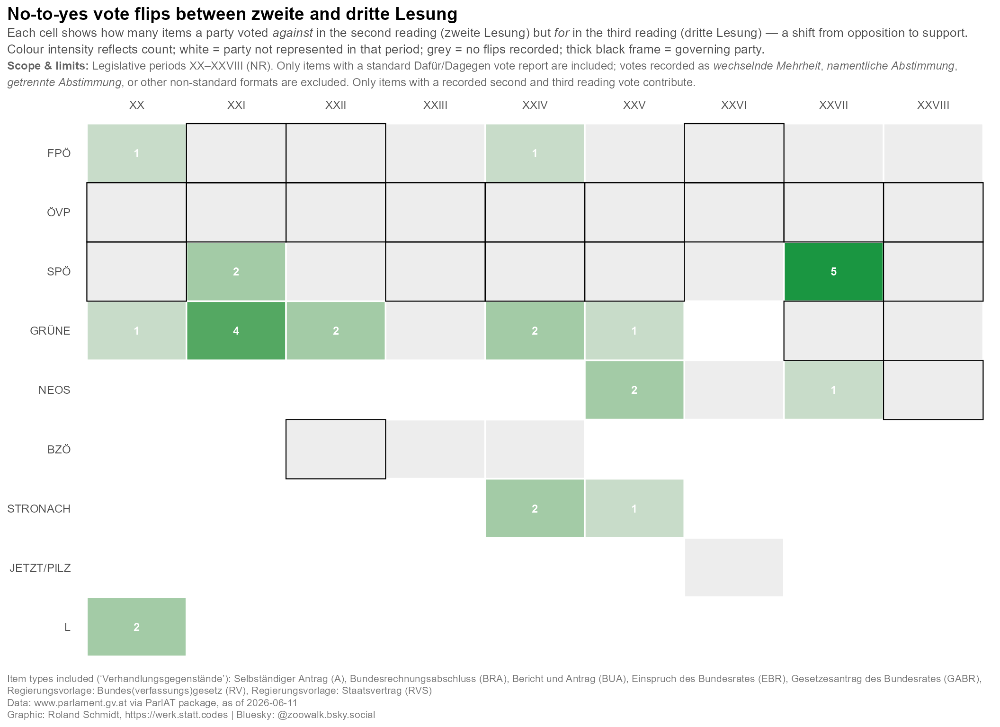
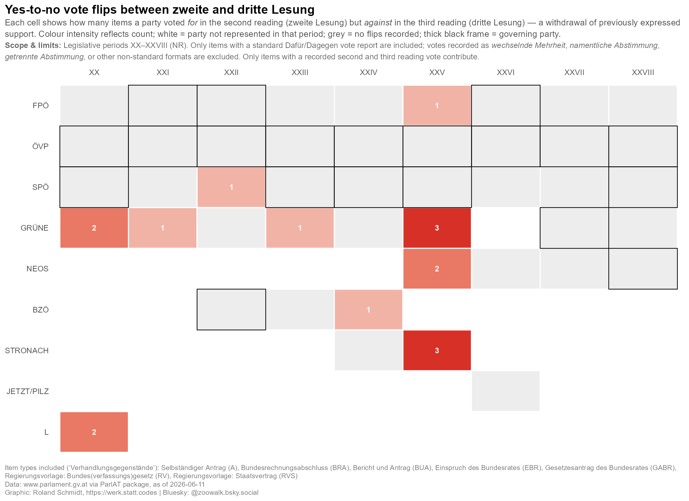

# Just the results, please {.unnumbered}

::: {layout-ncol="2"}
{group="voting_patterns_2_gallery"}

{group="voting_patterns_2_gallery"}
:::

# Packages

Get the necessary packages. In addition, I define here a small helper function which gives all reactable tables in this post a consistent look (title, optional subtitle, and a source note at the bottom), so I don't have to repeat the same styling code over and over again.

```{r}
#| label: setup
#| code-summary: "Load packages"
library(ParlAT)
library(tidyverse)
library(furrr)
library(reactable)
library(reactablefmtr)
library(naniar)
library(ggpattern)
library(ggtext)
library(patchwork)

# shared table theme and attribution footer for all reactable tables
compact_table_theme <- reactablefmtr::fivethirtyeight(font_size = 12)
table_source <- reactablefmtr::html(
  "<span style='font-size:8pt;color:grey30;font-family:Segoe UI !important;line-height:0.5'>Source: www.parlament.gv.at. Analysis: Roland Schmidt - @zoowalk.bsky.social - https://werk.statt.codes</span>"
)

# helper that wraps any reactable with a consistent title, optional subtitle, and source footer
style_reactable_table <- function(table, title, subtitle = NULL) {
  styled_table <- table %>%
    reactablefmtr::add_title(
      title = reactablefmtr::html(paste0(
        "<span style='font-size:12pt;'>",
        title,
        "</span>"
      ))
    )

  if (!is.null(subtitle)) {
    styled_table <- styled_table %>%
      reactablefmtr::add_subtitle(
        subtitle = reactablefmtr::html(paste0(
          "<span style='font-size:10pt;line-height:0.5;'>",
          subtitle,
          "</span>"
        )),
        font_color = "grey30",
        font_weight = "normal",
        font_style = "italic"
      )
  }

  styled_table %>%
    reactablefmtr::add_source(source = table_source)
}
```

# Get items

## Query data

As in the previous post, let's start by getting all items ('Verhandlungsgegenstände') of the National Council for the legislative periods 20 to 28. No big deal.

```{r}
#| label: fetch-items
#| code-summary: "Fetch National Council items and cache them"
#| cache: true
#| eval: false
# fetch all NR items for legislative periods 20–28 (GP XX through XXVIII)
items_20_28 <- seq(20, 28) %>%
  map(., \(x) get_items(legis_period = x, institution = "NR")) %>%
  list_rbind() # stack per-period tibbles into one dataframe
nrow(items_20_28)
```

```{r}
#| label: load-items-cache
#| include: false
# readr::write_rds(
#   items_20_28,
#   here::here(
#     "posts",
#     "2026-06-08-ParlAT-votingPatterns-2",
#     "_data",
#     "items_20_28.rds"
#   )
# )
items_20_28 <- readr::read_rds(here::here(
  "posts",
  "2026-06-08-ParlAT-votingPatterns-2",
  "_data",
  "items_20_28.rds"
))

data_cutoff <- {
  d <- max(items_20_28$date, na.rm = TRUE)
  sub("^0", "", format(d, "%d %B %Y")) # strip leading zero so "07 June" becomes "7 June"
}
```

## Keep items of interest

The `get_items()` call returned all (!) items, but not every item type is actually subject to a vote in a reading. Below I filter for those types which are: motions (Anträge), government bills (Regierungsvorlagen), budget-related items, and a few others. In case I missed any relevant category here, please let me know.

```{r}
#| label: define-item-scope
#| code-summary: "Select legislative item types"
# A=Anträge, RV=Regierungsvorlagen, BUA/GABR/BRA=budget-related, EBR=EU items
# anchored patterns (^A$, ^EBR$) prevent partial matches against longer codes
items_select <- c("^A$", "RV", "BUA", "GABR", "GABR13", "BRA", "^EBR$") %>%
  paste0(., collapse = "|")

item_type_scope_labels <- items_20_28 %>%
  distinct(type_doc, type_doc_long) %>%
  mutate(
    selected_for_scope = replace_na(
      str_detect(type_doc, regex(items_select)),
      FALSE
    ),
    label = paste0(type_doc_long, " (", type_doc, ")")
  ) %>%
  arrange(type_doc)

items_selected_label_str <- item_type_scope_labels %>%
  filter(selected_for_scope) %>%
  pull(label) %>%
  paste(collapse = ", ")

items_not_selected_label_str <- item_type_scope_labels %>%
  filter(!selected_for_scope) %>%
  pull(label) %>%
  paste(collapse = ", ")

vote_graph_caption <- paste0(
  "Voting on the following items ('Verhandlungsgegenstände') was included: ",
  items_selected_label_str,
  "<br>Voting on the following items was not included: ",
  items_not_selected_label_str,
  "<br><br>Data: www&#46;parlament.gv.at via ParlAT package, as of ",
  data_cutoff,
  "<br>Graphic: Roland Schmidt, https&#58;//werk.statt.codes | Bluesky: @zoowalk.bsky.social"
)

items_scope <- items_20_28 %>%
  filter(str_detect(type_doc, regex(items_select)))

# verify which long-form type labels the regex actually matched
items_scope %>%
  distinct(type_doc_long, type_doc)
```

# Get item details

## Query data

Now let's feed the URLs of the obtained items to `get_item_details()`, this time with the `stages` parameter set to `TRUE`. The stages data contains one row per procedural step of an item, and — crucially for this post — the description of each voting step. As in the previous post, I wrap the function call in purrr's `safely()` to collect any potential errors without breaking the loop, and use `future_map()` to query the API with multiple workers simultaneously, i.e. to speed up the process.

```{r}
#| label: fetch-item-details
#| code-summary: "Fetch item details with stages and cache them"
#| cache: true
#| eval: false
plan(multisession, workers = 4) # parallelise across 4 cores to speed up API fetching

item_urls <- items_scope %>%
  pull(item_url)

# wrap in safely() so a single failed request returns an error slot instead of halting the loop
safe_get_item_details <- safely(get_item_details)

item_details_raw <- item_urls %>%
  future_map(
    \(x) {
      safe_result <- safe_get_item_details(item_url = x, stages = TRUE)
      safe_result$item_url <- x # attach URL so failed results can be identified later
      safe_result
    },
    .progress = TRUE,
    .options = furrr_options(packages = c("ParlAT", "purrr", "tibble"))
  )
```

```{r}
#| label: load-item-details-cache
#| eval: true
#| include: false
# persist the raw fetch results so re-renders don't need to re-hit the API
# readr::write_rds(
#   item_details_raw,
#   here::here(
#     "posts",
#     "2026-06-08-ParlAT-votingPatterns-2",
#     "_data",
#     "item_details_raw.rds"
#   )
# )

plan(sequential) # reset to single-threaded after parallel fetch

# reload from disk so the object is available in non-eval (cached) renders
item_details_raw <- readr::read_rds(here::here(
  "posts",
  "2026-06-08-ParlAT-votingPatterns-2",
  "_data",
  "item_details_raw.rds"
))
```

## Prepare stages data

Below, I a) check for any failed calls, and b) combine the successful calls into a single data frame. Subsequently, I unnest the stages column so that we get one row per procedural step per item. Note that at this point the data frame still contains *all* stage rows for each item — also those without any vote. Filtering for the actual votes comes next.

```{r}
#| label: prepare-stages-data
#| code-summary: "Unnest stages, filter vote rows, add reading and vote_text_list columns"
# collect items where the API call failed; conditionMessage() extracts the error string
failed_items <- item_details_raw |>
  keep(\(x) !is.null(x$error)) |>
  map(\(x) tibble(item_url = x$item_url, error = conditionMessage(x$error))) |>
  list_rbind()

# keep only successful results and extract the nested $result element
item_details <- item_details_raw |>
  keep(\(x) is.null(x$error)) |>
  map("result") |>
  list_rbind()

# unnest stages into one row per stage per item
item_stages <- item_details |>
  select(
    item_url,
    legis_period,
    type_doc,
    title,
    item_number,
    status_number,
    status_description,
    stages,
    votes
  ) |>
  filter(map_lgl(stages, \(x) !is.null(x))) |> # drop items with no stage data at all
  unnest(stages) %>%
  mutate(stage_date = lubridate::dmy(stage_date))

# used in inline text and table subtitles throughout the document
data_cutoff <- max(item_stages$stage_date)
```

# Get items in scope

Now to the actual filtering. From all the stage rows, I keep only those a) pertaining to the National Council, b) belonging to a second or third reading, and c) where a vote was actually cast. Along the way, two new columns are added: `reading` records whether the row pertains to the second or third reading (or, in some cases, both at once), and `vote_report_type` captures *how* the vote result is reported in the stage description. The latter matters more than one might think: only stages with an explicit 'Dafür:.../Dagegen:...' pattern (which I label 'regular') state each party's position; other formats such as 'wechselnde Mehrheit' or 'namentliche Abstimmung' don't allow extracting party positions from the stage text alone.

```{r}
#| label: scope-items
#| code-summary: "Filter to NR readings, classify vote report type"
items_scope <- item_stages |>
  filter(str_detect(phase, regex("NR"))) %>% # keep only National Council (NR) phases
  # r? makes the pattern match both "zweite"/"zweiter" and "dritte"/"dritter"
  filter(str_detect(stage_name, "(dritter?|zweiter?) Lesung")) %>%
  mutate(
    reading = case_when(
      # some items combine both readings into a single stage entry
      str_detect(stage_name, regex("zweite")) &
        str_detect(stage_name, regex("dritte")) ~ "second & third",
      str_detect(stage_name, regex("zweite")) ~ "second",
      str_detect(stage_name, regex("dritte")) ~ "third",
      .default = NULL
    )
  ) %>%
  # keep only stages that contain actual vote-outcome text
  filter(str_detect(
    stage_name,
    regex(
      "dafür|wechselnde Mehrheit|getrennte Abstimmung|namentliche Abstimmung|abgelehnt|mehrstimmig",
      ignore_case = T
    )
  )) %>%
  mutate(
    # classify how the vote result is reported; order matters — "regular" must come first
    # because some stage names contain both "dafür" and other keywords
    vote_report_type = case_when(
      str_detect(stage_name, regex("dafür", ignore_case = T)) &
        str_detect(stage_name, regex("dagegen", ignore_case = T)) ~ "regular",
      str_detect(
        stage_name,
        regex("wechselnde Mehrheit", ignore_case = T)
      ) ~ "wechselnde Mehrheit",
      str_detect(
        stage_name,
        regex("namentliche Abstimmung", ignore_case = T)
      ) ~ "namentliche Abstimmung",
      str_detect(
        stage_name,
        regex("getrennte Abstimmung", ignore_case = T)
      ) ~ "getrennte Abstimmung",
      str_detect(stage_name, regex("abgelehnt", ignore_case = T)) ~ "abgelehnt",
      str_detect(
        stage_name,
        regex("mehrstimmig", ignore_case = T)
      ) ~ "mehrstimmig",
      .default = NA
    )
  )

nrow(items_scope)
nrow(item_stages)

# inspect the distribution of vote reporting types
items_scope %>%
  count(vote_report_type, sort = T) %>%
  mutate(rel = n / sum(n) * 100)
```

## Check pairs

Time for a *data sanity check*. Since the analysis is about flips between the second and the third reading, every item should by now feature exactly two rows — one per reading. Let's see whether that's actually the case.

```{r}
#| label: check-pairs
#| code-summary: "Identify items with non-standard second/third reading pair counts"
# each item should produce exactly 2 rows: one for 2nd reading, one for 3rd
non_pairs <- items_scope %>%
  count(legis_period, item_url, name = "n_obs") %>%
  filter(n_obs != 2) # flag anything that deviates from the expected pair
n_distinct(non_pairs$item_url)
```

We would expect that every time has by now only two rows, i.e., one for the second and one for the third reading.
However, there are `r n_distinct(non_pairs$item_url)` out of `r n_distinct(items_scope$item_url)` which feature more than two rows.

To facilitate a closer look at these cases, the table below lists the deviating items with their individual vote-stage rows. Each item is linked to its page on the parliament's website, so you can check the underlying records yourself.

```{r}
#| label: non-pairs-table
#| code-summary: "Build reactable table of items with non-standard vote-stage pairs"
# limit to only the offending items so the table stays focused
non_pairs_details <- items_scope %>%
  semi_join(non_pairs, by = c("legis_period", "item_url")) %>%
  distinct() %>%
  select(
    legis_period,
    item_url,
    stage_date,
    stage_name,
    vote_report_type
  ) %>%
  mutate(n_obs = n(), .by = c("legis_period", "item_url"))

non_pairs_details_display <- non_pairs_details %>%
  arrange(desc(n_obs), legis_period, item_url, stage_date) %>%
  mutate(
    # strip the base URL and query string to get a compact "XXVIII/I/403" style reference
    item_ref = item_url %>%
      str_remove("^https://www\\.parlament\\.gv\\.at/gegenstand/") %>%
      str_remove("\\?.*$")
  ) %>%
  select(
    legis_period,
    item_ref,
    stage_date,
    stage_name,
    vote_report_type,
    n_obs,
    item_url
  )

non_pairs_details_table <- reactable(
  non_pairs_details_display,
  columns = list(
    legis_period = colDef(
      name = "Legis. period",
      align = "right",
      minWidth = 90,
      filterable = TRUE
    ),
    item_ref = colDef(
      name = "Item",
      minWidth = 125,
      filterable = TRUE,
      # custom cell renderer turns the short reference into a clickable link
      cell = function(value, index) {
        htmltools::tags$a(
          href = non_pairs_details_display$item_url[index],
          target = "_blank",
          value
        )
      }
    ),
    stage_date = colDef(
      name = "Stage date",
      align = "left",
      minWidth = 110,
      filterable = TRUE
    ),
    stage_name = colDef(
      name = "Stage",
      minWidth = 540,
      filterable = TRUE,
      style = list(whiteSpace = "normal", lineHeight = "1.35")
    ),
    vote_report_type = colDef(
      name = "Vote report type",
      minWidth = 155,
      filterable = TRUE
    ),
    n_obs = colDef(
      name = "Rows per item",
      align = "right",
      minWidth = 130,
      format = colFormat(digits = 0)
    ),
    item_url = colDef(show = FALSE) # kept in data for the cell renderer above, hidden from display
  ),
  fullWidth = TRUE,
  compact = TRUE,
  highlight = FALSE,
  outlined = TRUE,
  searchable = TRUE,
  defaultPageSize = 10,
  defaultSorted = "n_obs",
  defaultSortOrder = "desc",
  theme = compact_table_theme
) %>%
  style_reactable_table(
    "ITEMS WITH NON-STANDARD VOTE-STAGE PAIRS",
    paste0(
      "Items with more or fewer than the expected two vote-stage rows. Data as of ",
      data_cutoff,
      "."
    )
  )

non_pairs_details_table
```

As it turns out, some are duplicates in the data source, e.g. here: https://www.parlament.gv.at/gegenstand/XX/I/1530?selectedStage=105. The votes in the second and third reading are reported twice. Others are reported mulitple times because an item was within one single reading party approved/not approved and hence got two rows in the data source, i.e. https://www.parlament.gv.at/gegenstand/XXVIII/I/403

Rather than trying to repair these inconsistencies one by one, I simply remove the affected items from the analysis. Subsequently, I narrow the data down to items with a 'regular' vote report — and since this filter can itself break a previously complete pair (e.g. if only one of an item's two readings was reported in the regular format), I check for and remove incomplete pairs once more. The last line below shows which share of the original vote stages survives all these filters.

```{r}
#| label: filter-pairs
#| code-summary: "Remove non-standard pairs, keep regular vote type only"
# drop items that had non-standard row counts; only clean pairs remain
items_scope_pairs <- items_scope %>%
  anti_join(., non_pairs, by = c("legis_period", "item_url"))
nrow(items_scope_pairs)

# sanity check: after removing non-pairs every item should have exactly 2 rows
items_scope_pairs %>%
  mutate(n_obs = n(), .by = c("legis_period", "item_url")) %>%
  filter(n_obs != 2) %>%
  nrow()

table(items_scope_pairs$reading) #TODO

# this analysis focuses only on "regular" votes (explicit Dafür/Dagegen party lists)
items_scope_pairs_regular <- items_scope_pairs %>%
  filter(vote_report_type == "regular")

# re-check pairs after the regular filter: filtering by type can break previously clean pairs
non_pairs2 <- items_scope_pairs_regular %>%
  mutate(n_obs = n(), .by = c("legis_period", "item_url")) %>%
  filter(n_obs != 2)

items_scope_pairs_regular <- items_scope_pairs_regular %>%
  anti_join(., non_pairs2, by = c("legis_period", "item_url"))

nrow(items_scope_pairs)
nrow(items_scope_pairs_regular)
nrow(items_scope_pairs_regular) / nrow(items_scope) # share of all vote stages covered
```


# Extract votes

Now to the heart of the matter: getting each party's position out of the stage description. The text follows (mostly) the pattern 'Dafür: party A, party B, dagegen: party C', so the function below splits the string at the 'dagegen' boundary and cleans up both sides. Two details are worth mentioning: first, I keep only tokens which appear in a predefined list of valid party labels — this guards against vote counts, footnotes and other non-party fragments sneaking into the results. Second, since party labels changed over the legislative periods (e.g. the FPÖ appearing as 'F' in earlier periods), a small helper maps the historical variants onto one canonical name per party.

```{r}
#| label: define-vote-extractor
#| code-summary: "Define party normalisation and Dafür/Dagegen vote text parser"
# includes historical aliases (F, NEOS-LIF, F-BZÖ, S/V/N/G single-letter forms)
# alongside canonical modern names; used as an allowlist to filter out non-party tokens
valid_parties <- c(
  "SPÖ",
  "ÖVP",
  "F",
  "FPÖ",
  "GRÜNE",
  "L",
  "BZÖ",
  "STRONACH",
  "NEOS",
  "NEOS-LIF",
  "F-BZÖ",
  "JETZT",
  "PILZ",
  "NEOS/NEOS-LIF",
  "JETZT/PILZ",
  "S",
  "V",
  "N",
  "G"
)

# maps historical/transitional party labels to a single canonical name per party
normalise_party <- function(party) {
  case_when(
    party %in% c("NEOS-LIF", "NEOS/NEOS-LIF") ~ "NEOS",
    party == "F" ~ "FPÖ",
    party == "F-BZÖ" ~ "BZÖ",
    TRUE ~ party
  )
}

fn_get_votes <- function(vt) {
  # inner helper: splits a raw comma-separated party string into a clean character vector
  clean_parties <- function(x) {
    if (is.na(x) || str_trim(x) == "-") {
      return(character(0))
    }

    x |>
      str_split(",\\s*") |>
      unlist() |>
      str_trim() |>
      str_remove("\\)+$") |> # strip trailing parentheses e.g. "SPÖ (Mehrheit)" -> "SPÖ"
      str_trim() |>
      # keep only all-caps tokens (party abbreviations); drops vote counts, notes, etc.
      keep(\(p) {
        str_detect(
          p,
          regex("^[[:upper:]ÄÖÜ]+(?:[-/][[:upper:]ÄÖÜ]+)*$")
        )
      }) |>
      keep(\(p) p %in% valid_parties) # final guard against unknown tokens
  }

  # some stage texts use ". Dagegen:" (period separator) instead of ", dagegen:"
  # normalise to a consistent comma form so the split below works in both cases
  vt_norm <- str_replace(
    vt,
    regex("\\.\\s*Dagegen:", ignore_case = TRUE),
    ", dagegen:"
  )

  # split at the dagegen boundary; n=2 prevents splitting inside party lists
  parts <- str_split(
    vt_norm,
    regex(",\\s*dagegen:", ignore_case = TRUE),
    n = 2
  )[[1]]

  if (length(parts) != 2) {
    stop("Regular vote text does not contain both Dafür and Dagegen parts.")
  }

  if (!str_detect(parts[1], regex("Dafür:", ignore_case = TRUE))) {
    stop("Regular vote text does not contain a Dafür part.")
  }

  # strip the "Dafür:" label and everything before it (dotall handles multi-line stage names)
  yes_raw <- parts[1] |>
    str_remove(regex("^.*Dafür:\\s*", dotall = TRUE, ignore_case = TRUE))

  no_raw <- parts[2]

  list(
    vote_yes = clean_parties(yes_raw),
    vote_no = clean_parties(no_raw)
  )
}
```

With the function defined, applying it to the data is a one-liner. The result is a list column containing, for every vote stage, the vector of parties in favor and the vector of parties against.

```{r}
#| label: extract-votes
#| code-summary: "Apply vote parser to extract yes/no party lists per stage"
# parse each stage_name string into a list(vote_yes, vote_no) of party vectors
items_scope_pairs_regular <- items_scope_pairs_regular %>%
  mutate(votes_li = map(stage_name, fn_get_votes))
```

The list column is handy, but for the actual analysis a 'long' data frame is more convenient: one row per item, reading, and party, with two indicator columns recording whether the party voted in favor and/or against. The `summarise()` at the end collapses any remaining duplicate rows.

```{r}
#| label: votes-long
#| code-summary: "Expand to one row per party per stage (long format)"
items_scope_pairs_regular_long <- items_scope_pairs_regular %>%
  mutate(
    votes_party = map(votes_li, \(v) {
      yes_parties <- normalise_party(v$vote_yes)
      no_parties <- normalise_party(v$vote_no)

      # union ensures each party appears once per stage even if somehow listed in both sides
      tibble(
        party = union(yes_parties, no_parties),
        yes = as.integer(party %in% yes_parties),
        no = as.integer(party %in% no_parties)
      )
    })
  ) %>%
  unnest(votes_party) %>%
  select(
    item_url,
    legis_period,
    type_doc,
    title,
    item_number,
    status_number,
    status_description,
    stage_date,
    stage_name,
    reading,
    vote_report_type,
    party,
    yes,
    no
  ) %>%
  group_by(across(-c(yes, no))) %>%
  # collapse duplicate rows (e.g. from deduplication edge cases) by taking the maximum vote value
  summarise(
    yes = max(yes, na.rm = TRUE),
    no = max(no, na.rm = TRUE),
    .groups = "drop"
  )
```


To detect flips between the readings, we need both readings side by side. Hence, let's pivot the long data frame into a wide format where each row is one item-party combination, with separate columns for the vote in the second and the third reading (`yes_second`, `no_second`, `yes_third`, `no_third`). An `NA` in these columns means that the party has no recorded vote for that particular reading.

```{r}
#| label: votes-wide
#| code-summary: "Pivot to wide format with separate second/third reading columns"
items_scope_pairs_regular_wide <- items_scope_pairs_regular_long %>%
  # drop "second & third" combined rows; keep only clean individual readings
  filter(reading %in% c("second", "third")) %>%
  filter(vote_report_type == "regular") %>%
  select(
    item_url,
    legis_period,
    type_doc,
    title,
    item_number,
    status_number,
    status_description,
    party,
    reading,
    vote_report_type,
    yes,
    no
  ) %>%
  # pivot so each row is one item × party with columns yes_second, no_second, yes_third, no_third
  pivot_wider(
    id_cols = c(
      item_url,
      legis_period,
      type_doc,
      title,
      item_number,
      status_number,
      status_description,
      party
    ),
    names_from = reading,
    values_from = c(vote_report_type, yes, no),
    names_glue = "{.value}_{reading}",
    # NA fills indicate the party has no recorded vote for that particular reading
    values_fill = list(
      vote_report_type = NA_character_,
      yes = NA_integer_,
      no = NA_integer_
    )
  )
```

Speaking of `NA`s — before drawing any conclusions, it's worth checking how much missingness we are actually dealing with, and whether it is concentrated in particular legislative periods. The naniar package makes this a quick exercise.

```{r}
#| label: vis-missingness
#| code-summary: "Visualise missing values by legislative period"
library(naniar)
# faceting by legis_period reveals whether missingness is period-specific or systemic
items_scope_pairs_regular_wide %>%
  naniar::vis_miss(facet = legis_period)
```


Now for the first actual result: how often did a party reject an item in the second reading, only to support it in the third? Such no-to-yes flips are rare by design — the third reading usually follows immediately after the second — but where they occur, they may hint at successful last-minute amendments or changed political circumstances. The graph below shows the number of such flips per party and legislative period. Since a flip carries a different weight depending on whether a party sits in government or in opposition, governing parties are marked with a diagonal stripe pattern (this is where the ggpattern package comes in). Don't get distracted by the length of the code chunk; most of it is needed to make sure that empty cells are displayed correctly (a party not represented in parliament is something different than a party without flips).

```{r}
#| label: plot-flip-no-to-yes
#| code-summary: "Build tile plot of no-to-yes vote flips by party and legislative period"
#| fig-width: 11
#| fig-height: 8
#| out-width: "100%"
#| fig-align: "center"
# hand-coded coalition membership per legislative period (GP XX–XXVIII)
gov_parties_lookup <- tribble(
  ~legis_period , ~party ,
  "XX"          , "SPÖ"  , "XX"     , "ÖVP"   ,
  "XXI"         , "ÖVP"  , "XXI"    , "F"     ,
  "XXII"        , "ÖVP"  , "XXII"   , "F"     , "XXII"   , "F-BZÖ" ,
  "XXIII"       , "SPÖ"  , "XXIII"  , "ÖVP"   ,
  "XXIV"        , "SPÖ"  , "XXIV"   , "ÖVP"   ,
  "XXV"         , "SPÖ"  , "XXV"    , "ÖVP"   ,
  "XXVI"        , "ÖVP"  , "XXVI"   , "FPÖ"   ,
  "XXVII"       , "ÖVP"  , "XXVII"  , "GRÜNE" ,
  "XXVIII"      , "ÖVP"  , "XXVIII" , "SPÖ"   , "XXVIII" , "NEOS"
) %>%
  mutate(party = normalise_party(party)) %>% # align aliases before joining
  mutate(is_gov = TRUE)

all_periods_vec <- c(
  "XX",
  "XXI",
  "XXII",
  "XXIII",
  "XXIV",
  "XXV",
  "XXVI",
  "XXVII",
  "XXVIII"
)

# tracks which party × period combinations actually appear in the data
# used later to distinguish "not in parliament" (white) from "zero flips" (grey)
party_period_presence <- items_scope_pairs_regular_wide %>%
  distinct(legis_period, party) %>%
  mutate(present = TRUE)

# NA arises when a party only voted in one of the two readings; treat as no flip
flip_no_to_yes_counts <- items_scope_pairs_regular_wide %>%
  mutate(
    flip_no_to_yes = replace_na(no_second == 1 & yes_third == 1, FALSE)
  ) %>%
  # wt= turns count() into a weighted sum, effectively summing TRUE values
  count(
    legis_period,
    party,
    wt = as.integer(flip_no_to_yes),
    name = "flip_n"
  )

all_parties <- union(party_period_presence$party, gov_parties_lookup$party)

# fixed top order, then remaining parties by presence across legislative periods
party_order_priority <- c("FPÖ", "ÖVP", "SPÖ", "GRÜNE", "NEOS")

party_order <- c(
  party_order_priority,
  party_period_presence %>%
    distinct(party, legis_period) %>%
    count(party, name = "periods_present") %>%
    right_join(tibble(party = all_parties), by = "party") %>%
    mutate(periods_present = replace_na(periods_present, 0L)) %>%
    filter(!party %in% party_order_priority) %>%
    arrange(desc(periods_present), party) %>%
    pull(party),
  setdiff(party_order_priority, all_parties)
) %>%
  unique()

# full cross-product ensures every party × period cell exists for the tile plot
flip_no_to_yes_grid <- expand_grid(
  party = all_parties,
  legis_period = all_periods_vec
) %>%
  left_join(
    flip_no_to_yes_counts,
    by = c("party", "legis_period")
  ) %>%
  replace_na(list(flip_n = 0)) %>%
  left_join(
    gov_parties_lookup,
    by = c("party", "legis_period")
  ) %>%
  replace_na(list(is_gov = FALSE)) %>%
  left_join(
    party_period_presence,
    by = c("party", "legis_period")
  ) %>%
  replace_na(list(present = FALSE)) %>%
  mutate(
    party = factor(party, levels = rev(party_order)),
    legis_period = factor(legis_period, levels = all_periods_vec),
    label = if_else(flip_n > 0, as.character(flip_n), ""),
    # NA fill_val → white tile (not in parliament); 0 fill_val → light grey (no flips)
    fill_val = if_else(present, as.numeric(flip_n), NA_real_)
  )

# subset used for the geom_text layer so labels only appear on non-zero tiles
flip_no_to_yes_labels <- flip_no_to_yes_grid %>%
  filter(flip_n > 0)

# clamp lower bound to 1 so a single-flip period still gets a visible colour gradient
n_max <- max(1, max(flip_no_to_yes_grid$flip_n, na.rm = TRUE))
library(ggpattern)
p_flip_no_to_yes <- flip_no_to_yes_grid %>%
  ggplot(aes(
    x = legis_period,
    y = party,
    fill = fill_val,
    pattern = is_gov # diagonal stripe overlay for government parties
  )) +
  ggpattern::geom_tile_pattern(
    colour = "white",
    linewidth = 0.6,
    pattern_colour = "grey50",
    pattern_fill = "grey50",
    pattern_density = 0.08,
    pattern_spacing = 0.06,
    pattern_alpha = 0.45
  ) +
  geom_text(
    data = flip_no_to_yes_labels,
    aes(x = legis_period, y = party, label = label),
    colour = "white",
    size = 3.2,
    fontface = "bold",
    family = "Noto Sans",
    inherit.aes = FALSE # avoid inheriting `pattern` aesthetic which causes ggpattern warnings
  ) +
  scale_fill_gradient(
    low = "grey93",
    high = "#1a9641",
    limits = c(0, n_max),
    na.value = "white", # white = party not present in that period
    guide = "none"
  ) +
  scale_pattern_manual(
    values = c("TRUE" = "stripe", "FALSE" = "none"),
    guide = "none"
  ) +
  scale_x_discrete(position = "top") +
  labs(
    x = NULL,
    y = NULL,
    title = "No-to-yes vote flips between zweite and dritte Lesung",
    subtitle = paste0(
      "Each cell shows how many items a party voted *against* in the second reading (zweite Lesung) ",
      "but *for* in the third reading (dritte Lesung) — a shift from opposition to support. ",
      "Colour intensity reflects count; white = party not represented in that period; ",
      "grey = no flips recorded; diagonal stripe = governing party.<br>",
      "<span style='font-size:9pt;color:grey40;'>",
      "**Scope & limits:** Legislative periods XX–XXVIII (NR). ",
      "Only items with a standard Dafür/Dagegen vote report are included; ",
      "votes recorded as *wechselnde Mehrheit*, *namentliche Abstimmung*, *getrennte Abstimmung*, ",
      "or other non-standard formats are excluded. ",
      "Only complete second+third reading pairs are considered.",
      "</span>"
    ),
    caption = vote_graph_caption
  ) +
  theme_minimal(base_size = 11, base_family = "Noto Sans") +
  theme(
    panel.grid = element_blank(),
    axis.text = element_text(size = 9),
    plot.title = element_text(
      face = "bold",
      size = 14,
      hjust = 0,
      margin = ggplot2::margin(b = 4)
    ),
    plot.subtitle = ggtext::element_textbox_simple(
      size = 10,
      family = "Noto Sans",
      lineheight = 1.3,
      colour = "grey30",
      margin = ggplot2::margin(b = 10)
    ),
    plot.caption = ggtext::element_textbox_simple(
      size = 8,
      family = "Noto Sans",
      colour = "grey45",
      hjust = 0,
      halign = 0,
      margin = ggplot2::margin(t = 10)
    ),
    plot.title.position = "plot",
    plot.caption.position = "plot",
    legend.position = "none"
  )

p_flip_no_to_yes
```

And now the mirror image: items which a party supported in the second reading but rejected in the third, i.e. a withdrawal of previously expressed support. The code is essentially the same as above — only the flip condition is reversed, the parties are reordered by their yes-to-no totals, and the colour scheme switches to red.

```{r}
#| label: plot-flip-yes-to-no
#| code-summary: "Build tile plot of yes-to-no vote flips by party and legislative period"
#| fig-width: 11
#| fig-height: 8
#| out-width: "100%"
#| fig-align: "center"
# NA arises when a party only voted in one of the two readings; treat as no flip
flip_yes_to_no_counts <- items_scope_pairs_regular_wide %>%
  mutate(
    flip_yes_to_no = replace_na(yes_second == 1 & no_third == 1, FALSE)
  ) %>%
  # wt= turns count() into a weighted sum, effectively summing TRUE values
  count(
    legis_period,
    party,
    wt = as.integer(flip_yes_to_no),
    name = "flip_n"
  )

# full cross-product ensures every party × period cell exists for the tile plot
flip_yes_to_no_grid <- expand_grid(
  party = all_parties,
  legis_period = all_periods_vec
) %>%
  left_join(
    flip_yes_to_no_counts,
    by = c("party", "legis_period")
  ) %>%
  replace_na(list(flip_n = 0)) %>%
  left_join(
    gov_parties_lookup,
    by = c("party", "legis_period")
  ) %>%
  replace_na(list(is_gov = FALSE)) %>%
  left_join(
    party_period_presence,
    by = c("party", "legis_period")
  ) %>%
  replace_na(list(present = FALSE)) %>%
  mutate(
    party = factor(party, levels = rev(party_order)),
    legis_period = factor(legis_period, levels = all_periods_vec),
    label = if_else(flip_n > 0, as.character(flip_n), ""),
    # NA fill_val → white tile (not in parliament); 0 fill_val → light grey (no flips)
    fill_val = if_else(present, as.numeric(flip_n), NA_real_)
  )

# subset used for the geom_text layer so labels only appear on non-zero tiles
flip_yes_to_no_labels <- flip_yes_to_no_grid %>%
  filter(flip_n > 0)

# clamp lower bound to 1 so a single-flip period still gets a visible colour gradient
n_max_ytn <- max(1, max(flip_yes_to_no_grid$flip_n, na.rm = TRUE))

p_flip_yes_to_no <- flip_yes_to_no_grid %>%
  ggplot(aes(
    x = legis_period,
    y = party,
    fill = fill_val,
    pattern = is_gov # diagonal stripe overlay for government parties
  )) +
  ggpattern::geom_tile_pattern(
    colour = "white",
    linewidth = 0.6,
    pattern_colour = "grey50",
    pattern_fill = "grey50",
    pattern_density = 0.08,
    pattern_spacing = 0.06,
    pattern_alpha = 0.45
  ) +
  geom_text(
    data = flip_yes_to_no_labels,
    aes(x = legis_period, y = party, label = label),
    colour = "white",
    size = 3.2,
    fontface = "bold",
    family = "Noto Sans",
    inherit.aes = FALSE # avoid inheriting `pattern` aesthetic which causes ggpattern warnings
  ) +
  # red gradient signals withdrawal of support (yes → no)
  scale_fill_gradient(
    low = "grey93",
    high = "#d73027",
    limits = c(0, n_max_ytn),
    na.value = "white", # white = party not present in that period
    guide = "none"
  ) +
  scale_pattern_manual(
    values = c("TRUE" = "stripe", "FALSE" = "none"),
    guide = "none"
  ) +
  scale_x_discrete(position = "top") +
  labs(
    x = NULL,
    y = NULL,
    title = "Yes-to-no vote flips between zweite and dritte Lesung",
    subtitle = paste0(
      "Each cell shows how many items a party voted *for* in the second reading (zweite Lesung) ",
      "but *against* in the third reading (dritte Lesung) — a withdrawal of previously expressed support. ",
      "Colour intensity reflects count; white = party not represented in that period; ",
      "grey = no flips recorded; diagonal stripe = governing party.<br>",
      "<span style='font-size:9pt;color:grey40;'>",
      "**Scope & limits:** Legislative periods XX–XXVIII (NR). ",
      "Only items with a standard Dafür/Dagegen vote report are included; ",
      "votes recorded as *wechselnde Mehrheit*, *namentliche Abstimmung*, *getrennte Abstimmung*, ",
      "or other non-standard formats are excluded. ",
      "Only complete second+third reading pairs are considered.",
      "</span>"
    ),
    caption = vote_graph_caption
  ) +
  theme_minimal(base_size = 11, base_family = "Noto Sans") +
  theme(
    panel.grid = element_blank(),
    axis.text = element_text(size = 9),
    plot.title = element_text(
      face = "bold",
      size = 14,
      hjust = 0,
      margin = ggplot2::margin(b = 4)
    ),
    plot.subtitle = ggtext::element_textbox_simple(
      size = 10,
      family = "Noto Sans",
      lineheight = 1.3,
      colour = "grey30",
      margin = ggplot2::margin(b = 10)
    ),
    plot.caption = ggtext::element_textbox_simple(
      size = 8,
      family = "Noto Sans",
      colour = "grey45",
      hjust = 0,
      halign = 0,
      margin = ggplot2::margin(t = 10)
    ),
    plot.title.position = "plot",
    plot.caption.position = "plot",
    legend.position = "none"
  )

p_flip_yes_to_no
```


```{r}
knitr::knit_exit()
```

## Vote extraction check

Finally, another *data sanity check*, this time on the extraction itself: did the parsing of the stage texts produce any party labels which are not in our list of valid parties? The checks below scan the extracted tokens from two angles — once after stripping parenthetical additions, and once for any all-caps token that looks party-like but is unknown. Ideally, both checks come back empty.

```{r}
#| label: vote-extraction-check
#| code-summary: "Check for unrecognised party tokens in extracted votes"
# find parties that passed through fn_get_votes but are not in valid_parties
# (note: filter_out() is not a standard dplyr function — likely a bug; should be filter(!...))
vote_extraction_check <- items_scope %>%
  filter_out(str_detect(stage_name, regex("wechselnde"))) %>%
  mutate(vote_parties = map(votes_li, \(v) c(v$vote_yes, v$vote_no))) %>%
  select(item_url, legis_period, reading, stage_name, vote_parties) %>%
  unnest(vote_parties) %>%
  mutate(
    party_clean = str_trim(str_extract(vote_parties, "^[^(]+")) # strip parenthetical notes
  ) %>%
  filter(!party_clean %in% valid_parties)

# broader check: any all-caps token that looks party-like but isn't in valid_parties
# regex matches abbreviations that may include digits or slashes (e.g. "NEOS2")
vote_uppercase_unknown_check <- items_scope %>%
  mutate(vote_tokens = map(votes_li, \(v) c(v$vote_yes, v$vote_no))) %>%
  select(item_url, legis_period, reading, stage_name, vote_tokens) %>%
  unnest(vote_tokens) %>%
  distinct() %>%
  filter(
    !vote_tokens %in% valid_parties,
    str_detect(vote_tokens, regex("^[[:upper:]ÄÖÜ][[:upper:]ÄÖÜ0-9/-]*$"))
  )

n_distinct(vote_extraction_check$item_url)
n_distinct(items_scope$item_url)

report_type_check <- items_scope %>%
  count(report_type)

items_scope <- items_scope %>%
  distinct() # remove any exact duplicate rows before further processing

items_scope <- items_scope %>%
  group_by(legis_period, item_url) %>%
  mutate(obs_n = n()) %>%
  ungroup()

deviant <- items_scope %>%
  filter(obs_n != 2) # items with != 2 rows excluded from the paired analysis

item_votes_long <- items_scope %>%
  filter(report_type %in% c("regular", "no_dagegen")) %>%
  group_by(legis_period, item_url) %>%
  mutate(obs_n = n()) %>%
  ungroup() %>%
  filter(obs_n == 2) %>% # limit analysis to complete second+third reading pairs
  mutate(
    votes_party = map(votes_li, \(v) {
      yes_parties <- v$vote_yes
      no_parties <- v$vote_no

      tibble(
        party = union(yes_parties, no_parties),
        yes = as.integer(party %in% yes_parties),
        no = as.integer(party %in% no_parties)
      )
    })
  ) %>%
  unnest(votes_party)

item_votes_reading_wide <- item_votes_long %>%
  filter(reading %in% c("second", "third")) %>%
  mutate(
    # serialise the parsed vote list to a string for display in debug tables
    votes_li_raw = map_chr(votes_li, \(x) {
      paste(capture.output(str(x)), collapse = "\n")
    })
  ) %>%
  group_by(
    item_url,
    legis_period,
    type_doc,
    title,
    item_number,
    status_number,
    status_description,
    party
  ) %>%
  # collapse multiple stage entries per party into a single concatenated string
  mutate(
    stage_name = paste(unique(stage_name), collapse = "\n\n"),
    votes_li_raw = paste(unique(votes_li_raw), collapse = "\n\n")
  ) %>%
  ungroup() %>%
  select(
    item_url,
    legis_period,
    type_doc,
    title,
    item_number,
    status_number,
    status_description,
    party,
    stage_name,
    votes_li_raw,
    reading,
    yes,
    no,
    report_type
  ) %>%
  pivot_wider(
    id_cols = c(
      item_url,
      legis_period,
      type_doc,
      title,
      item_number,
      status_number,
      status_description,
      party,
      stage_name,
      votes_li_raw
    ),
    names_from = reading,
    values_from = c(yes, no, report_type),
    names_glue = "{.value}_{reading}",
    values_fill = list(yes = NA, no = NA, report_type = NA_character_)
  ) %>%
  mutate(
    flip_pos = ifelse(no_second == 1 & yes_third == 1, TRUE, FALSE), # voted against in 2nd, for in 3rd
    flip_neg = ifelse(yes_second == 1 & no_third == 1, TRUE, FALSE) # voted for in 2nd, against in 3rd
  )
```
