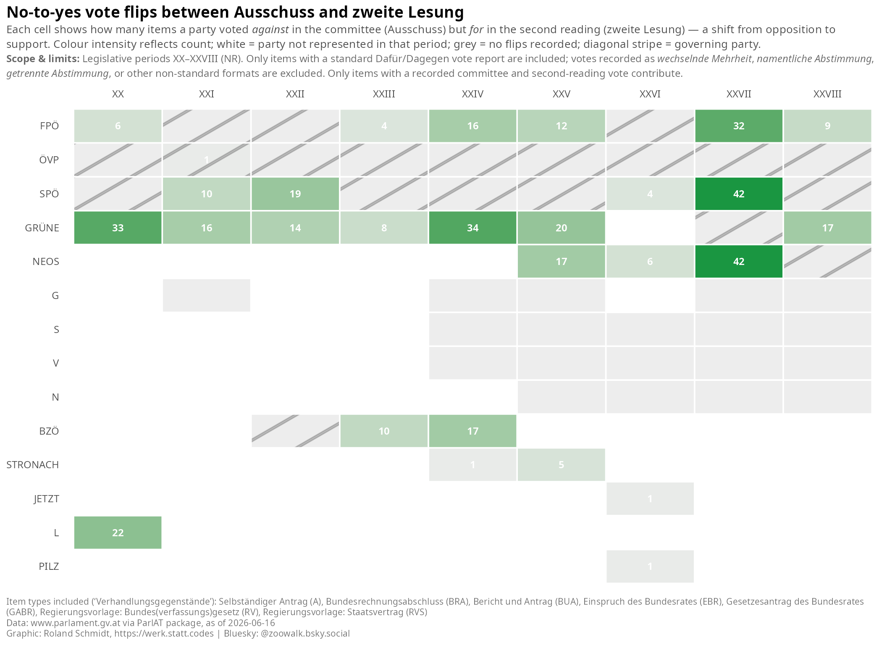
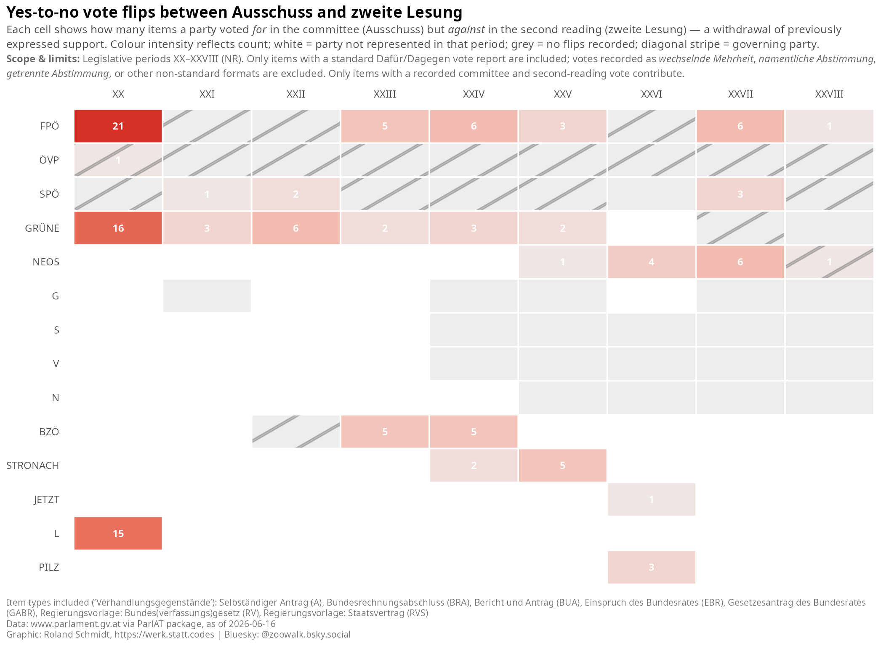

# Just the results, please {.unnumbered}

::: {layout-ncol="2"}
{group="voting_patterns_2_gallery"}

{group="voting_patterns_2_gallery"}

{group="voting_patterns_2_gallery"}

{group="voting_patterns_2_gallery"}
:::

# Packages

Get the necessary packages. In addition, I define here a small helper function which gives all reactable tables in this post a consistent look (title, optional subtitle, and a source note at the bottom), so I don't have to repeat the same styling code over and over again.

```{r}
#| label: setup
#| code-summary: "Load packages"
library(ParlAT)
library(tidyverse)
library(furrr)
library(reactable)
library(reactablefmtr)
library(naniar)
library(ggpattern)
library(ggtext)
library(patchwork)
library(ggalluvial)

# shared table theme and attribution footer for all reactable tables
compact_table_theme <- reactablefmtr::fivethirtyeight(font_size = 12)
table_source <- reactablefmtr::html(
  "<span style='font-size:8pt;color:grey30;font-family:Segoe UI !important;line-height:0.5'>Source: www.parlament.gv.at. Analysis: Roland Schmidt - @zoowalk.bsky.social - https://werk.statt.codes</span>"
)

# helper that wraps any reactable with a consistent title, optional subtitle, and source footer
style_reactable_table <- function(table, title, subtitle = NULL) {
  styled_table <- table %>%
    reactablefmtr::add_title(
      title = reactablefmtr::html(paste0(
        "<span style='font-size:12pt;'>",
        title,
        "</span>"
      ))
    )

  if (!is.null(subtitle)) {
    styled_table <- styled_table %>%
      reactablefmtr::add_subtitle(
        subtitle = reactablefmtr::html(paste0(
          "<span style='font-size:10pt;line-height:0.5;'>",
          subtitle,
          "</span>"
        )),
        font_color = "grey30",
        font_weight = "normal",
        font_style = "italic"
      )
  }

  styled_table %>%
    reactablefmtr::add_source(source = table_source)
}
```

# Get items

## Query data

As in the previous post, let's start by getting all items ('Verhandlungsgegenstände') of the National Council for the legislative periods 20 to 28. No big deal.

```{r}
#| label: fetch-items
#| code-summary: "Fetch National Council items and cache them"
#| cache: true
#| eval: false
# fetch all NR items for legislative periods 20–28 (GP XX through XXVIII)
items_20_28 <- seq(20, 28) %>%
  map(., \(x) get_items(legis_period = x, institution = "NR")) %>%
  list_rbind() # stack per-period tibbles into one dataframe
nrow(items_20_28)
```

```{r}
#| label: load-items-cache
#| include: false
# readr::write_rds(
#   items_20_28,
#   here::here(
#     "posts",
#     "2026-06-08-ParlAT-votingPatterns-2",
#     "_data",
#     "items_20_28.rds"
#   )
# )
items_20_28 <- readr::read_rds(here::here(
  "posts",
  "2026-06-08-ParlAT-votingPatterns-2",
  "_data",
  "items_20_28.rds"
))

data_cutoff <- {
  d <- max(items_20_28$date, na.rm = TRUE)
  sub("^0", "", format(d, "%d %B %Y")) # strip leading zero so "07 June" becomes "7 June"
}
```

## Keep items of interest

The `get_items()` call returned all (!) items, but not every item type is actually subject to a vote in a reading. Below I filter for those types which are: motions (Anträge), government bills (Regierungsvorlagen), budget-related items, and a few others. In case I missed any relevant category here, please let me know.

```{r}
#| label: define-item-scope
#| code-summary: "Select legislative item types"
# A=Anträge, RV=Regierungsvorlagen, BUA/GABR/BRA=budget-related, EBR=EU items
# anchored patterns (^A$, ^EBR$) prevent partial matches against longer codes
items_select <- c("^A$", "RV", "BUA", "GABR", "GABR13", "BRA", "^EBR$") %>%
  paste0(., collapse = "|")

items_scope <- items_20_28 %>%
  filter(str_detect(type_doc, regex(items_select)))

# verify which long-form type labels the regex actually matched. Note that the
# unanchored RV/GABR patterns also match variants (RVEU, RVS, GABR13, …); these
# pass the type filter but rarely carry a standard reading vote, so they drop out
# downstream. The graph caption is therefore built later, from the item types that
# actually survive into the analysis (see the votes-wide section).
items_scope %>%
  distinct(type_doc_long, type_doc)
```

# Get item details

## Query data

Now let's feed the URLs of the obtained items to `get_item_details()`, this time with the `stages` parameter set to `TRUE`. The stages data contains one row per procedural step of an item, and — crucially for this post — the description of each voting step. As in the previous post, I wrap the function call in purrr's `safely()` to collect any potential errors without breaking the loop, and use `future_map()` to query the API with multiple workers simultaneously, i.e. to speed up the process.

```{r}
#| label: fetch-item-details
#| code-summary: "Fetch item details with stages and cache them"
#| cache: true
#| eval: false
plan(multisession, workers = 4) # parallelise across 4 cores to speed up API fetching

item_urls <- items_scope %>%
  pull(item_url)

# wrap in safely() so a single failed request returns an error slot instead of halting the loop
safe_get_item_details <- safely(get_item_details)

item_details_raw <- item_urls %>%
  future_map(
    \(x) {
      safe_result <- safe_get_item_details(item_url = x, stages = TRUE)
      safe_result$item_url <- x # attach URL so failed results can be identified later
      safe_result
    },
    .progress = TRUE,
    .options = furrr_options(packages = c("ParlAT", "purrr", "tibble"))
  )
```

```{r}
#| label: load-item-details-cache
#| eval: true
#| include: false
# persist the raw fetch results so re-renders don't need to re-hit the API
# readr::write_rds(
#   item_details_raw,
#   here::here(
#     "posts",
#     "2026-06-08-ParlAT-votingPatterns-2",
#     "_data",
#     "item_details_raw.rds"
#   )
# )

plan(sequential) # reset to single-threaded after parallel fetch

# reload from disk so the object is available in non-eval (cached) renders
item_details_raw <- readr::read_rds(here::here(
  "posts",
  "2026-06-08-ParlAT-votingPatterns-2",
  "_data",
  "item_details_raw.rds"
))
```

## Also fetch the committee reports

There is a catch that only becomes visible once you look closely at the source: for most bills, the committee's vote is **not** recorded on the bill's own page at all. It lives on a separate object — the committee report (`Ausschussbericht`, type `AUB`) — which carries the formal `Antrag auf Annahme des Gesetzesvorschlags` division with each party's position, plus a reference back to the parent bill. So to capture committee votes properly, I fetch every committee report for periods 20–28 as well, again with `stages = TRUE`.

```{r}
#| label: fetch-aub-details
#| code-summary: "Fetch all committee reports (Ausschussbericht) with stages and cache them"
#| cache: true
#| eval: false
aub_urls <- items_20_28 %>%
  filter(type_doc == "AUB") %>% # AUB = Ausschussbericht (committee report)
  pull(item_url) %>%
  unique()

plan(multisession, workers = 4)
safe_get_item_details <- safely(get_item_details)
aub_details_raw <- aub_urls %>%
  future_map(
    \(x) {
      safe_result <- safe_get_item_details(item_url = x, stages = TRUE)
      safe_result$item_url <- x
      safe_result
    },
    .progress = TRUE,
    .options = furrr_options(packages = c("ParlAT", "purrr", "tibble"))
  )
```

```{r}
#| label: load-aub-cache
#| eval: true
#| include: false
# readr::write_rds(
#   aub_details_raw,
#   here::here("posts", "2026-06-08-ParlAT-votingPatterns-2", "_data", "aub_details_raw.rds")
# )
plan(sequential)
aub_details_raw <- readr::read_rds(here::here(
  "posts",
  "2026-06-08-ParlAT-votingPatterns-2",
  "_data",
  "aub_details_raw.rds"
))
```

## Prepare stages data

Below, I a) check for any failed calls, and b) combine the successful calls into a single data frame. Subsequently, I unnest the stages column so that we get one row per procedural step per item. Note that at this point the data frame still contains *all* stage rows for each item — also those without any vote. Filtering for the actual votes comes next.

```{r}
#| label: prepare-stages-data
#| code-summary: "Unnest stages, filter vote rows, add reading and vote_text_list columns"
# collect items where the API call failed; conditionMessage() extracts the error string
failed_items <- item_details_raw |>
  keep(\(x) !is.null(x$error)) |>
  map(\(x) tibble(item_url = x$item_url, error = conditionMessage(x$error))) |>
  list_rbind()

# keep only successful results and extract the nested $result element
item_details <- item_details_raw |>
  keep(\(x) is.null(x$error)) |>
  map("result") |>
  list_rbind()

# unnest stages into one row per stage per item
item_stages <- item_details |>
  select(
    item_url,
    legis_period,
    type_doc,
    title,
    item_number,
    status_number,
    status_description,
    stages,
    votes
  ) |>
  filter(map_lgl(stages, \(x) !is.null(x))) |> # drop items with no stage data at all
  unnest(stages) %>%
  mutate(stage_date = lubridate::dmy(stage_date))

# used in inline text and table subtitles throughout the document
data_cutoff <- max(item_stages$stage_date)
```

## Build committee votes from the reports

Now I turn the committee reports into usable committee votes. For each report I a) read its stages and keep the `Antrag auf Annahme des Gesetzesvorschlags` line (which holds the `Dafür/Dagegen` party split), and b) follow its `references` entry flagged `HG` ("Hauptgegenstand") back to the parent bill. The result is one committee-vote row per bill, carrying the parent bill's identifiers so it slots in alongside the second- and third-reading rows further down.

```{r}
#| label: prepare-committee-votes
#| code-summary: "Extract committee votes from reports and link them to the parent bill"
# successful report fetches
aub_details <- aub_details_raw |>
  keep(\(x) is.null(x$error)) |>
  map("result") |>
  list_rbind()

# link each report to its parent bill via the reference flagged "HG" (Hauptgegenstand)
aub_parent <- aub_details |>
  transmute(
    aub_url = item_url,
    parent_url = map_chr(references, \(r) {
      if (is.null(r) || !is.data.frame(r) || nrow(r) == 0) {
        return(NA_character_)
      }
      hg <- r[!is.na(r$art) & r$art == "HG", , drop = FALSE]
      if (nrow(hg) == 0) {
        return(NA_character_)
      }
      paste0("https://www.parlament.gv.at", hg$url[1])
    })
  )

# the committee's adoption-vote stage(s) from each report, linked to the parent bill
aub_committee_stages <- aub_details |>
  select(aub_url = item_url, stages) |>
  filter(map_lgl(stages, \(x) !is.null(x))) |>
  unnest(stages) |>
  filter(str_detect(stage_name, regex("Antrag auf Annahme des", ignore_case = TRUE))) |>
  mutate(stage_date = lubridate::dmy(stage_date)) |>
  left_join(aub_parent, by = "aub_url") |>
  filter(!is.na(parent_url))

# parent bill's item-level fields, so committee rows line up with the reading rows
parent_meta <- item_stages |>
  distinct(
    item_url,
    legis_period,
    type_doc,
    title,
    item_number,
    status_number,
    status_description
  )

# one committee row per bill (keep the latest adoption vote if a report has several)
committee_rows <- aub_committee_stages |>
  inner_join(parent_meta, by = c("parent_url" = "item_url")) |>
  transmute(
    item_url = parent_url,
    legis_period,
    type_doc,
    title,
    item_number,
    status_number,
    status_description,
    stage_date,
    stage_name,
    phase = "Ausschussbericht",
    reading = "committee"
  ) |>
  slice_max(stage_date, n = 1, by = item_url, with_ties = FALSE)

nrow(committee_rows) # committee votes available to merge with the readings
```

# Get items in scope

## How much committee activity is actually a vote?

It is worth pausing on what the **bill's own page** records about its committee phase — because, as it turns out, surprisingly little of it is the actual vote. A committee does far more than decide on a bill: it requests written opinions (Stellungnahmen), sets deadlines (Fristsetzungen), refers items back, and so on. The table below breaks all of a bill's National Council committee stages down by type. The punchline: the formal **adoption vote** — the committee's decision on the bill, the part we actually want — appears on the bill's own page only rarely. That is exactly why we fetched the committee reports above and took the committee vote from *there* instead.

```{r}
#| label: committee-context-summary
#| code-summary: "Categorise National Council committee stages and show the vote share"
# same vote-keyword set the scope filter below relies on
committee_vote_keywords <- "dafür|wechselnde Mehrheit|getrennte Abstimmung|namentliche Abstimmung|abgelehnt|mehrstimmig"

# classify every National Council committee stage by what it records
committee_stages <- item_stages %>%
  filter(phase == "Ausschussberatungen NR") %>%
  mutate(
    is_vote = str_detect(
      stage_name,
      regex(committee_vote_keywords, ignore_case = TRUE)
    ),
    category = case_when(
      str_detect(
        stage_name,
        regex("Antrag auf Annahme des", ignore_case = TRUE)
      ) ~ "Adoption vote on the bill",
      str_detect(
        stage_name,
        regex("Einholung einer Stellungnahme", ignore_case = TRUE)
      ) ~ "Opinion request (Stellungnahme)",
      str_detect(stage_name, regex("Fristsetzung", ignore_case = TRUE)) ~
        "Deadline motion (Fristsetzung)",
      is_vote ~ "Other vote",
      .default = "Non-vote / procedural"
    ),
    # only the adoption vote is carried into the analysis by the scope filter
    in_scope = category == "Adoption vote on the bill"
  )

# aggregate to one row per category with its share of all committee stages
committee_category_summary <- committee_stages %>%
  summarise(rows = n(), .by = c(category, in_scope)) %>%
  mutate(
    share = rows / sum(rows),
    in_analysis_scope = if_else(in_scope, "Yes", "No")
  ) %>%
  arrange(desc(rows)) %>%
  select(category, rows, share, in_analysis_scope)

committee_category_table <- reactable(
  committee_category_summary,
  columns = list(
    category = colDef(name = "Committee stage type", minWidth = 230),
    rows = colDef(
      name = "Stages",
      align = "right",
      minWidth = 90,
      format = colFormat(separators = TRUE)
    ),
    share = colDef(
      name = "Share of committee stages",
      minWidth = 230,
      align = "left",
      # data bars make the tiny vote share read at a glance against the procedural bulk
      cell = reactablefmtr::data_bars(
        committee_category_summary,
        max_value = 1,
        number_fmt = scales::label_percent(accuracy = 0.1),
        fill_color = "#1a9641",
        background = "#f0f0f0",
        text_position = "outside-end"
      )
    ),
    in_analysis_scope = colDef(
      name = "Adoption vote?",
      align = "center",
      minWidth = 130
    )
  ),
  fullWidth = TRUE,
  compact = TRUE,
  highlight = TRUE,
  outlined = TRUE,
  theme = compact_table_theme
) %>%
  style_reactable_table(
    "WHAT THE BILL'S OWN PAGE RECORDS ABOUT ITS COMMITTEE PHASE",
    paste0(
      "All committee stages recorded on the bills' own pages, by type — the adoption vote is the rarest of them. Data as of ",
      data_cutoff,
      "."
    )
  )

committee_category_table
```

Across all `r scales::comma(nrow(committee_stages))` committee stages recorded on the bills' own pages, only `r scales::percent(mean(committee_stages$is_vote), accuracy = 0.1)` record a vote at all, and just `r scales::percent(mean(committee_stages$in_scope), accuracy = 0.1)` are the bill-adoption vote — which is why the committee position has to come from the report instead. For reference, the table below lists the vote-bearing committee stages that *do* appear on the bills' own pages, each linked to its source.

```{r}
#| label: committee-vote-rows-table
#| code-summary: "List committee stages that record a vote, with links to the source"
committee_vote_rows <- committee_stages %>%
  filter(is_vote) %>%
  mutate(
    # strip the base URL and query string to a compact "XXVIII/I/403" style reference
    item_ref = item_url %>%
      str_remove("^https://www\\.parlament\\.gv\\.at/gegenstand/") %>%
      str_remove("\\?.*$"),
    in_analysis_scope = if_else(in_scope, "Yes", "No")
  ) %>%
  select(
    legis_period,
    item_ref,
    stage_date,
    stage_name,
    category,
    in_analysis_scope,
    item_url
  ) %>%
  arrange(desc(stage_date))

committee_vote_rows_table <- reactable(
  committee_vote_rows,
  columns = list(
    legis_period = colDef(
      name = "Legis. period",
      align = "right",
      minWidth = 90,
      filterable = TRUE
    ),
    item_ref = colDef(
      name = "Item",
      minWidth = 120,
      filterable = TRUE,
      # custom cell renderer turns the short reference into a clickable link
      cell = function(value, index) {
        htmltools::tags$a(
          href = committee_vote_rows$item_url[index],
          target = "_blank",
          value
        )
      }
    ),
    stage_date = colDef(
      name = "Stage date",
      align = "left",
      minWidth = 110,
      filterable = TRUE
    ),
    stage_name = colDef(
      name = "Stage",
      minWidth = 460,
      filterable = TRUE,
      style = list(whiteSpace = "normal", lineHeight = "1.35")
    ),
    category = colDef(name = "Type", minWidth = 180, filterable = TRUE),
    in_analysis_scope = colDef(
      name = "Adoption vote?",
      align = "center",
      minWidth = 100,
      filterable = TRUE
    ),
    item_url = colDef(show = FALSE) # kept for the cell renderer, hidden from display
  ),
  fullWidth = TRUE,
  compact = TRUE,
  highlight = FALSE,
  outlined = TRUE,
  searchable = TRUE,
  defaultPageSize = 10,
  theme = compact_table_theme
) %>%
  style_reactable_table(
    "COMMITTEE STAGES THAT RECORD A VOTE",
    paste0(
      "All 'Ausschussberatungen NR' stages containing a vote keyword. 'In scope?' marks the bill-adoption votes used in the analysis. Data as of ",
      data_cutoff,
      "."
    )
  )

committee_vote_rows_table
```

## Applying the scope filter

Now to the actual filtering. I take the second- and third-reading rows from the bills' own National Council stages and **bind on the committee votes built from the reports** above, so the three stages sit in one table. Then I keep only the rows where a vote was actually cast. The committee step is the bill's first formal vote, taken before it reaches the plenary floor; including it lets us follow an item across three stages instead of two. Along the way, two new columns are added: `reading` records the stage — committee, second, or third reading (or, in some cases, second and third at once) — and `vote_report_type` captures *how* the vote result is reported in the stage description. The latter matters more than one might think: only stages with an explicit 'Dafür:.../Dagegen:...' pattern (which I label 'regular') state each party's position; other formats such as 'wechselnde Mehrheit' or 'namentliche Abstimmung' don't allow extracting party positions from the stage text alone.

```{r}
#| label: scope-items
#| code-summary: "Filter to NR readings, classify vote report type"
items_scope <- item_stages |>
  filter(str_detect(phase, regex("NR"))) %>% # keep only National Council (NR) phases
  # plenary 2nd/3rd readings from the bill's own stages
  # r? makes the pattern match both "zweite"/"zweiter" and "dritte"/"dritter"
  filter(str_detect(stage_name, "(dritter?|zweiter?) Lesung")) %>%
  mutate(
    reading = case_when(
      # some items combine both readings into a single stage entry
      str_detect(stage_name, regex("zweite")) &
        str_detect(stage_name, regex("dritte")) ~ "second & third",
      str_detect(stage_name, regex("zweite")) ~ "second",
      str_detect(stage_name, regex("dritte")) ~ "third",
      .default = NA_character_
    )
  ) %>%
  # committee votes come from the committee reports (see prepare-committee-votes)
  bind_rows(committee_rows) %>%
  # keep only stages that contain actual vote-outcome text
  filter(str_detect(
    stage_name,
    regex(
      "dafür|wechselnde Mehrheit|getrennte Abstimmung|namentliche Abstimmung|abgelehnt|mehrstimmig",
      ignore_case = T
    )
  )) %>%
  mutate(
    # classify how the vote result is reported; order matters — "regular" must come first
    # because some stage names contain both "dafür" and other keywords
    vote_report_type = case_when(
      # "regular" requires the explicit Dafür:/Dagegen: party-list separator the parser
      # keys on; parenthetical forms like "mehrstimmig (dafür S,V dagegen F)" fall through
      str_detect(stage_name, regex("dafür", ignore_case = T)) &
        str_detect(stage_name, regex("dagegen", ignore_case = T)) &
        str_detect(
          stage_name,
          regex(",\\s*dagegen:|\\.\\s*Dagegen:", ignore_case = T)
        ) ~ "regular",
      str_detect(
        stage_name,
        regex("wechselnde Mehrheit", ignore_case = T)
      ) ~ "wechselnde Mehrheit",
      str_detect(
        stage_name,
        regex("namentliche Abstimmung", ignore_case = T)
      ) ~ "namentliche Abstimmung",
      str_detect(
        stage_name,
        regex("getrennte Abstimmung", ignore_case = T)
      ) ~ "getrennte Abstimmung",
      str_detect(stage_name, regex("abgelehnt", ignore_case = T)) ~ "abgelehnt",
      str_detect(
        stage_name,
        regex("mehrstimmig", ignore_case = T)
      ) ~ "mehrstimmig",
      .default = NA
    )
  )

nrow(items_scope)
nrow(item_stages)

# inspect the distribution of vote reporting types
items_scope %>%
  count(vote_report_type, sort = T) %>%
  mutate(rel = n / sum(n) * 100)
```

## Check for duplicate stage rows

Time for a *data sanity check*. Now that the analysis spans up to three stages — committee, second reading and third reading — an item no longer needs to have a fixed number of rows. What it *should* have, however, is at most one row per stage: a single committee vote, a single second-reading vote, a single third-reading vote. Any item with more than one row for the same stage points to a data inconsistency (duplicates in the source, or an item that was approved/rejected twice within one stage). Let's see how many such cases there are.

```{r}
#| label: check-pairs
#| code-summary: "Identify items with duplicate vote rows within a stage"
# each item should have at most one row per stage (committee / second / third)
dup_rows <- items_scope %>%
  count(legis_period, item_url, reading, name = "n_rows") %>%
  filter(n_rows > 1) # flag any item+stage combination that occurs more than once
n_distinct(dup_rows$item_url)
```

There are `r n_distinct(dup_rows$item_url)` items out of `r n_distinct(items_scope$item_url)` which feature more than one row for the same stage.

To facilitate a closer look at these cases, the table below lists the deviating items with their individual vote-stage rows. Each item is linked to its page on the parliament's website, so you can check the underlying records yourself.

```{r}
#| label: non-pairs-table
#| code-summary: "Build reactable table of items with duplicate vote rows in a stage"
# limit to only the offending items so the table stays focused
non_pairs_details <- items_scope %>%
  semi_join(dup_rows, by = c("legis_period", "item_url")) %>%
  distinct() %>%
  select(
    legis_period,
    item_url,
    stage_date,
    stage_name,
    vote_report_type
  ) %>%
  mutate(n_obs = n(), .by = c("legis_period", "item_url"))

non_pairs_details_display <- non_pairs_details %>%
  arrange(desc(n_obs), legis_period, item_url, stage_date) %>%
  mutate(
    # strip the base URL and query string to get a compact "XXVIII/I/403" style reference
    item_ref = item_url %>%
      str_remove("^https://www\\.parlament\\.gv\\.at/gegenstand/") %>%
      str_remove("\\?.*$")
  ) %>%
  select(
    legis_period,
    item_ref,
    stage_date,
    stage_name,
    vote_report_type,
    n_obs,
    item_url
  )

non_pairs_details_table <- reactable(
  non_pairs_details_display,
  columns = list(
    legis_period = colDef(
      name = "Legis. period",
      align = "right",
      minWidth = 90,
      filterable = TRUE
    ),
    item_ref = colDef(
      name = "Item",
      minWidth = 125,
      filterable = TRUE,
      # custom cell renderer turns the short reference into a clickable link
      cell = function(value, index) {
        htmltools::tags$a(
          href = non_pairs_details_display$item_url[index],
          target = "_blank",
          value
        )
      }
    ),
    stage_date = colDef(
      name = "Stage date",
      align = "left",
      minWidth = 110,
      filterable = TRUE
    ),
    stage_name = colDef(
      name = "Stage",
      minWidth = 540,
      filterable = TRUE,
      style = list(whiteSpace = "normal", lineHeight = "1.35")
    ),
    vote_report_type = colDef(
      name = "Vote report type",
      minWidth = 155,
      filterable = TRUE
    ),
    n_obs = colDef(
      name = "Rows per item",
      align = "right",
      minWidth = 130,
      format = colFormat(digits = 0)
    ),
    item_url = colDef(show = FALSE) # kept in data for the cell renderer above, hidden from display
  ),
  fullWidth = TRUE,
  compact = TRUE,
  highlight = FALSE,
  outlined = TRUE,
  searchable = TRUE,
  defaultPageSize = 10,
  defaultSorted = "n_obs",
  defaultSortOrder = "desc",
  theme = compact_table_theme
) %>%
  style_reactable_table(
    "ITEMS WITH DUPLICATE VOTE ROWS IN A STAGE",
    paste0(
      "Items with more than one vote row for the same stage (committee, second or third reading). Data as of ",
      data_cutoff,
      "."
    )
  )

non_pairs_details_table
```

As it turns out, some are duplicates in the data source, e.g. here: https://www.parlament.gv.at/gegenstand/XX/I/1530?selectedStage=105. The votes in the second and third reading are reported twice. Others are reported mulitple times because an item was within one single reading party approved/not approved and hence got two rows in the data source, i.e. https://www.parlament.gv.at/gegenstand/XXVIII/I/403

Rather than trying to repair these inconsistencies one by one, I simply remove the affected items from the analysis. Subsequently, I narrow the data down to items with a 'regular' vote report — and since this filter can itself re-introduce a duplicate-free-but-now-inconsistent state, I check for and remove duplicate stage rows once more. The last line below shows which share of the original vote stages survives all these filters.

```{r}
#| label: filter-pairs
#| code-summary: "Remove items with duplicate stage rows, keep regular vote type only"
# drop items that had duplicate rows within a stage; only clean items remain
items_scope_pairs <- items_scope %>%
  anti_join(., dup_rows, by = c("legis_period", "item_url"))
nrow(items_scope_pairs)

# sanity check: no item should now have more than one row per stage
items_scope_pairs %>%
  count(legis_period, item_url, reading, name = "n_rows") %>%
  filter(n_rows > 1) %>%
  nrow()

table(items_scope_pairs$reading)

# this analysis focuses only on "regular" votes (explicit Dafür/Dagegen party lists)
items_scope_pairs_regular <- items_scope_pairs %>%
  filter(vote_report_type == "regular")

# re-check after the regular filter: filtering by type can leave residual duplicates
dup_rows2 <- items_scope_pairs_regular %>%
  count(legis_period, item_url, reading, name = "n_rows") %>%
  filter(n_rows > 1)

items_scope_pairs_regular <- items_scope_pairs_regular %>%
  anti_join(., dup_rows2, by = c("legis_period", "item_url"))

nrow(items_scope_pairs)
nrow(items_scope_pairs_regular)
nrow(items_scope_pairs_regular) / nrow(items_scope) # share of all vote stages covered
```


# Extract votes

Now to the heart of the matter: getting each party's position out of the stage description. The text follows (mostly) the pattern 'Dafür: party A, party B, dagegen: party C', so the function below splits the string at the 'dagegen' boundary and cleans up both sides. Two details are worth mentioning: first, I keep only tokens which appear in a predefined list of valid party labels — this guards against vote counts, footnotes and other non-party fragments sneaking into the results. Second, since party labels changed over the legislative periods (e.g. the FPÖ appearing as 'F' in earlier periods), a small helper maps the historical variants onto one canonical name per party.

```{r}
#| label: define-vote-extractor
#| code-summary: "Define party normalisation and Dafür/Dagegen vote text parser"
# includes historical aliases (F, NEOS-LIF, F-BZÖ, S/V/N/G single-letter forms)
# alongside canonical modern names; used as an allowlist to filter out non-party tokens
valid_parties <- c(
  "SPÖ",
  "ÖVP",
  "F",
  "FPÖ",
  "GRÜNE",
  "L",
  "BZÖ",
  "STRONACH",
  "NEOS",
  "NEOS-LIF",
  "F-BZÖ",
  "JETZT",
  "PILZ",
  "NEOS/NEOS-LIF",
  "JETZT/PILZ",
  "S",
  "V",
  "N",
  "G"
)

# maps historical/transitional party labels to a single canonical name per party
normalise_party <- function(party) {
  case_when(
    party %in% c("NEOS-LIF", "NEOS/NEOS-LIF") ~ "NEOS",
    party == "F" ~ "FPÖ",
    party == "F-BZÖ" ~ "BZÖ",
    TRUE ~ party
  )
}

fn_get_votes <- function(vt) {
  # inner helper: splits a raw comma-separated party string into a clean character vector
  clean_parties <- function(x) {
    if (is.na(x) || str_trim(x) == "-") {
      return(character(0))
    }

    x |>
      str_split(",\\s*") |>
      unlist() |>
      str_trim() |>
      str_remove("\\)+$") |> # strip trailing parentheses e.g. "SPÖ (Mehrheit)" -> "SPÖ"
      str_trim() |>
      # keep only all-caps tokens (party abbreviations); drops vote counts, notes, etc.
      keep(\(p) {
        str_detect(
          p,
          regex("^[[:upper:]ÄÖÜ]+(?:[-/][[:upper:]ÄÖÜ]+)*$")
        )
      }) |>
      keep(\(p) p %in% valid_parties) # final guard against unknown tokens
  }

  # some stage texts use ". Dagegen:" (period separator) instead of ", dagegen:"
  # normalise to a consistent comma form so the split below works in both cases
  vt_norm <- str_replace(
    vt,
    regex("\\.\\s*Dagegen:", ignore_case = TRUE),
    ", dagegen:"
  )

  # split at the dagegen boundary; n=2 prevents splitting inside party lists
  parts <- str_split(
    vt_norm,
    regex(",\\s*dagegen:", ignore_case = TRUE),
    n = 2
  )[[1]]

  if (length(parts) != 2) {
    stop("Regular vote text does not contain both Dafür and Dagegen parts.")
  }

  if (!str_detect(parts[1], regex("Dafür:", ignore_case = TRUE))) {
    stop("Regular vote text does not contain a Dafür part.")
  }

  # strip the "Dafür:" label and everything before it (dotall handles multi-line stage names)
  yes_raw <- parts[1] |>
    str_remove(regex("^.*Dafür:\\s*", dotall = TRUE, ignore_case = TRUE))

  no_raw <- parts[2]

  list(
    vote_yes = clean_parties(yes_raw),
    vote_no = clean_parties(no_raw)
  )
}
```

With the function defined, applying it to the data is a one-liner. The result is a list column containing, for every vote stage, the vector of parties in favor and the vector of parties against.

```{r}
#| label: extract-votes
#| code-summary: "Apply vote parser to extract yes/no party lists per stage"
# parse each stage_name string into a list(vote_yes, vote_no) of party vectors
items_scope_pairs_regular <- items_scope_pairs_regular %>%
  mutate(votes_li = map(stage_name, fn_get_votes))
```

The list column is handy, but for the actual analysis a 'long' data frame is more convenient: one row per item, reading, and party, with two indicator columns recording whether the party voted in favor and/or against. The `summarise()` at the end collapses any remaining duplicate rows.

```{r}
#| label: votes-long
#| code-summary: "Expand to one row per party per stage (long format)"
items_scope_pairs_regular_long <- items_scope_pairs_regular %>%
  mutate(
    votes_party = map(votes_li, \(v) {
      yes_parties <- normalise_party(v$vote_yes)
      no_parties <- normalise_party(v$vote_no)

      # union ensures each party appears once per stage even if somehow listed in both sides
      tibble(
        party = union(yes_parties, no_parties),
        yes = as.integer(party %in% yes_parties),
        no = as.integer(party %in% no_parties)
      )
    })
  ) %>%
  unnest(votes_party) %>%
  select(
    item_url,
    legis_period,
    type_doc,
    title,
    item_number,
    status_number,
    status_description,
    stage_date,
    stage_name,
    reading,
    vote_report_type,
    party,
    yes,
    no
  ) %>%
  group_by(across(-c(yes, no))) %>%
  # collapse duplicate rows (e.g. from deduplication edge cases) by taking the maximum vote value
  summarise(
    yes = max(yes, na.rm = TRUE),
    no = max(no, na.rm = TRUE),
    .groups = "drop"
  )
```


To detect flips between the readings, we need both readings side by side. Hence, let's pivot the long data frame into a wide format where each row is one item-party combination, with separate columns for the vote in the second and the third reading (`yes_second`, `no_second`, `yes_third`, `no_third`). An `NA` in these columns means that the party has no recorded vote for that particular reading.

```{r}
#| label: votes-wide
#| code-summary: "Pivot to wide format with separate second/third reading columns"
items_scope_pairs_regular_wide <- items_scope_pairs_regular_long %>%
  # drop "second & third" combined rows; keep committee + clean individual readings
  filter(reading %in% c("committee", "second", "third")) %>%
  filter(vote_report_type == "regular") %>%
  select(
    item_url,
    legis_period,
    type_doc,
    title,
    item_number,
    status_number,
    status_description,
    party,
    reading,
    vote_report_type,
    yes,
    no
  ) %>%
  # pivot so each row is one item × party with columns yes_second, no_second, yes_third, no_third
  pivot_wider(
    id_cols = c(
      item_url,
      legis_period,
      type_doc,
      title,
      item_number,
      status_number,
      status_description,
      party
    ),
    names_from = reading,
    values_from = c(vote_report_type, yes, no),
    names_glue = "{.value}_{reading}",
    # NA fills indicate the party has no recorded vote for that particular reading
    values_fill = list(
      vote_report_type = NA_character_,
      yes = NA_integer_,
      no = NA_integer_
    )
  )

# graph caption: list only the item types that actually survive into the analysis
# (the type filter is broader, but several variants never carry a reading vote)
analysed_type_labels <- items_scope_pairs_regular_wide %>%
  distinct(type_doc) %>%
  left_join(distinct(items_20_28, type_doc, type_doc_long), by = "type_doc") %>%
  arrange(type_doc) %>%
  mutate(label = paste0(type_doc_long, " (", type_doc, ")")) %>%
  pull(label) %>%
  paste(collapse = ", ")

vote_graph_caption <- paste0(
  "Item types included ('Verhandlungsgegenstände'): ",
  analysed_type_labels,
  "<br>Data: www&#46;parlament.gv.at via ParlAT package, as of ",
  data_cutoff,
  "<br>Graphic: Roland Schmidt, https&#58;//werk.statt.codes | Bluesky: @zoowalk.bsky.social"
)
```

Speaking of `NA`s — before drawing any conclusions, it's worth checking how much missingness we are actually dealing with, and whether it is concentrated in particular legislative periods. The naniar package makes this a quick exercise.

```{r}
#| label: vis-missingness
#| code-summary: "Visualise missing values by legislative period"
library(naniar)
# faceting by legis_period reveals whether missingness is period-specific or systemic
items_scope_pairs_regular_wide %>%
  naniar::vis_miss(facet = legis_period)
```


Now for the first actual result: how often did a party reject an item in the second reading, only to support it in the third? Such no-to-yes flips are rare by design — the third reading usually follows immediately after the second — but where they occur, they may hint at successful last-minute amendments or changed political circumstances. The graph below shows the number of such flips per party and legislative period. Since a flip carries a different weight depending on whether a party sits in government or in opposition, governing parties are marked with a diagonal stripe pattern (this is where the ggpattern package comes in). Don't get distracted by the length of the code chunk; most of it is needed to make sure that empty cells are displayed correctly (a party not represented in parliament is something different than a party without flips).

```{r}
#| label: plot-flip-no-to-yes
#| code-summary: "Build tile plot of no-to-yes vote flips by party and legislative period"
#| fig-width: 11
#| fig-height: 8
#| out-width: "100%"
#| fig-align: "center"
# hand-coded coalition membership per legislative period (GP XX–XXVIII)
gov_parties_lookup <- tribble(
  ~legis_period , ~party ,
  "XX"          , "SPÖ"  , "XX"     , "ÖVP"   ,
  "XXI"         , "ÖVP"  , "XXI"    , "F"     ,
  "XXII"        , "ÖVP"  , "XXII"   , "F"     , "XXII"   , "F-BZÖ" ,
  "XXIII"       , "SPÖ"  , "XXIII"  , "ÖVP"   ,
  "XXIV"        , "SPÖ"  , "XXIV"   , "ÖVP"   ,
  "XXV"         , "SPÖ"  , "XXV"    , "ÖVP"   ,
  "XXVI"        , "ÖVP"  , "XXVI"   , "FPÖ"   ,
  "XXVII"       , "ÖVP"  , "XXVII"  , "GRÜNE" ,
  "XXVIII"      , "ÖVP"  , "XXVIII" , "SPÖ"   , "XXVIII" , "NEOS"
) %>%
  mutate(party = normalise_party(party)) %>% # align aliases before joining
  mutate(is_gov = TRUE)

all_periods_vec <- c(
  "XX",
  "XXI",
  "XXII",
  "XXIII",
  "XXIV",
  "XXV",
  "XXVI",
  "XXVII",
  "XXVIII"
)

# tracks which party × period combinations actually appear in the data
# used later to distinguish "not in parliament" (white) from "zero flips" (grey)
party_period_presence <- items_scope_pairs_regular_wide %>%
  distinct(legis_period, party) %>%
  mutate(present = TRUE)

# NA arises when a party only voted in one of the two readings; treat as no flip
flip_no_to_yes_counts <- items_scope_pairs_regular_wide %>%
  mutate(
    flip_no_to_yes = replace_na(no_second == 1 & yes_third == 1, FALSE)
  ) %>%
  # wt= turns count() into a weighted sum, effectively summing TRUE values
  count(
    legis_period,
    party,
    wt = as.integer(flip_no_to_yes),
    name = "flip_n"
  )

all_parties <- union(party_period_presence$party, gov_parties_lookup$party)

# fixed top order, then remaining parties by presence across legislative periods
party_order_priority <- c("FPÖ", "ÖVP", "SPÖ", "GRÜNE", "NEOS")

party_order <- c(
  party_order_priority,
  party_period_presence %>%
    distinct(party, legis_period) %>%
    count(party, name = "periods_present") %>%
    right_join(tibble(party = all_parties), by = "party") %>%
    mutate(periods_present = replace_na(periods_present, 0L)) %>%
    filter(!party %in% party_order_priority) %>%
    arrange(desc(periods_present), party) %>%
    pull(party),
  setdiff(party_order_priority, all_parties)
) %>%
  unique()

# full cross-product ensures every party × period cell exists for the tile plot
flip_no_to_yes_grid <- expand_grid(
  party = all_parties,
  legis_period = all_periods_vec
) %>%
  left_join(
    flip_no_to_yes_counts,
    by = c("party", "legis_period")
  ) %>%
  replace_na(list(flip_n = 0)) %>%
  left_join(
    gov_parties_lookup,
    by = c("party", "legis_period")
  ) %>%
  replace_na(list(is_gov = FALSE)) %>%
  left_join(
    party_period_presence,
    by = c("party", "legis_period")
  ) %>%
  replace_na(list(present = FALSE)) %>%
  mutate(
    party = factor(party, levels = rev(party_order)),
    legis_period = factor(legis_period, levels = all_periods_vec),
    label = if_else(flip_n > 0, as.character(flip_n), ""),
    # NA fill_val → white tile (not in parliament); 0 fill_val → light grey (no flips)
    fill_val = if_else(present, as.numeric(flip_n), NA_real_)
  )

# subset used for the geom_text layer so labels only appear on non-zero tiles
flip_no_to_yes_labels <- flip_no_to_yes_grid %>%
  filter(flip_n > 0)

# clamp lower bound to 1 so a single-flip period still gets a visible colour gradient
n_max <- max(1, max(flip_no_to_yes_grid$flip_n, na.rm = TRUE))
library(ggpattern)
p_flip_no_to_yes <- flip_no_to_yes_grid %>%
  ggplot(aes(
    x = legis_period,
    y = party,
    fill = fill_val,
    pattern = is_gov # diagonal stripe overlay for government parties
  )) +
  ggpattern::geom_tile_pattern(
    colour = "white",
    linewidth = 0.6,
    pattern_colour = "grey50",
    pattern_fill = "grey50",
    pattern_density = 0.08,
    pattern_spacing = 0.06,
    pattern_alpha = 0.45
  ) +
  geom_text(
    data = flip_no_to_yes_labels,
    aes(x = legis_period, y = party, label = label),
    colour = "white",
    size = 3.2,
    fontface = "bold",
    family = "Noto Sans",
    inherit.aes = FALSE # avoid inheriting `pattern` aesthetic which causes ggpattern warnings
  ) +
  scale_fill_gradient(
    low = "grey93",
    high = "#1a9641",
    limits = c(0, n_max),
    na.value = "white", # white = party not present in that period
    guide = "none"
  ) +
  scale_pattern_manual(
    values = c("TRUE" = "stripe", "FALSE" = "none"),
    guide = "none"
  ) +
  scale_x_discrete(position = "top") +
  labs(
    x = NULL,
    y = NULL,
    title = "No-to-yes vote flips between zweite and dritte Lesung",
    subtitle = paste0(
      "Each cell shows how many items a party voted *against* in the second reading (zweite Lesung) ",
      "but *for* in the third reading (dritte Lesung) — a shift from opposition to support. ",
      "Colour intensity reflects count; white = party not represented in that period; ",
      "grey = no flips recorded; diagonal stripe = governing party.<br>",
      "<span style='font-size:9pt;color:grey40;'>",
      "**Scope & limits:** Legislative periods XX–XXVIII (NR). ",
      "Only items with a standard Dafür/Dagegen vote report are included; ",
      "votes recorded as *wechselnde Mehrheit*, *namentliche Abstimmung*, *getrennte Abstimmung*, ",
      "or other non-standard formats are excluded. ",
      "Only items with a recorded second and third reading vote contribute.",
      "</span>"
    ),
    caption = vote_graph_caption
  ) +
  theme_minimal(base_size = 11, base_family = "Noto Sans") +
  theme(
    panel.grid = element_blank(),
    axis.text = element_text(size = 9),
    plot.title = element_text(
      face = "bold",
      size = 14,
      hjust = 0,
      margin = ggplot2::margin(b = 4)
    ),
    plot.subtitle = ggtext::element_textbox_simple(
      size = 10,
      family = "Noto Sans",
      lineheight = 1.3,
      colour = "grey30",
      margin = ggplot2::margin(b = 10)
    ),
    plot.caption = ggtext::element_textbox_simple(
      size = 8,
      family = "Noto Sans",
      colour = "grey45",
      hjust = 0,
      halign = 0,
      margin = ggplot2::margin(t = 10)
    ),
    plot.title.position = "plot",
    plot.caption.position = "plot",
    legend.position = "none"
  )

p_flip_no_to_yes
```

And now the mirror image: items which a party supported in the second reading but rejected in the third, i.e. a withdrawal of previously expressed support. The code is essentially the same as above — only the flip condition is reversed, the parties are reordered by their yes-to-no totals, and the colour scheme switches to red.

```{r}
#| label: plot-flip-yes-to-no
#| code-summary: "Build tile plot of yes-to-no vote flips by party and legislative period"
#| fig-width: 11
#| fig-height: 8
#| out-width: "100%"
#| fig-align: "center"
# NA arises when a party only voted in one of the two readings; treat as no flip
flip_yes_to_no_counts <- items_scope_pairs_regular_wide %>%
  mutate(
    flip_yes_to_no = replace_na(yes_second == 1 & no_third == 1, FALSE)
  ) %>%
  # wt= turns count() into a weighted sum, effectively summing TRUE values
  count(
    legis_period,
    party,
    wt = as.integer(flip_yes_to_no),
    name = "flip_n"
  )

# full cross-product ensures every party × period cell exists for the tile plot
flip_yes_to_no_grid <- expand_grid(
  party = all_parties,
  legis_period = all_periods_vec
) %>%
  left_join(
    flip_yes_to_no_counts,
    by = c("party", "legis_period")
  ) %>%
  replace_na(list(flip_n = 0)) %>%
  left_join(
    gov_parties_lookup,
    by = c("party", "legis_period")
  ) %>%
  replace_na(list(is_gov = FALSE)) %>%
  left_join(
    party_period_presence,
    by = c("party", "legis_period")
  ) %>%
  replace_na(list(present = FALSE)) %>%
  mutate(
    party = factor(party, levels = rev(party_order)),
    legis_period = factor(legis_period, levels = all_periods_vec),
    label = if_else(flip_n > 0, as.character(flip_n), ""),
    # NA fill_val → white tile (not in parliament); 0 fill_val → light grey (no flips)
    fill_val = if_else(present, as.numeric(flip_n), NA_real_)
  )

# subset used for the geom_text layer so labels only appear on non-zero tiles
flip_yes_to_no_labels <- flip_yes_to_no_grid %>%
  filter(flip_n > 0)

# clamp lower bound to 1 so a single-flip period still gets a visible colour gradient
n_max_ytn <- max(1, max(flip_yes_to_no_grid$flip_n, na.rm = TRUE))

p_flip_yes_to_no <- flip_yes_to_no_grid %>%
  ggplot(aes(
    x = legis_period,
    y = party,
    fill = fill_val,
    pattern = is_gov # diagonal stripe overlay for government parties
  )) +
  ggpattern::geom_tile_pattern(
    colour = "white",
    linewidth = 0.6,
    pattern_colour = "grey50",
    pattern_fill = "grey50",
    pattern_density = 0.08,
    pattern_spacing = 0.06,
    pattern_alpha = 0.45
  ) +
  geom_text(
    data = flip_yes_to_no_labels,
    aes(x = legis_period, y = party, label = label),
    colour = "white",
    size = 3.2,
    fontface = "bold",
    family = "Noto Sans",
    inherit.aes = FALSE # avoid inheriting `pattern` aesthetic which causes ggpattern warnings
  ) +
  # red gradient signals withdrawal of support (yes → no)
  scale_fill_gradient(
    low = "grey93",
    high = "#d73027",
    limits = c(0, n_max_ytn),
    na.value = "white", # white = party not present in that period
    guide = "none"
  ) +
  scale_pattern_manual(
    values = c("TRUE" = "stripe", "FALSE" = "none"),
    guide = "none"
  ) +
  scale_x_discrete(position = "top") +
  labs(
    x = NULL,
    y = NULL,
    title = "Yes-to-no vote flips between zweite and dritte Lesung",
    subtitle = paste0(
      "Each cell shows how many items a party voted *for* in the second reading (zweite Lesung) ",
      "but *against* in the third reading (dritte Lesung) — a withdrawal of previously expressed support. ",
      "Colour intensity reflects count; white = party not represented in that period; ",
      "grey = no flips recorded; diagonal stripe = governing party.<br>",
      "<span style='font-size:9pt;color:grey40;'>",
      "**Scope & limits:** Legislative periods XX–XXVIII (NR). ",
      "Only items with a standard Dafür/Dagegen vote report are included; ",
      "votes recorded as *wechselnde Mehrheit*, *namentliche Abstimmung*, *getrennte Abstimmung*, ",
      "or other non-standard formats are excluded. ",
      "Only items with a recorded second and third reading vote contribute.",
      "</span>"
    ),
    caption = vote_graph_caption
  ) +
  theme_minimal(base_size = 11, base_family = "Noto Sans") +
  theme(
    panel.grid = element_blank(),
    axis.text = element_text(size = 9),
    plot.title = element_text(
      face = "bold",
      size = 14,
      hjust = 0,
      margin = ggplot2::margin(b = 4)
    ),
    plot.subtitle = ggtext::element_textbox_simple(
      size = 10,
      family = "Noto Sans",
      lineheight = 1.3,
      colour = "grey30",
      margin = ggplot2::margin(b = 10)
    ),
    plot.caption = ggtext::element_textbox_simple(
      size = 8,
      family = "Noto Sans",
      colour = "grey45",
      hjust = 0,
      halign = 0,
      margin = ggplot2::margin(t = 10)
    ),
    plot.title.position = "plot",
    plot.caption.position = "plot",
    legend.position = "none"
  )

p_flip_yes_to_no
```

# Going one stage earlier: committee to second reading

The two graphs above looked at the step from the second to the third reading. But the procedural journey of an item starts earlier — in the committee (Ausschuss), where a first formal vote on the bill is cast before it ever reaches the plenary floor. With the committee vote now part of the data, we can look at the *earlier* transition: from the committee vote to the second reading. The two graphs below mirror the ones above, only the comparison shifts one stage back. Note that committee votes with an explicit party breakdown are considerably rarer than reading votes, so these cells are sparser.

```{r}
#| label: plot-flip-committee-no-to-yes
#| code-summary: "Build tile plot of no-to-yes vote flips between committee and second reading"
#| fig-width: 11
#| fig-height: 8
#| out-width: "100%"
#| fig-align: "center"
# NA arises when a party only voted in one of the two stages; treat as no flip
flip_comm_no_to_yes_counts <- items_scope_pairs_regular_wide %>%
  mutate(
    flip_no_to_yes = replace_na(no_committee == 1 & yes_second == 1, FALSE)
  ) %>%
  count(
    legis_period,
    party,
    wt = as.integer(flip_no_to_yes),
    name = "flip_n"
  )

# full cross-product ensures every party × period cell exists for the tile plot
flip_comm_no_to_yes_grid <- expand_grid(
  party = all_parties,
  legis_period = all_periods_vec
) %>%
  left_join(flip_comm_no_to_yes_counts, by = c("party", "legis_period")) %>%
  replace_na(list(flip_n = 0)) %>%
  left_join(gov_parties_lookup, by = c("party", "legis_period")) %>%
  replace_na(list(is_gov = FALSE)) %>%
  left_join(party_period_presence, by = c("party", "legis_period")) %>%
  replace_na(list(present = FALSE)) %>%
  mutate(
    party = factor(party, levels = rev(party_order)),
    legis_period = factor(legis_period, levels = all_periods_vec),
    label = if_else(flip_n > 0, as.character(flip_n), ""),
    fill_val = if_else(present, as.numeric(flip_n), NA_real_)
  )

flip_comm_no_to_yes_labels <- flip_comm_no_to_yes_grid %>%
  filter(flip_n > 0)

n_max_cnty <- max(1, max(flip_comm_no_to_yes_grid$flip_n, na.rm = TRUE))

p_flip_comm_no_to_yes <- flip_comm_no_to_yes_grid %>%
  ggplot(aes(
    x = legis_period,
    y = party,
    fill = fill_val,
    pattern = is_gov
  )) +
  ggpattern::geom_tile_pattern(
    colour = "white",
    linewidth = 0.6,
    pattern_colour = "grey50",
    pattern_fill = "grey50",
    pattern_density = 0.08,
    pattern_spacing = 0.06,
    pattern_alpha = 0.45
  ) +
  geom_text(
    data = flip_comm_no_to_yes_labels,
    aes(x = legis_period, y = party, label = label),
    colour = "white",
    size = 3.2,
    fontface = "bold",
    family = "Noto Sans",
    inherit.aes = FALSE
  ) +
  scale_fill_gradient(
    low = "grey93",
    high = "#1a9641",
    limits = c(0, n_max_cnty),
    na.value = "white",
    guide = "none"
  ) +
  scale_pattern_manual(
    values = c("TRUE" = "stripe", "FALSE" = "none"),
    guide = "none"
  ) +
  scale_x_discrete(position = "top") +
  labs(
    x = NULL,
    y = NULL,
    title = "No-to-yes vote flips between Ausschuss and zweite Lesung",
    subtitle = paste0(
      "Each cell shows how many items a party voted *against* in the committee (Ausschuss) ",
      "but *for* in the second reading (zweite Lesung) — a shift from opposition to support. ",
      "Colour intensity reflects count; white = party not represented in that period; ",
      "grey = no flips recorded; diagonal stripe = governing party.<br>",
      "<span style='font-size:9pt;color:grey40;'>",
      "**Scope & limits:** Legislative periods XX–XXVIII (NR). ",
      "Only items with a standard Dafür/Dagegen vote report are included; ",
      "votes recorded as *wechselnde Mehrheit*, *namentliche Abstimmung*, *getrennte Abstimmung*, ",
      "or other non-standard formats are excluded. ",
      "Only items with a recorded committee and second-reading vote contribute.",
      "</span>"
    ),
    caption = vote_graph_caption
  ) +
  theme_minimal(base_size = 11, base_family = "Noto Sans") +
  theme(
    panel.grid = element_blank(),
    axis.text = element_text(size = 9),
    plot.title = element_text(
      face = "bold",
      size = 14,
      hjust = 0,
      margin = ggplot2::margin(b = 4)
    ),
    plot.subtitle = ggtext::element_textbox_simple(
      size = 10,
      family = "Noto Sans",
      lineheight = 1.3,
      colour = "grey30",
      margin = ggplot2::margin(b = 10)
    ),
    plot.caption = ggtext::element_textbox_simple(
      size = 8,
      family = "Noto Sans",
      colour = "grey45",
      hjust = 0,
      halign = 0,
      margin = ggplot2::margin(t = 10)
    ),
    plot.title.position = "plot",
    plot.caption.position = "plot",
    legend.position = "none"
  )

p_flip_comm_no_to_yes
```

And the mirror image one stage earlier: items a party supported in the committee but rejected in the second reading.

```{r}
#| label: plot-flip-committee-yes-to-no
#| code-summary: "Build tile plot of yes-to-no vote flips between committee and second reading"
#| fig-width: 11
#| fig-height: 8
#| out-width: "100%"
#| fig-align: "center"
# NA arises when a party only voted in one of the two stages; treat as no flip
flip_comm_yes_to_no_counts <- items_scope_pairs_regular_wide %>%
  mutate(
    flip_yes_to_no = replace_na(yes_committee == 1 & no_second == 1, FALSE)
  ) %>%
  count(
    legis_period,
    party,
    wt = as.integer(flip_yes_to_no),
    name = "flip_n"
  )

flip_comm_yes_to_no_grid <- expand_grid(
  party = all_parties,
  legis_period = all_periods_vec
) %>%
  left_join(flip_comm_yes_to_no_counts, by = c("party", "legis_period")) %>%
  replace_na(list(flip_n = 0)) %>%
  left_join(gov_parties_lookup, by = c("party", "legis_period")) %>%
  replace_na(list(is_gov = FALSE)) %>%
  left_join(party_period_presence, by = c("party", "legis_period")) %>%
  replace_na(list(present = FALSE)) %>%
  mutate(
    party = factor(party, levels = rev(party_order)),
    legis_period = factor(legis_period, levels = all_periods_vec),
    label = if_else(flip_n > 0, as.character(flip_n), ""),
    fill_val = if_else(present, as.numeric(flip_n), NA_real_)
  )

flip_comm_yes_to_no_labels <- flip_comm_yes_to_no_grid %>%
  filter(flip_n > 0)

n_max_cnty <- max(1, max(flip_comm_yes_to_no_grid$flip_n, na.rm = TRUE))

p_flip_comm_yes_to_no <- flip_comm_yes_to_no_grid %>%
  ggplot(aes(
    x = legis_period,
    y = party,
    fill = fill_val,
    pattern = is_gov
  )) +
  ggpattern::geom_tile_pattern(
    colour = "white",
    linewidth = 0.6,
    pattern_colour = "grey50",
    pattern_fill = "grey50",
    pattern_density = 0.08,
    pattern_spacing = 0.06,
    pattern_alpha = 0.45
  ) +
  geom_text(
    data = flip_comm_yes_to_no_labels,
    aes(x = legis_period, y = party, label = label),
    colour = "white",
    size = 3.2,
    fontface = "bold",
    family = "Noto Sans",
    inherit.aes = FALSE
  ) +
  scale_fill_gradient(
    low = "grey93",
    high = "#d73027",
    limits = c(0, n_max_cnty),
    na.value = "white",
    guide = "none"
  ) +
  scale_pattern_manual(
    values = c("TRUE" = "stripe", "FALSE" = "none"),
    guide = "none"
  ) +
  scale_x_discrete(position = "top") +
  labs(
    x = NULL,
    y = NULL,
    title = "Yes-to-no vote flips between Ausschuss and zweite Lesung",
    subtitle = paste0(
      "Each cell shows how many items a party voted *for* in the committee (Ausschuss) ",
      "but *against* in the second reading (zweite Lesung) — a withdrawal of previously expressed support. ",
      "Colour intensity reflects count; white = party not represented in that period; ",
      "grey = no flips recorded; diagonal stripe = governing party.<br>",
      "<span style='font-size:9pt;color:grey40;'>",
      "**Scope & limits:** Legislative periods XX–XXVIII (NR). ",
      "Only items with a standard Dafür/Dagegen vote report are included; ",
      "votes recorded as *wechselnde Mehrheit*, *namentliche Abstimmung*, *getrennte Abstimmung*, ",
      "or other non-standard formats are excluded. ",
      "Only items with a recorded committee and second-reading vote contribute.",
      "</span>"
    ),
    caption = vote_graph_caption
  ) +
  theme_minimal(base_size = 11, base_family = "Noto Sans") +
  theme(
    panel.grid = element_blank(),
    axis.text = element_text(size = 9),
    plot.title = element_text(
      face = "bold",
      size = 14,
      hjust = 0,
      margin = ggplot2::margin(b = 4)
    ),
    plot.subtitle = ggtext::element_textbox_simple(
      size = 10,
      family = "Noto Sans",
      lineheight = 1.3,
      colour = "grey30",
      margin = ggplot2::margin(b = 10)
    ),
    plot.caption = ggtext::element_textbox_simple(
      size = 8,
      family = "Noto Sans",
      colour = "grey45",
      hjust = 0,
      halign = 0,
      margin = ggplot2::margin(t = 10)
    ),
    plot.title.position = "plot",
    plot.caption.position = "plot",
    legend.position = "none"
  )

p_flip_comm_yes_to_no
```

# Where do position changes happen?

The graphs so far each looked at a single transition. The bigger question is *where along an item's journey* a party actually changes its mind — between the committee vote and the second reading, or between the second and the third reading. This is where the accommodation of opposition parties should become visible: if a governing majority makes concessions to win broader support, the resulting position changes should cluster at a particular stage. Below I prepare a tidy table of every transition, then explore it with three different visual angles.

A note on fairness: the two transitions are not observed for exactly the same set of party–item pairs (a bill needs a recorded vote at *both* of the relevant stages to contribute). To keep them directly comparable, the charts below use a **rate** — flips divided by the number of comparable (eligible) party–item pairs at that transition — rather than raw counts.

```{r}
#| label: prep-transitions
#| code-summary: "Encode positions per stage and classify each transition's change"
# position held by each party at each stage (NA = no recorded vote at that stage)
stage_positions <- items_scope_pairs_regular_wide %>%
  mutate(
    pos_committee = case_when(
      yes_committee == 1 ~ "Dafür",
      no_committee == 1 ~ "Dagegen",
      .default = NA_character_
    ),
    pos_second = case_when(
      yes_second == 1 ~ "Dafür",
      no_second == 1 ~ "Dagegen",
      .default = NA_character_
    ),
    pos_third = case_when(
      yes_third == 1 ~ "Dafür",
      no_third == 1 ~ "Dagegen",
      .default = NA_character_
    )
  ) %>%
  left_join(
    gov_parties_lookup %>% select(legis_period, party, is_gov),
    by = c("legis_period", "party")
  ) %>%
  mutate(
    role = factor(
      if_else(replace_na(is_gov, FALSE), "Government", "Opposition"),
      levels = c("Government", "Opposition")
    )
  )

# one row per party × item × transition, classifying the change at that step
transitions <- stage_positions %>%
  transmute(
    item_url,
    legis_period,
    party,
    role,
    `Committee → 2nd reading` = case_when(
      is.na(pos_committee) | is.na(pos_second) ~ NA_character_,
      pos_committee == pos_second ~ "no change",
      pos_committee == "Dagegen" & pos_second == "Dafür" ~ "no → yes",
      pos_committee == "Dafür" & pos_second == "Dagegen" ~ "yes → no"
    ),
    `2nd → 3rd reading` = case_when(
      is.na(pos_second) | is.na(pos_third) ~ NA_character_,
      pos_second == pos_third ~ "no change",
      pos_second == "Dagegen" & pos_third == "Dafür" ~ "no → yes",
      pos_second == "Dafür" & pos_third == "Dagegen" ~ "yes → no"
    )
  ) %>%
  pivot_longer(
    c(`Committee → 2nd reading`, `2nd → 3rd reading`),
    names_to = "transition",
    values_to = "change"
  ) %>%
  filter(!is.na(change)) %>% # keep only transitions observed at both stages
  mutate(
    transition = factor(
      transition,
      levels = c("Committee → 2nd reading", "2nd → 3rd reading")
    )
  )

# how many comparable pairs and how many flips at each transition?
transitions %>% count(transition, change) %>% print(n = Inf)
transitions %>% count(transition, name = "eligible_pairs")

# concise caption for the exploratory charts below
# (the full item-list caption is too tall for these denser, multi-facet plots)
vote_graph_caption_short <- paste0(
  "Data: www&#46;parlament.gv.at via ParlAT package, as of ",
  data_cutoff,
  " · Graphic: Roland Schmidt, https&#58;//werk.statt.codes · NR, regular votes only (GP XX–XXVIII)"
)
```

## Angle 1 — Where, by legislative period (rate)

The most direct answer. For each legislative period, the bars compare the flip **rate** at the two transitions, split into the two directions (no → yes, a move toward support; yes → no, a withdrawal) and by party role. If accommodation happens in committee, the left-hand (committee → 2nd) bars dominate; if it happens on the floor, the right-hand bars do.

```{r}
#| label: plot-where-flips-bars
#| code-summary: "Per-period bars: flip rate by transition, direction and role"
#| fig-width: 11
#| fig-height: 8
#| out-width: "100%"
#| fig-align: "center"
flip_dirs <- transitions %>%
  filter(change %in% c("no → yes", "yes → no")) %>%
  count(legis_period, transition, role, change, name = "n_flip") %>%
  left_join(
    transitions %>%
      count(legis_period, transition, role, name = "n_eligible"),
    by = c("legis_period", "transition", "role")
  ) %>%
  mutate(
    rate = n_flip / n_eligible,
    legis_period = factor(legis_period, levels = all_periods_vec)
  )

p_where_bars <- flip_dirs %>%
  ggplot(aes(x = legis_period, y = rate, fill = transition)) +
  geom_col(position = position_dodge2(width = 0.9, preserve = "single"), width = 0.7) +
  geom_text(
    aes(label = n_flip),
    position = position_dodge2(width = 0.9, preserve = "single"),
    vjust = -0.3,
    size = 2.5,
    family = "Noto Sans",
    colour = "grey35"
  ) +
  # drop = FALSE keeps the (near-empty) Government column visible — its emptiness is the point
  facet_grid(change ~ role, scales = "free_y", drop = FALSE) +
  scale_fill_manual(
    values = c(
      "Committee → 2nd reading" = "#4575b4",
      "2nd → 3rd reading" = "#fdae61"
    ),
    name = NULL
  ) +
  scale_y_continuous(
    labels = scales::percent_format(accuracy = 0.1),
    expand = expansion(mult = c(0, 0.12))
  ) +
  labs(
    x = NULL,
    y = "Share of comparable party–item pairs that flipped",
    title = "Where do parties change their position?",
    subtitle = paste0(
      "Flip **rate** at each transition — committee → 2nd reading (blue) vs 2nd → 3rd reading (orange) — ",
      "by direction and party role. Bar labels show the absolute number of flips. ",
      "A high committee → 2nd bar means positions settled already in committee; ",
      "a high 2nd → 3rd bar means they shifted on the floor.<br>",
      "<span style='font-size:9pt;color:grey40;'>Rate = flips ÷ comparable party–item pairs observed at that transition (NR, regular votes only, GP XX–XXVIII).</span>"
    ),
    caption = vote_graph_caption_short
  ) +
  theme_minimal(base_size = 11, base_family = "Noto Sans") +
  theme(
    panel.grid.minor = element_blank(),
    panel.grid.major.x = element_blank(),
    axis.text = element_text(size = 9),
    legend.position = "top",
    plot.title = element_text(face = "bold", size = 14, margin = ggplot2::margin(b = 4)),
    plot.subtitle = ggtext::element_textbox_simple(
      size = 10, colour = "grey30", lineheight = 1.3, margin = ggplot2::margin(b = 10)
    ),
    plot.caption = ggtext::element_textbox_simple(
      size = 8, colour = "grey45", margin = ggplot2::margin(t = 10)
    ),
    plot.title.position = "plot",
    plot.caption.position = "plot",
    strip.text = element_text(face = "bold", size = 10)
  )

p_where_bars
```

## Angle 2 — The flow across all three stages (alluvial)

A more exploratory view: each band follows party–item pairs from their committee position through the second to the third reading, with band width proportional to how many pairs take that path. Wherever a band switches sides (Dafür ↔ Dagegen) between two axes, that is a position change. Restricted to pairs with a recorded vote at all three stages, split by government vs opposition.

```{r}
#| label: plot-where-flips-alluvial
#| code-summary: "Alluvial of positions across committee → 2nd → 3rd, by role"
#| fig-width: 11
#| fig-height: 7
#| out-width: "100%"
#| fig-align: "center"
# only pairs observed at all three stages can flow across the full diagram
alluvial_data <- stage_positions %>%
  filter(!is.na(pos_committee), !is.na(pos_second), !is.na(pos_third)) %>%
  count(role, pos_committee, pos_second, pos_third, name = "n")

p_where_alluvial <- ggplot(
  alluvial_data,
  aes(axis1 = pos_committee, axis2 = pos_second, axis3 = pos_third, y = n)
) +
  ggalluvial::geom_alluvium(aes(fill = pos_committee), alpha = 0.7, width = 0.18) +
  ggalluvial::geom_stratum(width = 0.18, fill = "grey96", colour = "grey55") +
  geom_text(
    stat = "stratum",
    aes(label = after_stat(stratum)),
    size = 3,
    family = "Noto Sans"
  ) +
  scale_x_discrete(
    limits = c("Committee", "2nd reading", "3rd reading"),
    expand = c(0.08, 0.08)
  ) +
  scale_fill_manual(
    values = c("Dafür" = "#1a9641", "Dagegen" = "#d73027"),
    name = "Position in committee"
  ) +
  facet_wrap(~role) +
  labs(
    x = NULL,
    y = "Party–item pairs",
    title = "How positions flow from committee to the third reading",
    subtitle = paste0(
      "Each band is a set of party–item pairs sharing the same committee / 2nd / 3rd reading positions; ",
      "a band crossing from one side to the other between two axes is a position change. ",
      "Colour = the party's position already in committee.<br>",
      "<span style='font-size:9pt;color:grey40;'>Only pairs with a recorded regular vote at all three stages (NR, GP XX–XXVIII).</span>"
    ),
    caption = vote_graph_caption_short
  ) +
  theme_minimal(base_size = 11, base_family = "Noto Sans") +
  theme(
    panel.grid = element_blank(),
    axis.text.y = element_text(size = 9),
    axis.text.x = element_text(size = 10, face = "bold"),
    legend.position = "top",
    plot.title = element_text(face = "bold", size = 14, margin = ggplot2::margin(b = 4)),
    plot.subtitle = ggtext::element_textbox_simple(
      size = 10, colour = "grey30", lineheight = 1.3, margin = ggplot2::margin(b = 10)
    ),
    plot.caption = ggtext::element_textbox_simple(
      size = 8, colour = "grey45", margin = ggplot2::margin(t = 10)
    ),
    plot.title.position = "plot",
    plot.caption.position = "plot",
    strip.text = element_text(face = "bold", size = 11)
  )

p_where_alluvial
```

## Angle 3 — Split-tile heatmap (party × period × transition)

The same party × period tile idiom as the earlier flip graphs, but now faceted by transition (columns) and direction (rows), so each party–period cell appears twice — once for the committee → 2nd step and once for 2nd → 3rd. Counts, not rates, so it reads as "how many flips, and at which step". Government parties carry the diagonal stripe.

```{r}
#| label: plot-where-flips-heatmap
#| code-summary: "Tile heatmap of flip counts faceted by transition and direction"
#| fig-width: 12
#| fig-height: 9
#| out-width: "100%"
#| fig-align: "center"
flip_tiles <- transitions %>%
  filter(change %in% c("no → yes", "yes → no")) %>%
  count(legis_period, party, transition, change, name = "n_flip")

# full party × period × transition × direction grid so empty cells render correctly
where_tile_grid <- expand_grid(
  party = all_parties,
  legis_period = all_periods_vec,
  transition = c("Committee → 2nd reading", "2nd → 3rd reading"),
  change = c("no → yes", "yes → no")
) %>%
  left_join(
    flip_tiles %>% mutate(transition = as.character(transition)),
    by = c("party", "legis_period", "transition", "change")
  ) %>%
  replace_na(list(n_flip = 0)) %>%
  left_join(gov_parties_lookup, by = c("party", "legis_period")) %>%
  replace_na(list(is_gov = FALSE)) %>%
  left_join(party_period_presence, by = c("party", "legis_period")) %>%
  replace_na(list(present = FALSE)) %>%
  mutate(
    party = factor(party, levels = rev(party_order)),
    legis_period = factor(legis_period, levels = all_periods_vec),
    transition = factor(
      transition,
      levels = c("Committee → 2nd reading", "2nd → 3rd reading")
    ),
    label = if_else(n_flip > 0, as.character(n_flip), ""),
    fill_val = if_else(present, as.numeric(n_flip), NA_real_)
  )

n_max_where <- max(1, max(where_tile_grid$n_flip, na.rm = TRUE))

p_where_heatmap <- where_tile_grid %>%
  ggplot(aes(x = legis_period, y = party, fill = fill_val, pattern = is_gov)) +
  ggpattern::geom_tile_pattern(
    colour = "white",
    linewidth = 0.5,
    pattern_colour = "grey50",
    pattern_fill = "grey50",
    pattern_density = 0.08,
    pattern_spacing = 0.06,
    pattern_alpha = 0.45
  ) +
  geom_text(
    data = where_tile_grid %>% filter(n_flip > 0),
    mapping = aes(x = legis_period, y = party, label = label),
    colour = "white",
    size = 2.8,
    fontface = "bold",
    family = "Noto Sans",
    inherit.aes = FALSE
  ) +
  facet_grid(change ~ transition) +
  scale_fill_gradient(
    low = "grey92",
    high = "#542788",
    limits = c(0, n_max_where),
    na.value = "white",
    guide = "none"
  ) +
  scale_pattern_manual(values = c("TRUE" = "stripe", "FALSE" = "none"), guide = "none") +
  scale_x_discrete(position = "top") +
  labs(
    x = NULL,
    y = NULL,
    title = "Flip counts by party, period, transition and direction",
    subtitle = paste0(
      "Columns: where the flip occurs (committee → 2nd vs 2nd → 3rd). Rows: direction. ",
      "Colour intensity = number of flips; white = party not represented; diagonal stripe = governing party.<br>",
      "<span style='font-size:9pt;color:grey40;'>NR, regular votes only, GP XX–XXVIII.</span>"
    ),
    caption = vote_graph_caption_short
  ) +
  theme_minimal(base_size = 11, base_family = "Noto Sans") +
  theme(
    panel.grid = element_blank(),
    axis.text = element_text(size = 8),
    legend.position = "none",
    plot.title = element_text(face = "bold", size = 14, margin = ggplot2::margin(b = 4)),
    plot.subtitle = ggtext::element_textbox_simple(
      size = 10, colour = "grey30", lineheight = 1.3, margin = ggplot2::margin(b = 10)
    ),
    plot.caption = ggtext::element_textbox_simple(
      size = 8, colour = "grey45", margin = ggplot2::margin(t = 10)
    ),
    plot.title.position = "plot",
    plot.caption.position = "plot",
    strip.text = element_text(face = "bold", size = 10)
  )

p_where_heatmap
```

## Angle 4 — Stage × period at a glance

Finally, the most compact summary of all: a single tile grid with the two transitions on the x-axis and the legislative periods down the y-axis. Each tile's colour is the **relative** number of flips — the share of comparable party–item pairs that change position at that transition — with the absolute count combining both directions. It makes the headline pattern unmissable: the committee → 2nd reading column is consistently darker than the 2nd → 3rd column.

```{r}
#| label: plot-flip-stage-period
#| code-summary: "Heatmap of relative flip rate by stage and legislative period"
#| fig-width: 7
#| fig-height: 7.5
#| out-width: "70%"
#| fig-align: "center"
flip_stage_period <- transitions %>%
  group_by(legis_period, transition) %>%
  summarise(
    eligible = n(),
    n_flip = sum(change %in% c("no → yes", "yes → no")),
    .groups = "drop"
  ) %>%
  mutate(
    rate = n_flip / eligible,
    legis_period = factor(legis_period, levels = rev(all_periods_vec)),
    # white text on dark tiles, dark text on light tiles
    lab_colour = if_else(rate > max(rate) / 2, "white", "grey15")
  )

p_flip_stage_period <- flip_stage_period %>%
  ggplot(aes(x = transition, y = legis_period, fill = rate)) +
  geom_tile(colour = "white", linewidth = 0.9) +
  geom_text(
    aes(label = scales::percent(rate, accuracy = 0.1), colour = lab_colour),
    family = "Noto Sans",
    size = 3.3
  ) +
  scale_colour_identity() +
  scale_fill_gradient(
    low = "grey94",
    high = "#3b0f70",
    labels = scales::percent_format(accuracy = 1),
    name = "Flip rate"
  ) +
  scale_x_discrete(position = "top") +
  labs(
    x = NULL,
    y = NULL,
    title = "Relative number of flips by stage and legislative period",
    subtitle = paste0(
      "Tile colour = share of comparable party–item pairs that change position at each transition ",
      "(both directions combined, all parties). The committee → 2nd reading step carries almost all of the movement.<br>",
      "<span style='font-size:9pt;color:grey40;'>NR, regular votes only.</span>"
    ),
    caption = vote_graph_caption_short
  ) +
  theme_minimal(base_size = 11, base_family = "Noto Sans") +
  theme(
    panel.grid = element_blank(),
    axis.text = element_text(size = 10),
    axis.text.x = element_text(face = "bold"),
    legend.position = "right",
    plot.title = element_text(face = "bold", size = 14, margin = ggplot2::margin(b = 4)),
    plot.subtitle = ggtext::element_textbox_simple(
      size = 10, colour = "grey30", lineheight = 1.3, margin = ggplot2::margin(b = 10)
    ),
    plot.caption = ggtext::element_textbox_simple(
      size = 8, colour = "grey45", margin = ggplot2::margin(t = 10)
    ),
    plot.title.position = "plot",
    plot.caption.position = "plot"
  )

p_flip_stage_period
```

# A closer look: items decided at all three stages

Now that committee votes come from the reports, the full committee → 2nd → 3rd path is observable for most bills, not just a contested few. This section narrows to exactly those items — the ones with a recorded **regular** vote at the committee, the second reading **and** the third reading — so we can trace each party's position across all three stages and see where, if anywhere, it changes.

```{r}
#| label: three-stage-subset
#| code-summary: "Restrict to items with a recorded vote at committee, 2nd and 3rd reading"
# positions per item × party × stage (NA where the party has no vote at that stage)
three_stage_long <- items_scope_pairs_regular_long %>%
  filter(reading %in% c("committee", "second", "third")) %>%
  mutate(
    pos = case_when(yes == 1 ~ "Dafür", no == 1 ~ "Dagegen", .default = NA_character_)
  )

# keep only items that carry a recorded vote at ALL three stages
three_stage_items <- three_stage_long %>%
  distinct(item_url, reading) %>%
  count(item_url, name = "n_stages") %>%
  filter(n_stages == 3)

# one row per item × party, positions and dates of the three stages side by side
three_stage_wide <- three_stage_long %>%
  semi_join(three_stage_items, by = "item_url") %>%
  select(legis_period, item_url, title, party, reading, pos, stage_date) %>%
  pivot_wider(names_from = reading, values_from = c(pos, stage_date)) %>%
  left_join(
    gov_parties_lookup %>% select(legis_period, party, is_gov),
    by = c("legis_period", "party")
  ) %>%
  mutate(
    role = if_else(replace_na(is_gov, FALSE), "Government", "Opposition"),
    change_committee_2nd = pos_committee != pos_second, # NA if a stage is missing
    change_2nd_3rd = pos_second != pos_third
  )

cat("Items with a recorded vote at all three stages:", nrow(three_stage_items), "\n")
cat("Party–item rows in this subset:", nrow(three_stage_wide), "\n")
# where do the changes sit?
three_stage_wide %>%
  summarise(
    `committee → 2nd` = sum(change_committee_2nd, na.rm = TRUE),
    `2nd → 3rd` = sum(change_2nd_3rd, na.rm = TRUE)
  ) %>%
  print()
```

Within this subset, virtually every recorded position change happens at the **committee → second reading** step; the second → third reading step almost never moves anyone. The table below lists every party–item change in the subset, most recent first, each linked to its source page so the individual case can be checked.

```{r}
#| label: three-stage-changes-table
#| code-summary: "Table of every committee → 2nd → 3rd position change, most recent first"
three_stage_changes <- three_stage_wide %>%
  filter(change_committee_2nd | change_2nd_3rd) %>%
  mutate(
    where = case_when(
      replace_na(change_committee_2nd, FALSE) &
        replace_na(change_2nd_3rd, FALSE) ~ "committee → 2nd & 2nd → 3rd",
      replace_na(change_committee_2nd, FALSE) ~ "committee → 2nd",
      replace_na(change_2nd_3rd, FALSE) ~ "2nd → 3rd"
    ),
    item_ref = item_url %>%
      str_remove("^https://www\\.parlament\\.gv\\.at/gegenstand/") %>%
      str_remove("\\?.*$")
  ) %>%
  arrange(desc(stage_date_second)) %>%
  select(
    legis_period,
    item_ref,
    title,
    party,
    role,
    pos_committee,
    pos_second,
    pos_third,
    where,
    stage_date_second,
    item_url
  )

# shared colour styling for the three position columns
pos_style <- function(value) {
  if (is.na(value)) {
    return(list(color = "#bbb"))
  }
  list(
    color = if (value == "Dafür") "#1a7a3c" else "#c0392b",
    fontWeight = "600"
  )
}

three_stage_changes_table <- reactable(
  three_stage_changes,
  columns = list(
    legis_period = colDef(name = "GP", align = "right", minWidth = 60, filterable = TRUE),
    item_ref = colDef(
      name = "Item",
      minWidth = 110,
      filterable = TRUE,
      cell = function(value, index) {
        htmltools::tags$a(
          href = three_stage_changes$item_url[index],
          target = "_blank",
          value
        )
      }
    ),
    title = colDef(
      name = "Title",
      minWidth = 240,
      filterable = TRUE,
      style = list(whiteSpace = "normal", lineHeight = "1.3")
    ),
    party = colDef(name = "Party", minWidth = 80, filterable = TRUE),
    role = colDef(name = "Role", minWidth = 110, filterable = TRUE),
    pos_committee = colDef(name = "Committee", minWidth = 95, style = pos_style),
    pos_second = colDef(name = "2nd reading", minWidth = 95, style = pos_style),
    pos_third = colDef(name = "3rd reading", minWidth = 95, style = pos_style),
    where = colDef(name = "Change at", minWidth = 150, filterable = TRUE),
    stage_date_second = colDef(name = "2nd reading date", minWidth = 130, filterable = TRUE),
    item_url = colDef(show = FALSE)
  ),
  fullWidth = TRUE,
  compact = TRUE,
  highlight = TRUE,
  outlined = TRUE,
  searchable = TRUE,
  defaultPageSize = 12,
  theme = compact_table_theme
) %>%
  style_reactable_table(
    "POSITION CHANGES AMONG ITEMS DECIDED AT ALL THREE STAGES",
    paste0(
      "Every party–item whose position differs between two consecutive stages, most recent first. Data as of ",
      data_cutoff,
      "."
    )
  )

three_stage_changes_table
```

```{r}
#| label: three-stage-latest-case
#| include: false
# most recent committee → 2nd change, used to anchor the highlight prose below
latest_c2_item <- three_stage_wide %>%
  filter(replace_na(change_committee_2nd, FALSE)) %>%
  arrange(desc(stage_date_second)) %>%
  slice_head(n = 1)

latest_c2_parties <- three_stage_wide %>%
  semi_join(latest_c2_item, by = c("item_url")) %>%
  filter(replace_na(change_committee_2nd, FALSE)) %>%
  distinct(party) %>%
  pull(party) %>%
  paste(collapse = ", ")
```

::: {.callout-note}
## Most recent example
The most recent item in this subset with a committee → second-reading change is
**`r latest_c2_item$title` (`r str_remove(str_remove(latest_c2_item$item_url, "^.*/gegenstand/"), "\\?.*$")`)**,
voted on `r format(latest_c2_item$stage_date_second, "%d %B %Y")`. There,
**`r latest_c2_parties`** voted *`r latest_c2_item$pos_committee`* in committee but
*`r latest_c2_item$pos_second`* at the second reading — and then *`r latest_c2_item$pos_third`*
at the third. [Open on parlament.gv.at &rarr;](`r latest_c2_item$item_url`)
:::

```{r}
knitr::knit_exit()
```

## Vote extraction check

Finally, another *data sanity check*, this time on the extraction itself: did the parsing of the stage texts produce any party labels which are not in our list of valid parties? The checks below scan the extracted tokens from two angles — once after stripping parenthetical additions, and once for any all-caps token that looks party-like but is unknown. Ideally, both checks come back empty.

```{r}
#| label: vote-extraction-check
#| code-summary: "Check for unrecognised party tokens in extracted votes"
# find parties that passed through fn_get_votes but are not in valid_parties
# (note: filter_out() is not a standard dplyr function — likely a bug; should be filter(!...))
vote_extraction_check <- items_scope %>%
  filter_out(str_detect(stage_name, regex("wechselnde"))) %>%
  mutate(vote_parties = map(votes_li, \(v) c(v$vote_yes, v$vote_no))) %>%
  select(item_url, legis_period, reading, stage_name, vote_parties) %>%
  unnest(vote_parties) %>%
  mutate(
    party_clean = str_trim(str_extract(vote_parties, "^[^(]+")) # strip parenthetical notes
  ) %>%
  filter(!party_clean %in% valid_parties)

# broader check: any all-caps token that looks party-like but isn't in valid_parties
# regex matches abbreviations that may include digits or slashes (e.g. "NEOS2")
vote_uppercase_unknown_check <- items_scope %>%
  mutate(vote_tokens = map(votes_li, \(v) c(v$vote_yes, v$vote_no))) %>%
  select(item_url, legis_period, reading, stage_name, vote_tokens) %>%
  unnest(vote_tokens) %>%
  distinct() %>%
  filter(
    !vote_tokens %in% valid_parties,
    str_detect(vote_tokens, regex("^[[:upper:]ÄÖÜ][[:upper:]ÄÖÜ0-9/-]*$"))
  )

n_distinct(vote_extraction_check$item_url)
n_distinct(items_scope$item_url)

report_type_check <- items_scope %>%
  count(report_type)

items_scope <- items_scope %>%
  distinct() # remove any exact duplicate rows before further processing

items_scope <- items_scope %>%
  group_by(legis_period, item_url) %>%
  mutate(obs_n = n()) %>%
  ungroup()

deviant <- items_scope %>%
  filter(obs_n != 2) # items with != 2 rows excluded from the paired analysis

item_votes_long <- items_scope %>%
  filter(report_type %in% c("regular", "no_dagegen")) %>%
  group_by(legis_period, item_url) %>%
  mutate(obs_n = n()) %>%
  ungroup() %>%
  filter(obs_n == 2) %>% # limit analysis to complete second+third reading pairs
  mutate(
    votes_party = map(votes_li, \(v) {
      yes_parties <- v$vote_yes
      no_parties <- v$vote_no

      tibble(
        party = union(yes_parties, no_parties),
        yes = as.integer(party %in% yes_parties),
        no = as.integer(party %in% no_parties)
      )
    })
  ) %>%
  unnest(votes_party)

item_votes_reading_wide <- item_votes_long %>%
  filter(reading %in% c("second", "third")) %>%
  mutate(
    # serialise the parsed vote list to a string for display in debug tables
    votes_li_raw = map_chr(votes_li, \(x) {
      paste(capture.output(str(x)), collapse = "\n")
    })
  ) %>%
  group_by(
    item_url,
    legis_period,
    type_doc,
    title,
    item_number,
    status_number,
    status_description,
    party
  ) %>%
  # collapse multiple stage entries per party into a single concatenated string
  mutate(
    stage_name = paste(unique(stage_name), collapse = "\n\n"),
    votes_li_raw = paste(unique(votes_li_raw), collapse = "\n\n")
  ) %>%
  ungroup() %>%
  select(
    item_url,
    legis_period,
    type_doc,
    title,
    item_number,
    status_number,
    status_description,
    party,
    stage_name,
    votes_li_raw,
    reading,
    yes,
    no,
    report_type
  ) %>%
  pivot_wider(
    id_cols = c(
      item_url,
      legis_period,
      type_doc,
      title,
      item_number,
      status_number,
      status_description,
      party,
      stage_name,
      votes_li_raw
    ),
    names_from = reading,
    values_from = c(yes, no, report_type),
    names_glue = "{.value}_{reading}",
    values_fill = list(yes = NA, no = NA, report_type = NA_character_)
  ) %>%
  mutate(
    flip_pos = ifelse(no_second == 1 & yes_third == 1, TRUE, FALSE), # voted against in 2nd, for in 3rd
    flip_neg = ifelse(yes_second == 1 & no_third == 1, TRUE, FALSE) # voted for in 2nd, against in 3rd
  )
```
