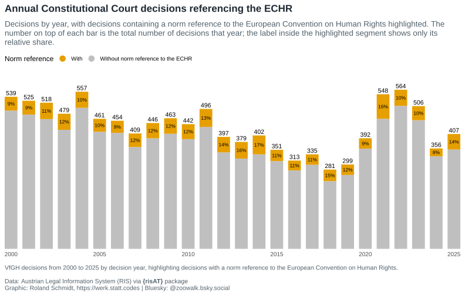
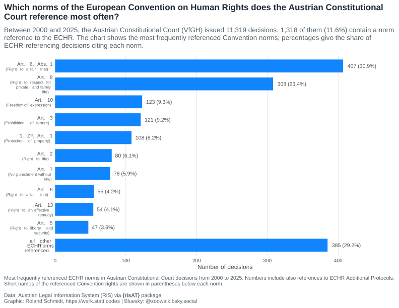
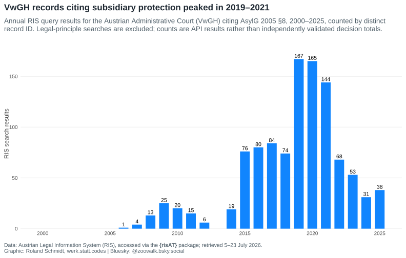
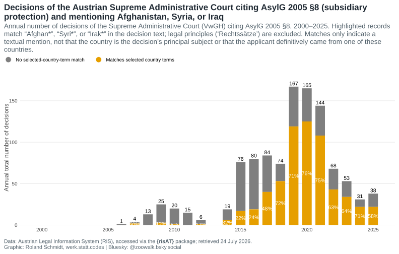
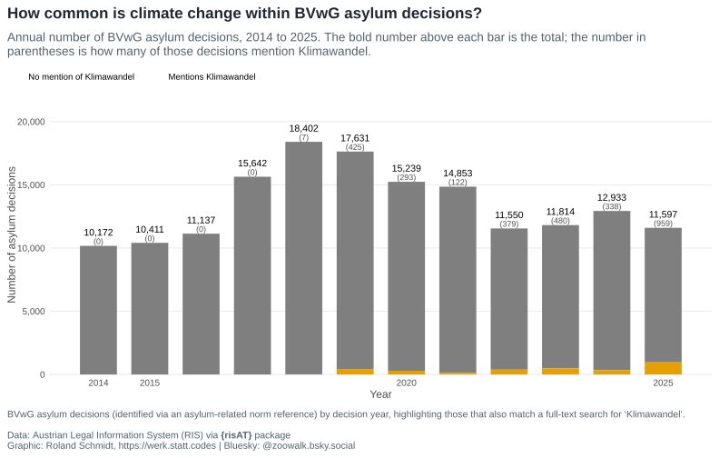
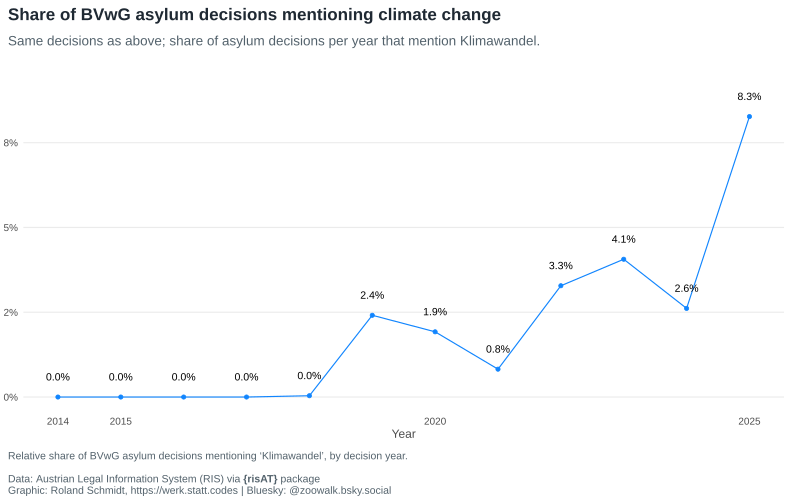
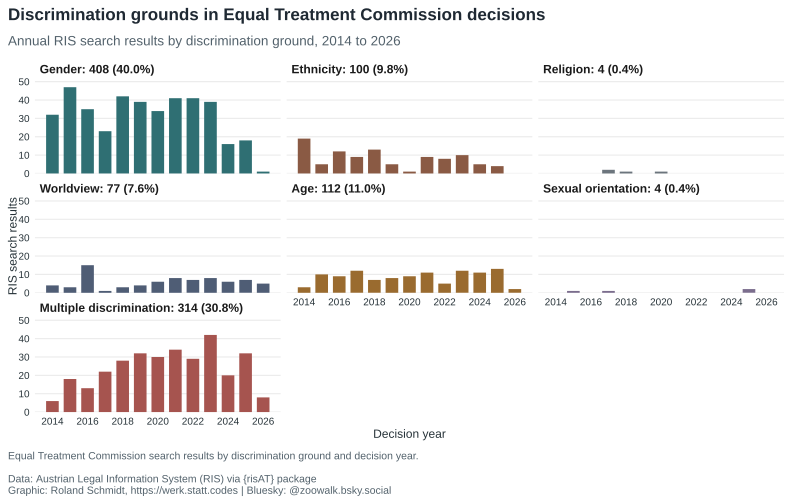
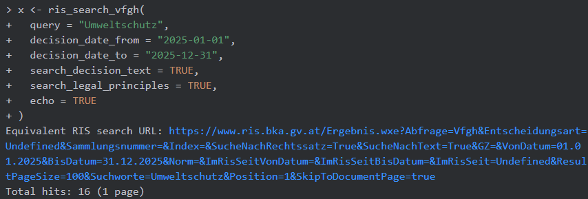

# Just the results, please {.unnumbered}

::: {layout-ncol="2"}
{group="risat_results_gallery"}

{group="risat_results_gallery"}

{group="risat_results_gallery"}

{group="risat_results_gallery"}

{group="risat_results_gallery"}

{group="risat_results_gallery"}

{group="risat_results_gallery"}
:::

```{r}
#| label: setup
#| include: false
library(risAT)
library(dplyr)
library(tidyr)
library(purrr)
library(stringr)
library(lubridate)
library(ggplot2)
library(ggtext)
library(reactable)
library(here)

i_am("posts/2026-06-30-risAT-intro/index.qmd")

data_path <- function(...) {
  here("posts", "2026-06-30-risAT-intro", "_data", ...)
}
```

```{r}
#| label: helper-functions
#| include: false
# Set shared typography so figures stay visually consistent.
gg_base_size <- 12
gg_title_size <- 17
gg_subtitle_size <- 13.5
gg_caption_size <- 10.5
gg_strip_size <- 12
gg_axis_size <- 10
gg_annot_size <- 3.7
gg_plot_family <- "Arial"

# Define a reusable ggplot theme for all RIS figures in the post.
ris_plot_theme <- function() {
  theme_minimal(base_size = gg_base_size, base_family = gg_plot_family) +
    theme(
      panel.grid.minor = element_blank(),
      plot.title.position = "plot",
      plot.caption.position = "plot",
      plot.title = ggtext::element_textbox_simple(
        hjust = 0,
        halign = 0,
        size = gg_title_size,
        family = gg_plot_family,
        face = "bold",
        color = "#1F2933",
        lineheight = 1.1,
        width = grid::unit(1, "npc"),
        margin = ggplot2::margin(b = 8)
      ),
      plot.subtitle = ggtext::element_textbox_simple(
        color = "#52616B",
        size = gg_subtitle_size,
        family = gg_plot_family,
        lineheight = 1.15,
        width = grid::unit(1, "npc"),
        margin = ggplot2::margin(t = 4, b = 12)
      ),
      plot.caption = ggtext::element_textbox_simple(
        color = "#52616B",
        hjust = 0,
        halign = 0,
        size = gg_caption_size,
        family = gg_plot_family,
        lineheight = 1.1,
        width = grid::unit(1, "npc"),
        margin = ggplot2::margin(t = 14)
      ),
      strip.text = ggtext::element_markdown(
        size = gg_strip_size,
        family = gg_plot_family,
        lineheight = 1.2,
        hjust = 0
      ),
      axis.text = element_text(
        size = gg_axis_size,
        family = gg_plot_family,
        color = "#4D4D4D"
      ),
      axis.title = element_text(
        family = gg_plot_family,
        color = "#4D4D4D"
      ),
      legend.position = "top",
      # anchor the legend to the whole plot (title/subtitle width), not just the
      # panel—otherwise it appears shifted right, past the y-axis label margin
      legend.location = "plot",
      legend.justification.top = "left",
      legend.margin = ggplot2::margin(0, 0, 0, 0),
      panel.grid.major.x = element_blank(),
      plot.margin = ggplot2::margin(t = 8, r = 8, b = 8, l = 8)
    )
}

# Open a standard SVG device using the figure theme's locally available font.
svg_plot <- function(filename, width, height, ...) {
  svglite::svglite(
    filename = filename,
    width = width,
    height = height,
    ...
  )
}

# Store the shared provenance-only caption used by all figures.
ris_graph_caption <- paste0(
  "Data: Austrian Legal Information System (RIS), accessed via the **{risAT}** package; ",
  "retrieved 5–23 July 2026.",
  "<br>Graphic: Roland Schmidt, werk.statt.codes | Bluesky: @zoowalk.bsky.social"
)

# Expand all available content URLs into one row per linked format.
prepare_content_urls_table <- function(data, n = 12) {
  if (!"content_urls" %in% names(data)) {
    data$content_urls <- vector("list", nrow(data))
  }

  display_cols <- c("decision_date", "case_number", "content_urls")
  missing_cols <- setdiff(display_cols, names(data))

  for (col in missing_cols) {
    if (col == "content_urls") {
      data[[col]] <- vector("list", nrow(data))
    } else {
      data[[col]] <- rep(NA_character_, nrow(data))
    }
  }

  data %>%
    select(all_of(display_cols)) %>%
    unnest_longer(content_urls, values_to = "url", keep_empty = TRUE) %>%
    mutate(
      format = case_when(
        str_detect(str_to_lower(url), "\\.pdf(?:$|[?#])") ~ "PDF",
        str_detect(str_to_lower(url), "\\.html?(?:$|[?#])") ~ "HTML",
        str_detect(str_to_lower(url), "\\.xml(?:$|[?#])") ~ "XML",
        str_detect(str_to_lower(url), "\\.rtf(?:$|[?#])") ~ "RTF",
        TRUE ~ "Other"
      )
    ) %>%
    select(decision_date, case_number, format, url) %>%
    arrange(desc(decision_date)) %>%
    slice_head(n = n)
}

# Normalise one norms value while preserving internal comma-separated clauses.
normalise_norm_values <- function(x) {
  if (is.null(x) || length(x) == 0 || all(is.na(x))) {
    return(character())
  }

  values <- as.character(unlist(x, use.names = FALSE))

  values %>%
    str_squish() %>%
    discard(\(value) is.na(value) || value == "")
}

# Parse article and paragraph references from one ECHR norm string.
parse_echr_norm_reference <- function(norm) {
  empty_result <- tibble(
    ZP_type = character(),
    art = character(),
    abs = character()
  )

  if (is.na(norm) || !str_detect(norm, fixed("EMRK"))) {
    return(empty_result)
  }

  protocol <- str_extract(norm, regex("\\d+\\.?\\s*ZP", ignore_case = TRUE))
  protocol <- if_else(
    is.na(protocol),
    NA_character_,
    str_replace(protocol, regex("^(\\d+)\\.?\\s*ZP$", ignore_case = TRUE), "\\1. ZP")
  )

  article_pattern <- regex("\\bArt\\.?\\s*([0-9]+|[IVX]+)\\b", ignore_case = TRUE)
  article_matches <- str_match_all(norm, article_pattern)[[1]]
  article_locations <- str_locate_all(norm, article_pattern)[[1]]

  if (nrow(article_matches) == 0) {
    return(tibble(ZP_type = protocol, art = NA_character_, abs = NA_character_))
  }

  map_dfr(seq_len(nrow(article_matches)), \(i) {
    article_token <- str_to_upper(article_matches[i, 2])
    article <- if (str_detect(article_token, "^\\d+$")) {
      article_token
    } else {
      as.character(as.integer(as.roman(article_token)))
    }

    segment_end <- if (i < nrow(article_locations)) {
      article_locations[i + 1, "start"] - 1
    } else {
      str_length(norm)
    }
    segment <- str_sub(norm, article_locations[i, "start"], segment_end)
    paragraphs <- str_match_all(
      segment,
      regex("\\bAbs\\.?\\s*(\\d+)\\b", ignore_case = TRUE)
    )[[1]][, 2]

    if (length(paragraphs) == 0) {
      paragraphs <- NA_character_
    }

    tibble(
      ZP_type = protocol,
      art = article,
      abs = unique(paragraphs)
    )
  })
}

# Test whether any normalised norm value matches a case-insensitive pattern.
has_matching_norm <- function(x, pattern) {
  any(str_detect(as.character(unlist(x, use.names = FALSE)), regex(pattern, ignore_case = TRUE)), na.rm = TRUE)
}

```

# Context and purpose

The Austrian Legal Information System, [RIS](https://www.ris.bka.gv.at/), short for *Rechtsinformationssystem*, is the central public repository of Austrian law and jurisprudence. Broadly speaking, it provides access to Austria's current and historical legal norms, including federal and state law, as well as to the jurisprudence of the country's most important courts and judicial institutions. The latter covers the case law of the Constitutional Court (*Verfassungsgerichtshof*, VfGH), the Administrative Court (*Verwaltungsgerichtshof*, VwGH), the Federal Administrative Court (*Bundesverwaltungsgericht*, BVwG), and decisions by institutions such as the Equal Treatment Commission, the Data Protection Authority, and the Federal Disciplinary Board.

This wealth of information makes RIS an indispensable source for anyone working on the Austrian legal system. Although individual records are readily available through the official website, obtaining RIS data in bulk and analysing it beyond individual cases has generally required working directly with the service's API and transforming the returned JSON.

The new R package {risAT} aims to lower this barrier. It wraps the RIS Open Government Data REST API and returns tidy[^tidy] data frames with standardised English column names while preserving the links and metadata needed to inspect the original RIS records. The package can help legal scholars, legal professionals, journalists, and other R users assemble corpora for text analysis or calculate descriptive statistics for decisions matching specified criteria. In short, {risAT} is designed for questions that extend beyond a single record.

Please note that the package is still under development (`0.1.0`) and that its interface may change. The package is neither affiliated with nor endorsed by RIS or the Austrian Federal Chancellery.

You can install {risAT} from GitHub:

``` r
# install.packages("pak")
pak::pak("werkstattcodes/risAT")
```

For the full function reference, see the [documentation site](https://werkstattcodes.github.io/risAT/) and the [GitHub repository](https://github.com/werkstattcodes/risAT/). If you want to receive updates on releases—likely to be particularly relevant in this early phase—I recommend subscribing to the repository on GitHub. For questions or suggestions, please use the discussion board or file an issue on the GitHub page.

If you use the package in a publication, please cite it as follows:

```{r}
#| label: cite-risat
#| code-fold: false
citation("risAT")
```

# Scope

The RIS API organises case law by *application*. In practice, that means one application for each court system or specialised decision-making body. {risAT} provides convenience wrappers for the main courts, plus a generic search function:

| Function | Court / Body |
|------------------------------------|------------------------------------|
| `ris_search_vfgh()` | Constitutional Court (*Verfassungsgerichtshof*, VfGH) |
| `ris_search_vwgh()` | Administrative Court (*Verwaltungsgerichtshof*, VwGH) |
| `ris_search_justiz()` | Ordinary courts (*OGH, OLG, LG, BG*) |
| `ris_search_bvwg()` | Federal Administrative Court (*Bundesverwaltungsgericht*, BVwG) |
| `ris_search_lvwg()` | State administrative courts (*Landesverwaltungsgerichte*, LVwG) |
| `ris_search_dsk()` | Data protection authorities |
| `ris_search_dok()` | Disciplinary body decisions |
| `ris_search_pvak()` | Staff representation oversight |
| `ris_search_gbk()` | Equal Treatment Commission (*Gleichbehandlungskommission*) |
| `ris_search_case_law()` | Generic wrapper for any supported case-law application |

The court-specific functions are thin wrappers around `ris_search_case_law()`. Beyond case law, `ris_search_federal()` provides access to the federal-law (*Bundesrecht*) application.

Results share several core columns, including `id`, `application`, `decision_date`, and `case_number`, although the exact schema varies by RIS application. Where available, the `content_urls` list-column stores links to the record in formats such as HTML, PDF, XML, and RTF.

With `echo = TRUE`, {risAT} prints the equivalent RIS web search URL and the number of returned rows. This is useful because it lets you move between the reproducible R workflow and the browser interface that many legal researchers already know.

{fig-align="left"}


# Examples

The examples below are meant to show the kinds of questions one can start asking once RIS case law is available as data. They are not full analyses, and the query choices are intentionally transparent so that they can be adjusted for more careful research designs. 

::: {.callout-note}

## Data scope and reproducibility

The data used below were retrieved between 5 and 23 July 2026. Counts refer to records returned by the RIS OGD API, not to an independently validated census of every decision issued by an institution. RIS itself does not guarantee the accuracy, completeness, or currency of its OGD data; see the [official RIS OGD information](https://www.ris.bka.gv.at/UI/Ogd.aspx). The source repository retains Quarto's frozen results, but the large raw RDS snapshots are stored locally and are not versioned. Re-executing the complete analysis therefore requires refetching those snapshots with the displayed queries.

:::

## VfGH — European Convention on Human Rights

To start, we use {risAT} to query records from the Austrian Constitutional Court, the Verfassungsgerichtshof (VfGH). The European Convention on Human Rights (ECHR) is directly applicable in Austria and has constitutional rank, making its presence in VfGH decisions particularly relevant; see this [Council of Europe overview](https://www.venice.coe.int/WebForms/documents/default.aspx?pdffile=CDL-JU%282012%29013-e). To examine how frequently VfGH records refer to ECHR norms, the code below

1.  retrieves VfGH metadata records from the beginning of 2000 to the end of 2025, and
2.  checks whether the ECHR is referenced in each record's `norms` column.

```{r}
#| label: read-vfgh-data
#| include: false

vfgh_2000_2025 <- readr::read_rds(data_path("vfgh", "vfgh_2000_2025.rds"))
```

Here is the relevant function call via {risAT}'s `ris_search_vfgh()`[^1]:

[^1]: This call is rather comprehensive and can be quite time consuming. To add a layer of robustness, you may want to split it into separate calls for each year, store the interim results, and then combine them. Also a note on netiquette: the RIS API is a public service; please be considerate and avoid sending too many requests in quick succession.

[^tidy]: "Tidy" data follows a simple convention—each variable is a column, each observation is a row, and each value is a cell—which makes it easy to work with in R. See Hadley Wickham's [Tidy Data](https://vita.had.co.nz/papers/tidy-data.html) paper for the original formulation.

```{r}
#| label: fetch-vfgh-all
#| code-summary: "Get VfGH records from 2000 to 2025"
#| eval: false
vfgh_2000_2025 <- ris_search_vfgh(
  decision_date_from = "2000-01-01",
  decision_date_to = "2025-12-31",
  search_decision_text = TRUE,
  search_legal_principles = TRUE,
  echo = TRUE
) 
```

In total, the query returns `r nrow(vfgh_2000_2025)` records. Below is a glimpse of the data structure, showing the main columns and their types. The `norms` column is a list-column, which means that each row can contain multiple norms.

```{r}
#| label: glimpse-vfgh
#| code-summary: "Describe result"
glimpse(vfgh_2000_2025)
```

Next, we check which decision texts refer to the ECHR and calculate annual totals with and without such a reference. The code extracts the year from `decision_date`, checks the `norms` column for ECHR references, and calculates annual totals and shares.

To avoid counting both a decision text and its associated legal principle, we retain records of type `"Text"` and exclude `"Rechtssatz"` records, which summarise the legal essence of decisions.

```{r}
#| label: vfgh-data-year
#| cache: true
#| code-summary: "Identify VfGH decisions with ECHR norm reference"

class(vfgh_2000_2025$norms)
table(vfgh_2000_2025$document_type)

# Keep only decision texts.
vfgh_2000_2025_echr <- vfgh_2000_2025 %>%
  filter(document_type == "Text")

nrow(vfgh_2000_2025_echr)

# Extract the year and identify records with at least one EMRK norm.
vfgh_2000_2025_echr <- vfgh_2000_2025_echr %>%
  mutate(year = year(decision_date)) %>%
  mutate(
    norm_echr = map_lgl(norms, \(x) any(str_detect(as.character(unlist(x)), fixed("EMRK")), na.rm = TRUE))
  )

# Calculate annual totals and labels for plotting.
vfgh_year <- vfgh_2000_2025_echr %>%
  count(year, norm_echr) %>%
  mutate(
    norm_reference = factor(
      if_else(norm_echr, "Norm references ECHR", "General decisions"),
      levels = c("Norm references ECHR", "General decisions")
    )
  ) %>%
  group_by(year) %>%
  mutate(
    total = sum(n),
    share = n / total,
    echr_label = if_else(norm_echr, scales::percent(share, accuracy = 1), NA_character_)
  ) %>%
  ungroup()
```

Now we can visualise the results.

```{r}
#| label: fig-vfgh-plot-year
#| column: body-outset-right
#| fig-width: 11
#| fig-height: 7
#| out-width: "100%"
#| fig-align: "center"
#| dev: svg_plot
#| fig-ext: svg
#| cache: true
#| fig-cap: "Annual VfGH decision texts with and without an ECHR norm reference, 2000–2025."
#| fig-alt: "Stacked column chart of Austrian Constitutional Court decision texts by year from 2000 to 2025. Each bar is the annual RIS record count, divided into texts with and without EMRK in the norms field; labels give the annual total and ECHR-referencing share. The annual share fluctuates between roughly 8 and 17 per cent without a clear long-term trend."
#| code-summary: "Plot annual VfGH decisions and their ECHR references"
#| code-fold: true

vfgh_year_totals <- vfgh_year %>%
  distinct(year, total) %>%
  filter(total > 0)


vfgh_year %>%
  ggplot(aes(x = year, y = n, fill = norm_reference)) +
  geom_col(width = 0.72, key_glyph = draw_key_point) +
  geom_text(
    data = vfgh_year_totals,
    aes(x = year, y = total, label = total),
    inherit.aes = FALSE,
    vjust = -0.35,
    color = "black",
    size = gg_annot_size,
    family = gg_plot_family
  ) +
  geom_text(
    aes(label = echr_label),
    position = position_stack(vjust = 0.5),
    color = "black",
    size = gg_annot_size * 0.8,
    family = gg_plot_family,
    na.rm = TRUE
  ) +
  scale_x_continuous(
    breaks = seq(2000, 2025, 5),
    expand = expansion(mult = c(0, 0))
  ) +
  scale_y_continuous(expand = expansion(mult = c(0, 0.12))) +
  scale_fill_manual(
    values = c("General decisions" = "#BFBFBF", "Norm references ECHR" = "#e69f00"),
    labels = c(
      "Norm references ECHR" = "With ECHR norm reference",
      "General decisions" = "Without ECHR norm reference"
    ),
    name = "Norm reference"
  ) +
  guides(fill = guide_legend(override.aes = list(shape = 21, size = 5, colour = "white"))) +
  labs(
    title = "How often do Constitutional Court decisions reference the ECHR?",
    subtitle = paste0(
      "Annual Austrian Constitutional Court (VfGH) decision texts, 2000–2025. ",
      "Orange marks texts whose “norms” field contains “EMRK”; labels show each year’s total and ",
      "ECHR-referencing share. Counts are RIS records, not independently validated totals."
    ),
    x = NULL,
    y = NULL,
    caption = ris_graph_caption
  ) +
  ris_plot_theme() +
  theme(
    axis.text.y = element_blank(),
    axis.ticks.y = element_blank(),
    panel.grid.major.y = element_blank()
  )
```

@fig-vfgh-plot-year shows that only a few lines of data-transformation code are needed to examine the presence of ECHR norm references in VfGH decision texts. The annual share is relatively stable, fluctuating between about 8 and 17 per cent without a clear long-term trend.

We can refine the analysis by examining the ECHR articles, paragraphs, and Additional Protocol provisions referenced in these records. The code below extracts parseable article and paragraph combinations from `norms`, counts each combination once per decision, and adds a short descriptive label for each article.


```{r}
#| label: prep-echr-norms

vfgh_2000_2025_echr <- vfgh_2000_2025_echr %>%
  filter(norm_echr) %>%
  mutate(norms = map(norms, normalise_norm_values)) %>%
  unnest_longer(norms)

class(vfgh_2000_2025_echr$norms)

echr_decisions_total <- n_distinct(vfgh_2000_2025_echr$id)

echr_norm_names <- tibble::tribble(
  ~ZP_type,      ~art, ~norm_short,
  NA_character_, "1",  "Obligation to respect human rights",
  NA_character_, "2",  "Right to life",
  NA_character_, "3",  "Prohibition of torture",
  NA_character_, "4",  "Prohibition of slavery and forced labour",
  NA_character_, "5",  "Right to liberty and security",
  NA_character_, "6",  "Right to a fair trial",
  NA_character_, "7",  "No punishment without law",
  NA_character_, "8",  "Right to respect for private and family life",
  NA_character_, "9",  "Freedom of thought, conscience and religion",
  NA_character_, "10", "Freedom of expression",
  NA_character_, "11", "Freedom of assembly and association",
  NA_character_, "12", "Right to marry",
  NA_character_, "13", "Right to an effective remedy",
  NA_character_, "14", "Prohibition of discrimination",
  NA_character_, "15", "Derogation in time of emergency",
  NA_character_, "16", "Restrictions on political activity of aliens",
  NA_character_, "17", "Prohibition of abuse of rights",
  NA_character_, "18", "Limitation on use of restrictions on rights",

  "1. ZP",        "1", "Protection of property",
  "1. ZP",        "2", "Right to education",
  "1. ZP",        "3", "Right to free elections",

  "4. ZP",        "1", "Prohibition of imprisonment for debt",
  "4. ZP",        "2", "Freedom of movement",
  "4. ZP",        "3", "Prohibition of expulsion of nationals",
  "4. ZP",        "4", "Prohibition of collective expulsion of aliens",

  "6. ZP",        "1", "Abolition of the death penalty",

  "7. ZP",        "1", "Procedural safeguards relating to expulsion of aliens",
  "7. ZP",        "2", "Right of appeal in criminal matters",
  "7. ZP",        "3", "Compensation for wrongful conviction",
  "7. ZP",        "4", "Right not to be tried or punished twice",
  "7. ZP",        "5", "Equality between spouses",

  "12. ZP",       "1", "General prohibition of discrimination",

  "13. ZP",       "1", "Abolition of the death penalty in all circumstances"
)

echr_norm_parsed <- vfgh_2000_2025_echr %>%
  filter(str_detect(norms, fixed("EMRK"))) %>%
  transmute(
    id,
    parsed = map(norms, parse_echr_norm_reference)
  ) %>%
  unnest(parsed)

unparsed_echr_norms <- echr_norm_parsed %>%
  filter(is.na(art))

norm_count <- echr_norm_parsed %>%
  filter(!is.na(art)) %>%
  distinct(id, ZP_type, art, abs) %>%
  count(ZP_type, art, abs, sort = TRUE) %>%
  mutate(
    label = str_squish(str_c(
      coalesce(str_c(ZP_type, ", "), ""),
      str_c("Art. ", art),
      coalesce(str_c(", Abs. ", abs), "")
    ))
  ) %>%
  left_join(echr_norm_names, by = join_by(ZP_type, art)) %>%
  mutate(norm_short = coalesce(norm_short, "ECHR norm"))
```

`r nrow(unparsed_echr_norms)` ECHR norm `r if_else(nrow(unparsed_echr_norms) == 1, "entry does", "entries do")` not contain a parseable article reference and `r if_else(nrow(unparsed_echr_norms) == 1, "is", "are")` excluded from the ranking.

```{r}
#| label: fig-vfgh-echr-top-norms
#| column: body-outset-right
#| fig-width: 11
#| fig-height: 8.5
#| out-width: "100%"
#| fig-align: "center"
#| dev: svg_plot
#| fig-ext: svg
#| fig-cap: "Most frequently referenced parseable ECHR provisions in VfGH decision texts, 2000–2025."
#| fig-alt: "Horizontal bar chart ranking the 10 most frequent parseable ECHR article–paragraph combinations in Austrian Constitutional Court decision texts from 2000 to 2025. Counts include each combination at most once per decision text, and percentages use ECHR-referencing texts as the denominator. Article 6 paragraph 1 on a fair trial and Article 8 on private and family life are the most frequent."
#| code-summary: "Plot the most frequent ECHR norm references"
#| code-fold: true


norm_count_top <- norm_count %>%
  mutate(label = forcats::fct_lump_n(label, n = 10, w = n, other_level = "all other ECHR norms referenced.")) %>%
  summarise(
    n = sum(n),
    norm_short = if_else(
      n_distinct(norm_short) == 1,
      first(norm_short),
      "Other ECHR norms"
    ),
    .by = label
  ) %>%
  mutate(
    rel = n / echr_decisions_total,
    bar_label = sprintf("%s (%.1f%%)", n, rel * 100),
    label = forcats::fct_reorder(label, n),
    label = forcats::fct_relevel(label, "all other ECHR norms referenced.", after = 0)
  )

left_axis_labels <- norm_count_top %>%
  mutate(
    label_md = str_c(
      # escape leading "1." etc. so gridtext doesn't parse it as an ordered list
      str_replace_all(str_wrap(as.character(label), 15), "\n", "<br>") %>%
        str_replace("^(\\d+)\\.", "\\1\\\\."),
      if_else(
        label == "all other ECHR norms referenced.",
        "", # short name would be redundant here
        str_c(
          "<br><span style='font-size:8pt;color:#52616B'>(",
          str_replace_all(str_wrap(norm_short, 22), "\n", "<br>"),
          ")</span>"
        )
      )
    )
  ) %>%
  { setNames(.$label_md, as.character(.$label)) }

vfgh_decisions_total <- sum(vfgh_year$n)
echr_share <- echr_decisions_total / vfgh_decisions_total

norm_count_top %>%
  ggplot(aes(x = n, y = label)) +
  geom_col(fill = "#1185FE", width = 0.72) +
  geom_text(
    aes(label = bar_label),
    hjust = -0.15,
    color = "#4D4D4D",
    size = gg_annot_size,
    family = gg_plot_family
  ) +
  scale_x_continuous(expand = expansion(mult = c(0, 0.18))) +
  scale_y_discrete(labels = \(x) left_axis_labels[x]) +
  coord_cartesian(clip = "off") +
  labs(
    title = "Which ECHR provisions does Austria’s Constitutional Court reference most often?",
    subtitle = str_glue(
      "RIS returns {scales::comma(vfgh_decisions_total)} Austrian Constitutional Court (VfGH) ",
      "decision texts for 2000–2025; {scales::comma(echr_decisions_total)} ",
      "({scales::percent(echr_share, accuracy = 0.1)}) reference the ECHR. ",
      "The chart shows the 10 most frequent parseable article–paragraph combinations, each counted once ",
      "per decision text; percentages use all ECHR-referencing texts as the denominator. ",
      "Additional Protocols are included and unparseable entries are excluded."
    ),
    x = "Number of decisions",
    y = NULL,
    caption = ris_graph_caption
  ) +
  ris_plot_theme() +
  theme(
    # must target the leaf element: with ggplot2 4.0 complete themes,
    # axis.text.y gets overridden by the theme's plain axis.text.y.left
    axis.text.y.left = ggtext::element_markdown(
      size = gg_axis_size,
      family = gg_plot_family,
      color = "#4D4D4D",
      lineheight = 0.95,
      hjust = 1, # place the label box against the axis
      halign = 1 # right-align lines inside the box
    ),
    panel.grid.major.x = element_line(color = "#D8DEE4", linewidth = 0.35),
    panel.grid.major.y = element_blank()
  )
```


## VwGH — Subsidiary protection

The Verwaltungsgerichtshof (VwGH) is Austria's highest court in administrative matters. Its remit includes asylum proceedings; see the [VwGH overview of its role](https://www.vwgh.gv.at/gerichtshof/index.html).

This example demonstrates how to query jurisprudence for a specific legal norm. The `norm` parameter filters records by cited norm; here we search for `AsylG 2005 §8`, the provision on subsidiary protection.

```{r}
#| label: data-asyl-year
#| code-summary: "Get VwGH data on subsidiary protection"
#| cache: true

asyl_subsidiary_all <- ris_search_vwgh(
  norm = "'AsylG 2005 §8'",
  decision_date_from = "2000-01-01",
  decision_date_to = "2025-12-31",
  search_legal_principles = FALSE,
  echo = TRUE
)

# Check for duplicate identifiers.
nrow(janitor::get_dupes(asyl_subsidiary_all, id))
glimpse(asyl_subsidiary_all)
```

The resulting series rises during the 2010s, peaks in 2019–2021, and declines thereafter. This is a descriptive pattern in the RIS search results; the query alone cannot establish what caused it.

```{r}
#| label: fig-asyl-year
#| code-summary: "Plot data on subsidiary protection by year"
#| fig-cap: "Annual VwGH RIS records citing AsylG 2005 §8, 2000–2025."
#| fig-alt: "Column chart of distinct annual Austrian Administrative Court RIS records citing AsylG 2005 section 8 from 2000 to 2025. Counts rise during the 2010s, peak between 2019 and 2021, and decline thereafter."
#| column: body-outset-right
#| fig-width: 11
#| fig-height: 7
#| out-width: "100%"
#| fig-align: "center"
#| dev: svg_plot
#| fig-ext: svg
asyl_by_year <- asyl_subsidiary_all %>%
  mutate(year = year(decision_date)) %>%
  distinct(year, id) %>%
  count(year, name = "decisions") %>%
  complete(year = 2000:2025, fill = list(decisions = 0L)) %>%
  arrange(year)

asyl_by_year %>%
  ggplot(aes(x = year, y = decisions)) +
  geom_col(fill = "#1185FE", width = 0.72) +
  geom_text(
    data = asyl_by_year %>% filter(decisions > 0),
    aes(label = decisions),
    vjust = -0.35,
    size = gg_annot_size,
    family = gg_plot_family
  ) +
  scale_x_continuous(breaks = seq(2000, 2025, 5)) +
  scale_y_continuous(expand = expansion(mult = c(0, 0.12))) +
  labs(
    title = "VwGH records citing subsidiary protection peaked in 2019–2021",
    subtitle = paste0(
      "Annual RIS query results for the Austrian Administrative Court (VwGH) citing AsylG 2005 §8, ",
      "2000–2025, counted by distinct record ID. Legal-principle searches are excluded; counts are API ",
      "results rather than independently validated decision totals."
    ),
    x = NULL,
    y = "RIS search results",
    caption = ris_graph_caption
  ) +
  ris_plot_theme()
```

### Combining a norm with country-name terms

@fig-asyl-year shows all records returned for the selected norm. We can narrow this set with a free-text `query`. The search below uses `Afghan* OR Syri* OR Irak*` to identify records that mention the selected country-name stems. A match indicates a textual mention, not necessarily that the country is the decision's principal subject.

```{r}
#| label: data-asyl-year-countries
#| code-summary: "Query subsidiary protection records mentioning Afghanistan, Syria, or Iraq"
asyl_subsidiary_country_mentions <- ris_search_vwgh(
  norm = "'AsylG 2005 §8'",
  query = "Afghan* OR Syri* OR Irak*",
  decision_date_from = "2000-01-01",
  decision_date_to = "2025-12-31",
  search_decision_text = TRUE,
  search_legal_principles = FALSE,
  echo = TRUE
)

country_mention_ids <- as.character(asyl_subsidiary_country_mentions$id)

asyl_subsidiary_all <- asyl_subsidiary_all %>%
  mutate(
    year = year(decision_date),
    mentions_selected_country = as.character(id) %in% country_mention_ids
  )

asyl_country_by_year <- asyl_subsidiary_all %>%
  distinct(year, id, mentions_selected_country) %>%
  count(year, mentions_selected_country, name = "decisions") %>%
  complete(
    year = 2000:2025,
    mentions_selected_country = c(FALSE, TRUE),
    fill = list(decisions = 0L)
  ) %>%
  arrange(year, mentions_selected_country)

asyl_country_year_labels <- asyl_country_by_year %>%
  group_by(year) %>%
  summarise(
    total = sum(decisions),
    .groups = "drop"
  )

asyl_country_segment_labels <- asyl_country_by_year %>%
  group_by(year) %>%
  mutate(
    total = sum(decisions),
    country_mention_share = if_else(total > 0, decisions / total, NA_real_),
    country_mention_label = if_else(
      mentions_selected_country & decisions > 0,
      scales::percent(country_mention_share, accuracy = 1),
      NA_character_
    )
  ) %>%
  ungroup()
```

```{r}
#| label: fig-asyl-year-syria
#| code-summary: "Plot subsidiary protection records by year and country-name mentions"
#| fig-cap: "Annual VwGH RIS records citing AsylG 2005 §8, split by selected country-term matches."
#| fig-alt: "Stacked column chart of distinct annual Austrian Administrative Court RIS records citing AsylG 2005 section 8 from 2000 to 2025. Highlighted segments are decision texts matching Afghan, Syri, or Irak search stems; labels give annual totals and the matching share. More than half of the results match at least one selected term in every year from 2018 onward, although matches may be incidental."
#| column: body-outset-right
#| fig-width: 11
#| fig-height: 7
#| out-width: "100%"
#| fig-align: "center"
#| dev: svg_plot
#| fig-ext: svg
asyl_country_by_year %>%
  ggplot(aes(x = year, y = decisions, fill = mentions_selected_country)) +
  geom_col(width = 0.72, key_glyph = draw_key_point) +
  geom_text(
    data = asyl_country_year_labels %>% filter(total > 0),
    aes(x = year, y = total, label = total),
    inherit.aes = FALSE,
    vjust = -0.35,
    size = gg_annot_size,
    family = gg_plot_family
  ) +
  geom_text(
    data = asyl_country_segment_labels,
    aes(label = country_mention_label),
    position = position_stack(vjust = 0.5),
    color = "white",
    size = gg_annot_size,
    family = gg_plot_family,
    na.rm = TRUE
  ) +
  scale_x_continuous(breaks = seq(2000, 2025, 5)) +
  scale_y_continuous(expand = expansion(mult = c(0, 0.12))) +
  scale_fill_manual(
    values = c("FALSE" = "#7f7f7f", "TRUE" = "#e69f00"),
    labels = c(
      "FALSE" = "No selected-country-term match",
      "TRUE" = "Matches selected country terms"
    ),
    name = NULL
  ) +
  guides(fill = guide_legend(override.aes = list(shape = 21, size = 5, colour = "white"))) +
  labs(
    title = "Selected country terms appear in most VwGH subsidiary-protection results since 2018",
    subtitle = paste0(
      "Annual RIS results citing AsylG 2005 §8, 2000–2025. Highlighted records match “Afghan*”, ",
      "“Syri*”, or “Irak*” in the decision text; legal principles are excluded. Matches may be ",
      "incidental and do not identify a case’s principal country."
    ),
    x = NULL,
    y = "RIS search results",
    caption = ris_graph_caption
  ) +
  ris_plot_theme()
```

From 2018 onwards, more than half of the annual results mention at least one of the selected country-name stems. This remains a search-based classification: it does not distinguish passing references from cases centrally concerned with one of these countries.

## BVwG — Asylum and climate change

The next example uses records from the Bundesverwaltungsgericht (BVwG), the federal administrative court of first instance. The court began its work on 1 January 2014; see the [BVwG history](https://www.bvwg.gv.at/Bundesverwaltungsgericht/-ber-uns/entstehung.html). We search its decision texts and legal principles for `Klimawandel` (climate change) from 2014 to 2025.

Simply counting matches for one term provides little context. To construct a more useful denominator, we identify BVwG records whose `norms` field contains an asylum-related reference. This is an operational proxy, not a definitive classification of every asylum decision: it may omit relevant records without such a norm and include records that cite an asylum norm only incidentally.

The local metadata snapshot was fetched by decision-date range without a search term. We filter that snapshot using the norm-based proxy, then join it by `id` to the RIS full-text results for `Klimawandel`. The resulting annual share therefore describes term matches within records carrying an asylum-related norm reference; it should not be read as the prevalence of climate change across a validated population of all asylum decisions.

```{r}
#| label: fetch-bvwg-klimawandel
#| eval: false
#| code-summary: "Get BVwG records containing 'Klimawandel'"
bvwg_klimawandel_results <- ris_search_bvwg(
  query = "Klimawandel",
  decision_date_from = "2014-01-01",
  decision_date_to = "2025-12-31",
  search_decision_text = TRUE,
  search_legal_principles = TRUE,
  echo = TRUE
)
```

```{r}
#| label: read-bvwg-klimawandel
#| eval: true
#| include: false
# readr::write_rds(
#   bvwg_klimawandel_results,
#   data_path("climateChange_bvwg.rds"),
#   compress = "gz"
# )
bvwg_klimawandel_results <- readr::read_rds(data_path("climateChange_bvwg.rds"))
```

```{r}
#| label: prep-bvwg-asyl-climate
#| code-summary: "Join BVwG asylum-norm records with the Klimawandel results"
#| cache: true
bvwg_asyl_norm_records <- readr::read_rds(data_path("bvwg", "bvwg_2000_2025.rds")) %>%
  mutate(
    year = year(decision_date),
    has_asyl_norm = map_lgl(norms, has_matching_norm, pattern = "asyl")
  ) %>%
  filter(has_asyl_norm) %>%
  distinct(id, .keep_all = TRUE) %>%
  mutate(
    mentions_klimawandel = as.character(id) %in%
      as.character(bvwg_klimawandel_results$id)
  )

bvwg_asyl_norm_climate_year <- bvwg_asyl_norm_records %>%
  count(year, mentions_klimawandel, name = "records") %>%
  complete(
    year = 2014:2025,
    mentions_klimawandel = c(FALSE, TRUE),
    fill = list(records = 0L)
  ) %>%
  mutate(
    climate_group = factor(
      if_else(
        mentions_klimawandel,
        "Matches Klimawandel search",
        "No Klimawandel search match"
      ),
      levels = c("No Klimawandel search match", "Matches Klimawandel search")
    )
  ) %>%
  mutate(
    total = sum(records),
    share = if_else(total > 0, records / total, 0),
    .by = year
  )
```

@fig-bvwg-asyl-climate-absolute shows the absolute counts for this proxy population. The highlighted segment contains records that also match the `Klimawandel` search.

```{r}
#| label: fig-bvwg-asyl-climate-absolute
#| code-summary: "Plot annual asylum-norm records by Klimawandel mention"
#| fig-cap: "Annual BVwG records with asylum-related norm references, split by Klimawandel matches."
#| fig-alt: "Stacked column chart of annual Austrian Federal Administrative Court records with an asylum-related norm reference from 2014 to 2025. Highlighted segments are records also matching Klimawandel in the decision text or legal principles; labels give the annual proxy total and matching subset. No records match through 2017, and matches remain a minority thereafter."
#| column: body-outset-right
#| fig-width: 11
#| fig-height: 7
#| out-width: "100%"
#| fig-align: "center"
#| dev: svg_plot
#| fig-ext: svg
bvwg_asyl_norm_totals <- bvwg_asyl_norm_climate_year %>%
  distinct(year, total)

bvwg_asyl_norm_climate_counts <- bvwg_asyl_norm_climate_year %>%
  filter(mentions_klimawandel) %>%
  select(year, records, total)

bvwg_asyl_norm_climate_year %>%
  ggplot(aes(x = year, y = records, fill = climate_group)) +
  geom_col(width = 0.72, key_glyph = draw_key_point) +
  geom_text(
    data = bvwg_asyl_norm_totals,
    aes(x = year, y = total, label = scales::comma(total)),
    inherit.aes = FALSE,
    vjust = -1.5,
    color = "black",
    size = gg_annot_size,
    family = gg_plot_family
  ) +
  geom_text(
    data = bvwg_asyl_norm_climate_counts,
    aes(x = year, y = total, label = paste0("(", records, ")")),
    inherit.aes = FALSE,
    vjust = -0.3,
    color = "#4D4D4D",
    size = gg_annot_size * 0.85,
    family = gg_plot_family
  ) +
  scale_x_continuous(breaks = c(2014, 2015, 2020, 2025)) +
  scale_y_continuous(labels = scales::comma, expand = expansion(mult = c(0, 0.2))) +
  scale_fill_manual(
    values = c(
      "No Klimawandel search match" = "#7f7f7f",
      "Matches Klimawandel search" = "#e69f00"
    ),
    name = NULL
  ) +
  labs(
    title = "How often does ‘Klimawandel’ appear in BVwG asylum-related records?",
    subtitle = paste0(
      "Annual Austrian Federal Administrative Court (BVwG) records, 2014–2025. ‘Asylum-related’ means ",
      "that “norms” contains “asyl”; highlighted records also match “Klimawandel” in the decision text or ",
      "legal principles. This is a proxy, not a complete set of asylum decisions. Labels show the annual ",
      "total and matching subset."
    ),
    x = "Year",
    y = "RIS records",
    caption = ris_graph_caption
  ) +
  ris_plot_theme()
```

@fig-bvwg-asyl-climate-relative presents the same proxy population as annual shares. No records match before 2018. The share is generally higher in recent years but varies considerably: it is 4.1 per cent in 2023, falls to 2.6 per cent in 2024, and reaches 8.3 per cent in 2025.

```{r}
#| label: fig-bvwg-asyl-climate-relative
#| code-summary: "Plot the annual Klimawandel share among asylum-norm records"
#| fig-cap: "Annual share of Klimawandel matches among BVwG records with asylum-related norm references."
#| fig-alt: "Line chart of the annual share of Austrian Federal Administrative Court records with an asylum-related norm reference that also match Klimawandel from 2014 to 2025. The norm-based denominator is a proxy rather than a complete set of asylum decisions. The share is zero through 2017, fluctuates thereafter, reaches 4.1 per cent in 2023, falls to 2.6 per cent in 2024, and rises to 8.3 per cent in 2025."
#| column: body-outset-right
#| fig-width: 11
#| fig-height: 7
#| out-width: "100%"
#| fig-align: "center"
#| dev: svg_plot
#| fig-ext: svg
bvwg_asyl_norm_climate_year %>%
  filter(mentions_klimawandel) %>%
  ggplot(aes(x = year, y = share)) +
  geom_line(color = "#1185FE") +
  geom_point(color = "#1185FE") +
  geom_text(
    aes(label = scales::percent(share, accuracy = 0.1)),
    nudge_y = 0.006,
    color = "black",
    size = gg_annot_size,
    family = gg_plot_family
  ) +
  scale_x_continuous(breaks = c(2014, 2015, 2020, 2025)) +
  scale_y_continuous(
    labels = scales::percent_format(accuracy = 1),
    expand = expansion(mult = c(0.05, 0.12))
  ) +
  labs(
    title = "What share of BVwG asylum-related records mention ‘Klimawandel’?",
    subtitle = paste0(
      "Annual shares for 2014–2025. The denominator is records with “asyl” in the “norms” field; the ",
      "numerator is records also matching “Klimawandel” in the decision text or legal principles. ",
      "This proxy must not be interpreted as prevalence among all asylum decisions."
    ),
    x = "Year",
    y = NULL,
    caption = ris_graph_caption
  ) +
  ris_plot_theme()
```

## GBK — Discrimination grounds

The Equal Treatment Commission example illustrates the wrapper's domain-specific filters. Instead of relying only on text search, we can filter the RIS GBK endpoint by discrimination ground. @fig-gbk-discrimination shows annual search-result counts through 12 July 2026. These are endpoint classifications and record counts, not estimates of the underlying incidence of discrimination.

```{r}
#| label: fetch-gbk-discrimination
#| code-summary: "Search GBK records by discrimination ground and year"
#| cache: true

discrimination_grounds <- c(
  gender = "Gender",
  ethnicity = "Ethnicity",
  religion = "Religion",
  worldview = "Worldview",
  age = "Age",
  sexual_orientation = "Sexual orientation",
  multiple = "Multiple discrimination"
)

gbk_topics <- tibble(
  discrimination_ground = names(discrimination_grounds),
  discrimination_grounds_en = unname(discrimination_grounds)
)


gbk_results_by_ground <- gbk_topics$discrimination_ground %>%
  set_names() %>%
  map(\(ground) {
    ris_search_gbk(
      discrimination_ground = ground,
      decision_date_to = "2026-07-12",
      echo = TRUE
    )
  })

normalise_gbk_columns <- function(data) {
  data %>%
    mutate(
      across(
        any_of(c(
          "id", "application", "authority", "document_url",
          "gbk_commission", "gbk_discrimination_ground",
          "gbk_discrimination_ground_en", "gbk_discrimination_offense",
          "gbk_decision_type", "gbk_senate"
        )),
        as.character
      ),
      across(any_of(c("decision_date", "modified")), as.Date),
      across(any_of(c("norms", "content_urls", "case_number")), as.list)
    )
}

gbk_records <- gbk_results_by_ground %>%
  map(normalise_gbk_columns) %>%
  list_rbind(names_to = "discrimination_ground")

gbk_records_by_year <- gbk_records %>%
  mutate(year = year(decision_date)) %>%
  summarise(decisions = n(), .by = c(year, discrimination_ground)) %>%
  left_join(gbk_topics, by = "discrimination_ground") %>%
  mutate(
    discrimination_grounds_en = factor(
      discrimination_grounds_en,
      levels = unname(discrimination_grounds)
    )
  )
```

```{r}
#| label: fig-gbk-discrimination
#| code-summary: "Plot annual GBK results by discrimination ground"
#| fig-cap: "Annual Equal Treatment Commission RIS records by discrimination ground, 2014 to 12 July 2026."
#| fig-alt: "Faceted column chart with seven panels showing annual Equal Treatment Commission RIS record counts by discrimination ground from 2014 to 12 July 2026. Facet headings give each ground's total and share across returned records; gender has the largest total, followed by multiple discrimination, while religion and sexual orientation have the smallest. The 2026 counts are partial, and the endpoint classifications do not estimate the incidence of discrimination."
#| column: body-outset-right
#| fig-width: 11
#| fig-height: 7
#| out-width: "100%"
#| fig-align: "center"
#| dev: svg_plot
#| fig-ext: svg
gbk_plot_data <- gbk_records_by_year %>%
  mutate(ground_total = sum(decisions), .by = discrimination_grounds_en) %>%
  mutate(
    ground_share = ground_total / sum(decisions),
    facet_label = str_glue(
      "{discrimination_grounds_en}: {scales::comma(ground_total)} ({scales::percent(ground_share, accuracy = 0.1)})"
    ),
    facet_label = forcats::fct_reorder(facet_label, as.integer(discrimination_grounds_en))
  )

gbk_plot_data %>%
  ggplot(aes(x = year, y = decisions)) +
  geom_col(fill = "#1185FE", width = 0.72) +
  facet_wrap(vars(facet_label)) +
  scale_x_continuous(breaks = scales::breaks_width(2)) +
  scale_y_continuous(expand = expansion(mult = c(0, 0.08)), labels = scales::comma) +
  labs(
    title = "Which discrimination grounds appear most often in Equal Treatment Commission records?",
    subtitle = paste0(
      "Annual RIS query results by decision year, 2014–12 July 2026; 2026 is incomplete. ",
      "Facet headings show each ground’s total and share across all returned results. Counts are ",
      "endpoint classifications, not estimates of the incidence of discrimination."
    ),
    x = NULL,
    y = "RIS search results",
    fill = NULL,
    caption = ris_graph_caption
  ) +
  ris_plot_theme() +
  theme(
    legend.position = "none",
    strip.text = element_textbox(face = "bold")
  )
```

# What's next

At the moment, {risAT} focuses on the RIS case-law and federal-law endpoints. That already covers a lot: constitutional review, administrative-law disputes, data protection, equality decisions, ordinary court case law, and more.

The analyses presented above are only a snapshot, but I hope they have given you a sense of what {risAT} can contribute—and perhaps sparked your interest in the project. As time permits, I will gradually expand and harden the package, including by broadening its API coverage and refining the court-specific parameter mappings. If you have any questions or suggestions, please feel free to contact me via [direct message on Bluesky](https://bsky.app/profile/zoowalk.bsky.social){target="_blank"} or leave a note on the [{risAT} GitHub discussion board](https://github.com/werkstattcodes/risAT/discussions){target="_blank"}.
