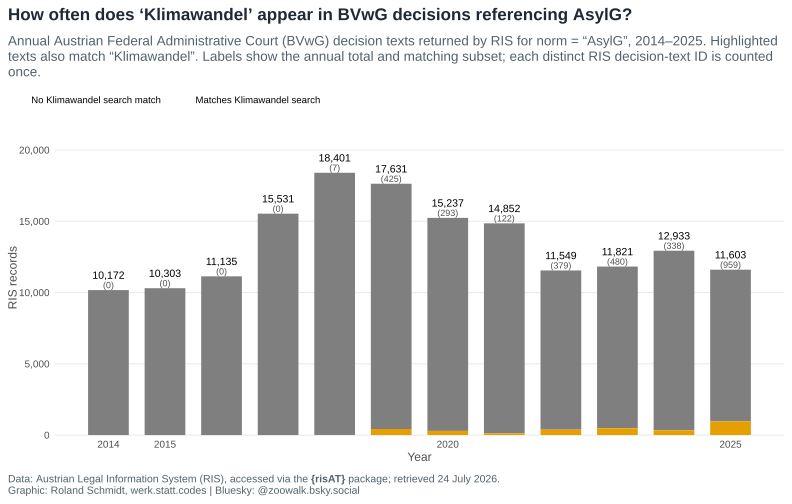
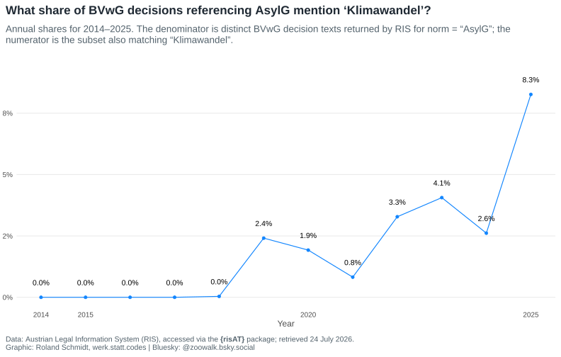

# Just the results, please {.unnumbered}

::: {layout-ncol="2"}
{group="bvwg_climate_gallery"}

{group="bvwg_climate_gallery"}
:::

```{r}
#| label: setup
#| include: false
library(risAT)
library(dplyr)
library(tidyr)
library(purrr)
library(stringr)
library(lubridate)
library(ggplot2)
library(ggtext)
library(here)

i_am("posts/2026-07-26-bvwg-asylum-climate/index.qmd")

data_path <- function(...) {
  here("posts", "2026-07-26-bvwg-asylum-climate", "_data", ...)
}
```

```{r}
#| label: helper-functions
#| include: false
# Set shared typography so figures stay visually consistent.
gg_base_size <- 12
gg_title_size <- 17
gg_subtitle_size <- 13.5
gg_caption_size <- 10.5
gg_strip_size <- 12
gg_axis_size <- 10
gg_annot_size <- 3.7
gg_plot_family <- "Arial"

# Define a reusable ggplot theme for all RIS figures in the post.
ris_plot_theme <- function() {
  theme_minimal(base_size = gg_base_size, base_family = gg_plot_family) +
    theme(
      panel.grid.minor = element_blank(),
      plot.title.position = "plot",
      plot.caption.position = "plot",
      plot.title = ggtext::element_textbox_simple(
        hjust = 0,
        halign = 0,
        size = gg_title_size,
        family = gg_plot_family,
        face = "bold",
        color = "#1F2933",
        lineheight = 1.1,
        width = grid::unit(1, "npc"),
        margin = ggplot2::margin(b = 8)
      ),
      plot.subtitle = ggtext::element_textbox_simple(
        color = "#52616B",
        size = gg_subtitle_size,
        family = gg_plot_family,
        lineheight = 1.15,
        width = grid::unit(1, "npc"),
        margin = ggplot2::margin(t = 4, b = 12)
      ),
      plot.caption = ggtext::element_textbox_simple(
        color = "#52616B",
        hjust = 0,
        halign = 0,
        size = gg_caption_size,
        family = gg_plot_family,
        lineheight = 1.1,
        width = grid::unit(1, "npc"),
        margin = ggplot2::margin(t = 14)
      ),
      strip.text = ggtext::element_markdown(
        size = gg_strip_size,
        family = gg_plot_family,
        lineheight = 1.2,
        hjust = 0
      ),
      axis.text = element_text(
        size = gg_axis_size,
        family = gg_plot_family,
        color = "#4D4D4D"
      ),
      axis.title = element_text(
        family = gg_plot_family,
        color = "#4D4D4D"
      ),
      legend.position = "top",
      # anchor the legend to the whole plot (title/subtitle width), not just the
      # panel—otherwise it appears shifted right, past the y-axis label margin
      legend.location = "plot",
      legend.justification.top = "left",
      legend.margin = ggplot2::margin(0, 0, 0, 0),
      panel.grid.major.x = element_blank(),
      plot.margin = ggplot2::margin(t = 8, r = 8, b = 8, l = 8)
    )
}

# Open a standard SVG device using the figure theme's locally available font.
svg_plot <- function(filename, width, height, ...) {
  svglite::svglite(
    filename = filename,
    width = width,
    height = height,
    ...
  )
}

# Store the shared provenance-only caption used by all figures.
ris_graph_caption <- paste0(
  "Data: Austrian Legal Information System (RIS), accessed via the **{risAT}** package; ",
  "retrieved 24 July 2026.",
  "<br>Graphic: Roland Schmidt, werk.statt.codes | Bluesky: @zoowalk.bsky.social"
)
```

# Background

Climate change is increasingly invoked in debates about migration and asylum. Whether it actually surfaces in the reasoning of asylum decisions is an empirical question—and one the Austrian Legal Information System (RIS) lets us probe directly. This post uses the [{risAT}](https://werkstattcodes.github.io/risAT/){target="_blank"} package to search decisions of the Bundesverwaltungsgericht (BVwG), Austria's federal administrative court, for references to `Klimawandel` (climate change). It expands on one example from the broader [{risAT} introduction](../2026-06-30-risAT-intro/index.qmd).

The BVwG began its work on 1 January 2014; see the [BVwG history](https://www.bvwg.gv.at/Bundesverwaltungsgericht/-ber-uns/entstehung.html). We restrict attention to its asylum-related decisions and ask how often their texts also mention climate change.

# Building the denominator: asylum decisions

To establish the denominator, we query BVwG decision texts whose `Norm` field matches `AsylG`, retrieving the results separately for each year from 2014 to 2025. Fetching year by year keeps each request small; running the years in parallel with {furrr} keeps the whole loop quick.

```{r}
#| label: fetch-bvwg-asyl
#| eval: false
#| code-summary: "Fetch BVwG asylum-norm records year by year (parallel)"
library(future)
library(furrr)
library(tictoc)

dir.create(data_path("bvwg_asyl"), showWarnings = FALSE)

plan(multisession, workers = 4)

tic()
future_walk(2014:2025, \(yr) {
  bvwg_asyl_year <- risAT::ris_search_bvwg(
    norm = "AsylG",
    decision_date_from = paste0(yr, "-01-01"),
    decision_date_to = paste0(yr, "-12-31"),
    search_decision_text = TRUE,
    search_legal_principles = FALSE,
    echo = TRUE
  )

  readr::write_rds(
    bvwg_asyl_year,
    data_path("bvwg_asyl", paste0("bvwg_asyl_", yr, ".rds")),
    compress = "gz"
  )
}, .progress = TRUE)
toc()

plan(sequential)
```

```{r}
#| label: read-bvwg-asyl
#| include: false
bvwg_asyl_files <- list.files(
  data_path("bvwg_asyl"),
  pattern = "^bvwg_asyl_[0-9]{4}\\.rds$",
  full.names = TRUE
)

stopifnot(length(bvwg_asyl_files) == 12L)

bvwg_asyl_records <- bvwg_asyl_files %>%
  map(readr::read_rds) %>%
  list_rbind() %>%
  mutate(year = year(decision_date))

stopifnot(
  setequal(bvwg_asyl_records$year, 2014:2025),
  all(bvwg_asyl_records$document_type == "Text"),
  nrow(bvwg_asyl_records) == 161168L,
  n_distinct(bvwg_asyl_records$id) == nrow(bvwg_asyl_records)
)
```

# Matching climate-change references

We then ask how many of these decision texts also match `Klimawandel` (climate change). The `Klimawandel` search covers BVwG decision texts over the same period. Joining the two result sets by their distinct RIS record IDs identifies the subset that satisfies both conditions.

```{r}
#| label: fetch-bvwg-klimawandel
#| eval: false
#| code-summary: "Get BVwG records containing 'Klimawandel'"
bvwg_klimawandel_results <- ris_search_bvwg(
  query = "Klimawandel",
  decision_date_from = "2014-01-01",
  decision_date_to = "2025-12-31",
  search_decision_text = TRUE,
  search_legal_principles = FALSE,
  echo = TRUE
)
```

```{r}
#| label: read-bvwg-klimawandel
#| eval: true
#| include: false
# readr::write_rds(
#   bvwg_klimawandel_results,
#   data_path("climateChange_bvwg.rds"),
#   compress = "gz"
# )
bvwg_klimawandel_results <- readr::read_rds(data_path("climateChange_bvwg.rds"))
```

```{r}
#| label: prep-bvwg-asyl-climate
#| code-summary: "Classify AsylG decision texts by Klimawandel match"
#| cache: true
bvwg_asyl_norm_records <- bvwg_asyl_records %>%
  mutate(
    mentions_klimawandel = as.character(id) %in%
      as.character(bvwg_klimawandel_results$id)
  )

stopifnot(sum(bvwg_asyl_norm_records$mentions_klimawandel) == 3003L)

bvwg_asyl_norm_climate_year <- bvwg_asyl_norm_records %>%
  count(year, mentions_klimawandel, name = "records") %>%
  complete(
    year = 2014:2025,
    mentions_klimawandel = c(FALSE, TRUE),
    fill = list(records = 0L)
  ) %>%
  mutate(
    climate_group = factor(
      if_else(
        mentions_klimawandel,
        "Matches Klimawandel search",
        "No Klimawandel search match"
      ),
      levels = c("No Klimawandel search match", "Matches Klimawandel search")
    )
  ) %>%
  mutate(
    total = sum(records),
    share = if_else(total > 0, records / total, 0),
    .by = year
  )
```

# Results

@fig-bvwg-asyl-climate-absolute shows the annual number of distinct BVwG decision texts returned for `norm = "AsylG"`. The highlighted segment contains the decision texts that also match the `Klimawandel` search.

```{r}
#| label: fig-bvwg-asyl-climate-absolute
#| code-summary: "Plot annual asylum-norm records by Klimawandel mention"
#| fig-cap: "Annual BVwG decision texts returned for the AsylG norm filter, split by Klimawandel matches."
#| fig-alt: "Stacked column chart of annual Austrian Federal Administrative Court decision texts returned by RIS with AsylG in the norm filter from 2014 to 2025. Highlighted segments also match Klimawandel in the decision text; labels give the annual AsylG total and matching subset. No decision texts match through 2017, and matches remain a minority thereafter."
#| column: body-outset-right
#| fig-width: 11
#| fig-height: 7
#| out-width: "100%"
#| fig-align: "center"
#| dev: svg_plot
#| fig-ext: svg
bvwg_asyl_norm_totals <- bvwg_asyl_norm_climate_year %>%
  distinct(year, total)

bvwg_asyl_norm_climate_counts <- bvwg_asyl_norm_climate_year %>%
  filter(mentions_klimawandel) %>%
  select(year, records, total)

bvwg_asyl_norm_climate_year %>%
  ggplot(aes(x = year, y = records, fill = climate_group)) +
  geom_col(width = 0.72, key_glyph = draw_key_point) +
  geom_text(
    data = bvwg_asyl_norm_totals,
    aes(x = year, y = total, label = scales::comma(total)),
    inherit.aes = FALSE,
    vjust = -1.5,
    color = "black",
    size = gg_annot_size,
    family = gg_plot_family
  ) +
  geom_text(
    data = bvwg_asyl_norm_climate_counts,
    aes(x = year, y = total, label = paste0("(", records, ")")),
    inherit.aes = FALSE,
    vjust = -0.3,
    color = "#4D4D4D",
    size = gg_annot_size * 0.85,
    family = gg_plot_family
  ) +
  scale_x_continuous(breaks = c(2014, 2015, 2020, 2025)) +
  scale_y_continuous(labels = scales::comma, expand = expansion(mult = c(0, 0.2))) +
  scale_fill_manual(
    values = c(
      "No Klimawandel search match" = "#7f7f7f",
      "Matches Klimawandel search" = "#e69f00"
    ),
    name = NULL
  ) +
  labs(
    title = "How often does ‘Klimawandel’ appear in BVwG decisions referencing AsylG?",
    subtitle = paste0(
      "Annual Austrian Federal Administrative Court (BVwG) decision texts returned by RIS for ",
      "norm = “AsylG”, 2014–2025. Highlighted texts also match “Klimawandel”. Labels show the annual ",
      "total and matching subset; each distinct RIS decision-text ID is counted once."
    ),
    x = "Year",
    y = "RIS records",
    caption = ris_graph_caption
  ) +
  ris_plot_theme()
```

@fig-bvwg-asyl-climate-relative presents the same results as annual shares. No decision texts match before 2018. The share is generally higher in recent years but varies considerably: it is 4.1 per cent in 2023, falls to 2.6 per cent in 2024, and reaches 8.3 per cent in 2025.

```{r}
#| label: fig-bvwg-asyl-climate-relative
#| code-summary: "Plot the annual Klimawandel share among asylum-norm records"
#| fig-cap: "Annual share of Klimawandel matches among BVwG decision texts returned for the AsylG norm filter."
#| fig-alt: "Line chart of the annual share of Austrian Federal Administrative Court decision texts returned by RIS for the AsylG norm filter that also match Klimawandel from 2014 to 2025. The share is zero through 2017, fluctuates thereafter, reaches 4.1 per cent in 2023, falls to 2.6 per cent in 2024, and rises to 8.3 per cent in 2025."
#| column: body-outset-right
#| fig-width: 11
#| fig-height: 7
#| out-width: "100%"
#| fig-align: "center"
#| dev: svg_plot
#| fig-ext: svg
bvwg_asyl_norm_climate_year %>%
  filter(mentions_klimawandel) %>%
  ggplot(aes(x = year, y = share)) +
  geom_line(color = "#1185FE") +
  geom_point(color = "#1185FE") +
  geom_text(
    aes(label = scales::percent(share, accuracy = 0.1)),
    nudge_y = 0.006,
    color = "black",
    size = gg_annot_size,
    family = gg_plot_family
  ) +
  scale_x_continuous(breaks = c(2014, 2015, 2020, 2025)) +
  scale_y_continuous(
    labels = scales::percent_format(accuracy = 1),
    expand = expansion(mult = c(0.05, 0.12))
  ) +
  labs(
    title = "What share of BVwG decisions referencing AsylG mention ‘Klimawandel’?",
    subtitle = paste0(
      "Annual shares for 2014–2025. The denominator is distinct BVwG decision texts returned by RIS for ",
      "norm = “AsylG”; the numerator is the subset also matching “Klimawandel”."
    ),
    x = "Year",
    y = NULL,
    caption = ris_graph_caption
  ) +
  ris_plot_theme()
```

A note of caution on interpretation: a textual match for `Klimawandel` only tells us the word appears in a decision returned for the `AsylG` norm filter—not that climate change was the decisive issue, nor that the decision turned on it. The counts describe how often the term surfaces, which is a different question from how often climate change is legally material.

# What's next

This analysis is a small slice of what {risAT} makes possible with RIS case-law data. If you have questions or suggestions, feel free to reach out via [direct message on Bluesky](https://bsky.app/profile/zoowalk.bsky.social){target="_blank"} or the [{risAT} GitHub discussion board](https://github.com/werkstattcodes/risAT/discussions){target="_blank"}.
